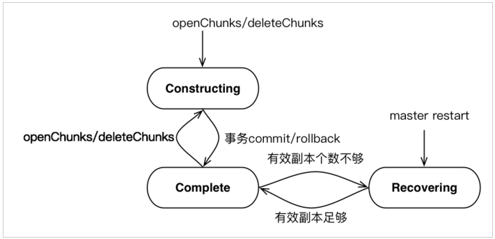
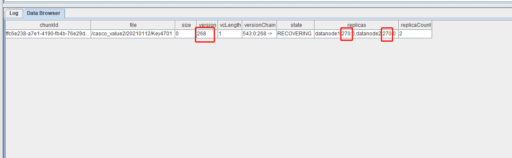

# еҲҶеҢәзҠ¶жҖҒдёҚдёҖиҮҙ

еңЁ DolphinDB ж—Ҙеёёиҝҗз»ҙж—¶пјҢеҸҜиғҪз”ұдәҺиҜҜж“ҚдҪңжҲ–ж„ҸеӨ–жғ…еҶөпјҢйҖ жҲҗжҺ§еҲ¶иҠӮзӮ№дёҺж•°жҚ®иҠӮзӮ№зҡ„еҲҶеҢәзҠ¶жҖҒдёҚдёҖиҮҙпјҢжңҖз»ҲеҜјиҮҙж•°жҚ®ж— жі•еҠ иҪҪе’ҢеҶҷе…ҘгҖӮй’ҲеҜ№иҝҷз§ҚејӮеёёпјҢжң¬ж•ҷзЁӢд»Ӣз»ҚеҰӮдҪ•и§ЈеҶі DolphinDB еҲҶеҢәзҠ¶жҖҒдёҚдёҖиҮҙзҡ„й—®йўҳд»ҘжҒўеӨҚж•°жҚ®еә“жӯЈеёёеҠ иҪҪж•°жҚ®еҠҹиғҪгҖӮ

## 1. еҹәжң¬жҰӮеҝө

DolphinDB еҲ©з”ЁеҲҶеёғејҸж–Ү件系з»ҹ (Distributed File SystemпјҢDFS) е®һзҺ°ж•°жҚ®еә“зҡ„еӯҳеӮЁе’Ңеҹәжң¬дәӢеҠЎжңәеҲ¶пјҢ并йҮҮз”ЁеӨҡеүҜжң¬жңәеҲ¶пјҢе°ҶзӣёеҗҢж•°жҚ®еқ—зҡ„еүҜжң¬еӯҳеӮЁеңЁдёҚеҗҢзҡ„ж•°жҚ®иҠӮзӮ№дёҠгҖӮ

ж•°жҚ®еә“д»ҘеҲҶеҢәдёәеҚ•дҪҚиҝӣиЎҢз®ЎзҗҶпјҢиҖҢж•°жҚ®еә“дёӯзҡ„ж•°жҚ®еҢ…жӢ¬д»ҘдёӢдёӨдёӘйғЁеҲҶпјҡ

* е…ғж•°жҚ®гҖӮж•°жҚ®еә“зҡ„еҲҶеҢәдҝЎжҒҜпјҢеҢ…жӢ¬жҜҸдёӘеҲҶеҢәзҡ„зүҲжң¬й“ҫпјҢеӨ§е°ҸпјҢеӯҳеӮЁдҪҚзҪ®зӯүдҝЎжҒҜпјҢеӯҳеӮЁеңЁжҺ§еҲ¶иҠӮзӮ№(Controller)гҖӮ
* еҲҶеҢәж•°жҚ®пјҢе…·дҪ“иҰҒеӯҳеӮЁзҡ„е®һйҷ…ж•°жҚ®пјҢеҢ…еҗ«еӨҡдёӘеүҜжң¬гҖӮжҜҸдёҖдёӘж•°жҚ®еқ—з®Җз§°дёәchunkгҖӮеүҜжң¬ж•°жҚ®еӯҳеӮЁеңЁеҗ„ж•°жҚ®иҠӮзӮ№(Data NodeпјҢеҸҲз§°Chunk Node)

иҝҷдәӣж•°жҚ®з»ҹдёҖз”ұ DFS з®ЎзҗҶгҖӮ

дёӢйқўеҲҶеҲ«д»Ӣз»Қ Controller д»ҘеҸҠ Data Node дёӯ chunk зҡ„дҝқеӯҳеҶ…е®№пјҡ

### 1.1 Controller

* ж–Ү件е‘ҪеҗҚз©әй—ҙпјҡдҫӢеҰӮ `/ff_custom15/YANGXS_YINZI8/202104M_202105M`гҖӮдёҖдёӘж–Ү件е‘ҪеҗҚз©әй—ҙзҡ„жҜҸдёҖзә§зӣ®еҪ•йғҪжңүеұһжҖ§пјҡ{'Normal', 'Partiton', 'Seq'}гҖӮе…¶дёӯпјҡ
  + Normalпјҡзұ»дјјдәҺжҷ®йҖҡзҡ„ж–Ү件系з»ҹзӣ®еҪ•гҖӮ
  + Partitionпјҡж•°жҚ®еә“зҡ„еҲҶеҢәзӣ®еҪ•пјҢRangeпјҢListпјҢValueгҖӮ
  + Seqпјҡе°ҶдёҖеј иЎЁжҢүз…§ Tablet Chunk дёәеҚ•дҪҚиҝӣиЎҢйЎәеәҸеҲҶеүІзҡ„зӣ®еҪ•гҖӮ
* File Chunkпјҡжҷ®йҖҡж–Ү件зҡ„ chunkгҖӮдҫӢеҰӮ `/ff_custom3/table_data_3.tbl` жҳҜдёҖдёӘ File ChunkгҖӮFile Chunk е’Ңж–Ү件еҗҚеӯҳеңЁжҳ е°„е…ізі»пјҢдёҖдёӘеӨ§ж–Ү件зҡ„ chunk еҜ№еә”еӨҡдёӘе°Ҹзҡ„ chunk еӯҳеӮЁгҖӮ
* Tablet ChunkпјҡдёҖз§Қзү№ж®Ҡзҡ„ chunkпјҢеҸҜд»ҘзҗҶи§Јдёәз»“жһ„еҢ–ж•°жҚ®иЎЁзҡ„дёҖе°ҸзүҮпјҢжҳҜдёҖдёӘзӣ®еҪ•пјҢеҚі Sequential еҲҶеҢәдёӢзҡ„PartжҰӮеҝөпјҢиҜҘзӣ®еҪ•дёӢеӯҳж”ҫе®һйҷ…зҡ„ж•°жҚ®пјҢиҝҷз§Қзұ»еһӢзҡ„зӣ®еҪ•еҝ…йЎ»дҪңдёәжңҖеҗҺдёҖзә§еҲҶеҢәпјҢиҜҘзӣ®еҪ•еҗҢж ·еҸ— chunk еӨ§е°ҸйҷҗеҲ¶гҖӮдҫӢеҰӮпјҢ`/ff_custom15/YANGXS_YINZI8/202104M_202105M` жҳҜдёҖдёӘTablet ChunkгҖӮ
* Chunk дҪҚзҪ®дҝЎжҒҜпјҢдёҖиҲ¬жҳҜз”ұ Data Node жұҮжҠҘеҲ° Controller еҗҲжҲҗпјҢеҢ…жӢ¬иҜҘ chunk зҡ„дҪҚзҪ®дҝЎжҒҜпјҢз®ЎзҗҶзҡ„еҲҶеҢәгҖҒTablet ChunkдҝЎжҒҜгҖҒеҗ„еҲҶеҢәгҖҒTablet Chunkзҡ„зүҲжң¬еҸ·е’ҢиҙҹиҪҪзӯүдҝЎжҒҜгҖӮ

### 1.2 Data Node дёҺ Chunk Node

еңЁ DFS дёӯпјҢData Node е’Ң Chunk Node жҳҜдёӨдёӘдёҚеҗҢзҡ„жҰӮеҝөпјҡ

* Data Node жҳҜиҙҹиҙЈеӯҳеӮЁе’Ңз®ЎзҗҶж•ҙдёӘж–Ү件зҡ„иҠӮзӮ№гҖӮData Node еёёз”ЁдәҺеӯҳеӮЁж•ҙдёӘж–Ү件зҡ„еӨҡдёӘеүҜжң¬пјҢд»Ҙе®һзҺ°ж•°жҚ®зҡ„еҶ—дҪҷеӨҮд»Ҫе’Ңй«ҳеҸҜз”ЁжҖ§гҖӮData Node дё»иҰҒеӨ„зҗҶ File Chunk е’Ң Tablet Chunk дёӨз§Қзұ»еһӢгҖӮе…¶дёӯпјҡ

  + File Chunk еҸҜд»ҘжҳҜд»Ҙ chunk id е‘ҪеҗҚзҡ„дёҖдёӘ binary ж–Ү件гҖӮ
  + Tablet Chunk еҸҜд»ҘжҳҜд»Ҙ chunk id е‘ҪеҗҚзҡ„дёҖдёӘзӣ®еҪ•пјҢйҮҢйқўеӯҳж”ҫTabletж•°жҚ®гҖӮ
* Chunk Node жҳҜиҙҹиҙЈеӯҳеӮЁе’Ңз®ЎзҗҶж•°жҚ®еқ—зҡ„иҠӮзӮ№пјҢйҖҡеёёдјҡеӯҳеӮЁеӨҡдёӘж•°жҚ®еқ—гҖӮChunk Node е®ҡж—¶еҗ‘ Controller жұҮжҠҘжң¬ең°еӯҳж”ҫзҡ„ File Chunk е’Ң Tablet Chunk дҝЎжҒҜд»ҘеҸҠиҙҹиҪҪдҝЎжҒҜгҖӮ

дёҖдёӘ Data Node еҸҜд»ҘеҗҢж—¶жӢ…д»»еӨҡдёӘ Chunk Node зҡ„и§’иүІпјҢеҚіеӯҳеӮЁе№¶з®ЎзҗҶеӨҡдёӘж•°жҚ®еқ—гҖӮиҝҷз§ҚеҲҶеұӮзҡ„жһ¶жһ„еҸҜд»Ҙжңүж•Ҳең°жҸҗй«ҳ DFS зҡ„жҖ§иғҪе’ҢеҸҜйқ жҖ§пјҢеҗҢж—¶д№ҹж–№дҫҝдәҶж•°жҚ®зҡ„з®ЎзҗҶе’Ңз»ҙжҠӨгҖӮ

дёҖдёӘж•°жҚ®еә“еҸҜд»ҘеҢ…еҗ«дёҠзҷҫдёҮдёӘеҲҶеҢәпјҢеҲҶеҢәзҡ„еӨҡеүҜжң¬д№Ӣй—ҙдҪҝз”ЁдәҢйҳ¶ж®өжҸҗдәӨеҚҸи®®е®һзҺ°еҲҶеҢәеүҜжң¬зҡ„ејәдёҖиҮҙжҖ§гҖӮ

дёӢйқўз®ҖиҰҒд»Ӣз»Қ TIDгҖҒCID д»ҘеҸҠдәҢйҳ¶ж®өжҸҗдәӨеҚҸи®®жөҒзЁӢпјҡ

* дәӢеҠЎзј–еҸ·пјҲTransaction Identifier, TID, unsigned long long, йҖ’еўһпјү
* дәӢеҠЎжҸҗдәӨзј–еҸ·пјҲCommit Identifier, CIDпјҢunsigned long long, йҖ’еўһпјү
* зүҲжң¬еҸ·пјҲunsigned intпјҢеҸҜд»ҘеҫӘзҺҜеҲ©з”Ёпјү

дәҢйҳ¶ж®өжҸҗдәӨеҚҸи®®зҡ„жөҒзЁӢеҰӮдёӢпјҡ

1. еҚҸи°ғдәәпјҲжҸҗдәӨд»»еҠЎзҡ„иҠӮзӮ№пјүйҰ–е…Ҳеҗ‘ControllerеҸ–еҫ—дёҖдёӘдәӢеҠЎзј–еҸ·пјҲTIDпјүпјҢ并еңЁ Controller зҡ„еҶ…еӯҳдёӯеҒҡе…ғж•°жҚ®дҝ®ж”№пјҢ然еҗҺжҠҠд»»еҠЎеҸ‘з»ҷжҜҸдёҖдёӘ Chunk NodeгҖӮжҜҸдёҖдёӘ Chunk Node еҺ»е®ҢжҲҗе…·дҪ“д»»еҠЎпјҢеҰӮжһңжңүй”ҷжҠӣеҮәејӮеёёз»ҷеҚҸи°ғдәәгҖӮ
2. * еҚҸи°ғдәә收еҲ°ејӮеёёжҲ–иҖ…иҜ·жұӮи¶…ж—¶пјҢи®Өдёәд»»еҠЎжІЎжңүе®ҢжҲҗпјҢеҶіе®ҡеӣһж»ҡдәӢеҠЎгҖӮеҗ‘еҗ„дёӘ Chunk Node е’Ң Controller еҸ‘еҮәеӣһж»ҡиҜ·жұӮгҖӮ
   * еҚҸи°ғдәәеҰӮжһңжІЎжңү收еҲ°ејӮеёёпјҢд№ҹжІЎжңүд»»дҪ•и¶…ж—¶пјҢеҚҸи°ғдәәеҶіе®ҡеҮҶеӨҮжҸҗдәӨдәӢеҠЎпјҲжҸҗдәӨзҡ„第дёҖйҳ¶ж®өпјүгҖӮеҚҸи°ғдәәд»Һ Controller иҺ·еҸ–дёҖдёӘ CID еҗҺпјҢдҪҝз”Ё TID е’Ң CID еҗ‘зӣёе…ізҡ„ Chunk Node е’Ң Controller еҸ‘йҖҒжҸҗдәӨиҜ·жұӮгҖӮ
3. * еҚҸи°ғдәә收еҲ°ејӮеёёжҲ–иҖ…иҜ·жұӮи¶…ж—¶пјҢеҶіе®ҡеӣһж»ҡдәӢеҠЎгҖӮеҗ‘еҗ„дёӘ Chunk Node е’Ң Controller еҸ‘еҮәеӣһж»ҡиҜ·жұӮгҖӮ
   * еҚҸи°ғдәәеҰӮжһңжІЎжңү收еҲ°ејӮеёёпјҢд№ҹжІЎжңүд»»дҪ•и¶…ж—¶пјҢеҚҸи°ғдәәеҶіе®ҡеҮҶеӨҮжҸҗдәӨдәӢеҠЎпјҲжҸҗдәӨзҡ„第дәҢйҳ¶ж®өпјүгҖӮеҚҸи°ғдәәеҗ‘ Controller е’Ң Chunk Node еҸ‘еҮә complete дәӢеҠЎиҜ·жұӮгҖӮ
4. еңЁз¬¬дәҢйҳ¶ж®өпјҲеӣһж»ҡжҲ–зЎ®и®ӨпјүпјҢдёҚз®Ў Chunk Node е’Ң Controller еҸ‘з”ҹд»Җд№ҲпјҢеҚҸи°ғдәәдёҚдҪңд»»дҪ•еӨ„зҗҶпјҢйғҪдәӨз”ұйӣҶзҫӨзҡ„зүҲжң¬жҒўеӨҚжңәеҲ¶жқҘеӨ„зҗҶгҖӮ

### 1.3 Controller е’ҢData Node дёҠзҡ„зүҲжң¬зҠ¶жҖҒиҜҙжҳҺ

DolphinDBдёҠзүҲжң¬зҠ¶жҖҒиҜҙжҳҺеҲҶеёғеңЁ Controller е’Ң Datanode дёҠпјҢжӯЈеёёжғ…еҶөйғҪеӨ„дәҺе®ҢжҲҗзҠ¶жҖҒгҖӮжүҖжңү chunk зҡ„зүҲжң¬д»Ҙ Controller зҡ„зүҲжң¬дёәж ҮеҮҶпјҢеҰӮжһңдёҖдёӘ Chunk Node дҝқеӯҳзҡ„жҹҗдёӘ chunk зҡ„зүҲжң¬дёҚзӯүдәҺ Controller дёҠдҝқеӯҳзҡ„иҜҘ chunk зҡ„зүҲжң¬пјҢйӮЈд№Ҳи®ӨдёәдёҚдёҖиҮҙпјҢйңҖиҰҒйҖҡиҝҮ Recovery жңәеҲ¶жҒўеӨҚеҲ°жңҖж–°зҡ„зүҲжң¬гҖӮдәӢеҠЎзүҲжң¬зҠ¶жҖҒиҜҙжҳҺеҰӮдёӢ:

* жҹҘзңӢControllerдёҠжүҖжңүchunkзҡ„зүҲжң¬пјҡ

  ```
  select * from getClusterChunksStatus()
  ```
* иҝ”еӣһиЎЁдёӯйҮҚиҰҒзҡ„еҲ—иҜҙжҳҺ

  + `chunkId`пјҡchunkзҡ„е”ҜдёҖж ҮиҜҶ
  + `file`пјҡеҲҶеҢәи·Ҝеҫ„гҖӮ
  + `size`пјҡfile chunk еҚ з”ЁзЈҒзӣҳз©әй—ҙпјҢеҚ•дҪҚдёә byteгҖӮеҜ№дәҺ tablet chunk, иҝ”еӣһ0пјҢйңҖиҰҒдҪҝз”Ё `getTabletsMeta` жқҘжҹҘзңӢе®ғ们е®һйҷ…еҚ з”Ёзҡ„зЈҒзӣҳз©әй—ҙгҖӮ
  + `version`пјҡзүҲжң¬еҸ·
  + `VCLength`: зүҲжң¬й“ҫй•ҝеәҰ
  + `VersionChain`: зүҲжң¬й“ҫгҖӮдҫӢеҰӮ1028:0:1 -> 1028:0:0 -> ж ҮиҜҶиҜҘ chunk з»ҸеҺҶдәҶдёӨдёӘзүҲжң¬пјҢ1028:0:1еҲҶеҲ«иЎЁзӨә chunk зҡ„ CidгҖҒsize д»ҘеҸҠ version
  + `state`пјҡ chunk зҠ¶жҖҒгҖӮCOMPLETE иЎЁзӨәж•°жҚ®е·ІеҜје…ҘпјӣCONSTRUCTING иЎЁзӨәжӯЈеңЁеҜје…Ҙж•°жҚ®пјӣRECOVERING иЎЁзӨәжӯЈеңЁжҒўеӨҚж•°жҚ®гҖӮ
  + `replicas`пјҡеүҜжң¬зҡ„еҲҶеёғдҝЎжҒҜгҖӮ
  + `replicaCount`пјҡеүҜжң¬ж•°

Controller дёҠзүҲжң¬жңү3дёӘзҠ¶жҖҒпјҡCONSTRUCTING, RECOVERING, COMPLETEпјҲеҜ№еә” `state` еӯ—ж®өпјү

* `CONSTRUCTING` пјҡ chunk жӯЈеңЁжһ„е»әдёӯпјҢжҜ”еҰӮ openchunk еҗҺжӯЈеңЁеҶҷе…ҘпјҢжӯЈеңЁеҲ йҷӨзӯүпјҢдёҖиҲ¬жҳҜдәӢеҠЎдёӯзҡ„зҠ¶жҖҒгҖӮ
* `RECOVERING` пјҡ chunk еӨ„дәҺжҒўеӨҚдёӯпјҢеҪ“ Controller еҲҡеҗҜеҠЁпјҢchunk йғҪеӨ„еңЁиҝҷдёӘзҠ¶жҖҒпјҢзӯүеҫ… Data Node жұҮжҠҘзүҲжң¬пјҢеҰӮжһңзүҲжң¬е’Ң Controller дёҠзҡ„зүҲжң¬дёҖиҮҙпјҢеҲҷзҠ¶жҖҒз”ұ RECOVERING еҸҳдёә COMPLETE зҠ¶жҖҒгҖӮ е…¶ж¬ЎпјҢеҰӮжһң Data Node жұҮжҠҘдёҠжқҘзҡ„зүҲжң¬дёҚдёҖиҮҙпјҢйӮЈд№Ҳ Controller дёҠзҡ„ chunk дјҡдёҖзӣҙеӨ„еңЁиҝҷз§ҚзҠ¶жҖҒпјҢзӣҙеҲ° recovery иҝҮзЁӢе®ҢжҲҗпјҢ然еҗҺзүҲжң¬еҸҳдёәдёҖиҮҙпјҢзҠ¶жҖҒеҸҳдёә COMPLETEгҖӮ йҷӨдәҶ Controller еҲҡеҗҜеҠЁпјҢеңЁжӯЈеёёиҝҗиЎҢдёӯпјҢд№ҹеҸҜиғҪеҮәзҺ°иҝҷз§ҚзҠ¶жҖҒгҖӮдҫӢеҰӮпјҢеңЁиҜ»ж•°жҚ®зҡ„ж—¶еҖҷпјҢжЈҖжҹҘеҲ°ж•°жҚ®ж ЎйӘҢй”ҷиҜҜпјҢData Node дјҡеҗ‘ Controller еҸ‘иө· recovery иҜ·жұӮпјҢеңЁ Controller жү§иЎҢ recovery зҡ„иҝҮзЁӢдёӯпјҢchunk зҡ„зҠ¶жҖҒд№ҹжҳҜ RECOVERINGгҖӮ
* `COMPLETE` пјҡ chunk еӨ„дәҺе®ҢжҲҗзҠ¶жҖҒпјҢдәӢеҠЎжӯЈеёёе®ҢжҲҗпјҢйҮҚеҗҜеҗҺзүҲжң¬дёҖиҮҙпјҢйғҪе°ҶеӨ„еңЁиҝҷдёӘзҠ¶жҖҒпјҢиҝҷдёӘзҠ¶жҖҒжҳҜжңҖз»ҲжӯЈзЎ®зҡ„зҠ¶жҖҒгҖӮ

еҪ“ Controller йҮҚеҗҜеҗҺпјҢжүҖжңүж–Ү件зҡ„жңҖеҗҺдёҖдёӘ chunk иў«зҪ®дёә Recovering зҠ¶жҖҒпјҢйҡҸзқҖ chunk дҝЎжҒҜжұҮжҠҘдёҠжқҘеҗҺпјҢеҰӮжһңеүҜжң¬ chunk version е’Ң master chunk version дёҖиҮҙдё”жңүж•ҲеүҜжң¬дёӘж•°еҲ°иҫҫйҳҲеҖјпјҢйӮЈд№Ҳ Recovering=> CompleteпјҢеҗҰеҲҷ Controller е°ҶдёҚдёҖиҮҙзҡ„ chunk еҠ е…Ҙеҫ…жҒўеӨҚ chunk йҳҹеҲ—гҖӮеҜ№дәҺзӯүеҫ…жҒўеӨҚзҡ„ chunkпјҢйҖүжӢ©дёҖдёӘдёҖиҮҙзҡ„ chunk еүҜжң¬дҪңдёә primary chunkпјҢжү§иЎҢиҝҷдёӘеүҜжң¬иҝҮзЁӢпјҢеҰӮжһңдёҖдёӘ chunk зҡ„жүҖжңүеүҜжң¬йғҪе’Ң Controller chunk version дёҚдёҖиҮҙпјҢж— жі•иҝӣиЎҢжҒўеӨҚгҖӮеҜ№дәҺжӯЈеңЁиҝӣиЎҢжҒўеӨҚзҡ„ chunk жқҘиҜҙпјҢйҷҗеҲ¶иҜҘ chunk ж— жі•иҝӣиЎҢеҶҷгҖӮеҜ№дәҺжҜҸдёӘ chunk зҡ„ recovery иҝҮзЁӢйғҪеҲҶй…ҚдёҖдёӘе”ҜдёҖзҡ„ recovery idпјҢз”ұ master з”ҹжҲҗпјҢз”ЁдәҺеҺ»йҮҚеӨҚгҖӮжүҖд»Ҙжң¬зҜҮж–Ү章第еӣӣиҠӮй’ҲеҜ№ж— жі•йҮҚеҗҜиҮӘеҠЁжҒўеӨҚ chunk зҡ„й—®йўҳжҸҗеҮәи§ЈеҶіж–№жЎҲгҖӮController зҡ„ chunk зҠ¶жҖҒеҰӮдёӢеӣҫжүҖзӨәпјҡ



жҹҘиҜўControllerдёҠзүҲжң¬еҸҜиғҪжңүй—®йўҳзҡ„ chunkпјҡ

```
select * from getClusterChunksStatus()  where  state != 'COMPLETE'
select * from rpc(getControllerAlias(), getClusterChunksStatus) where  state != 'COMPLETE'
```

* жҹҘзңӢ Data Node дёҠжүҖжңү chunk зҡ„зүҲжң¬

  ```
  select * from pnodeRun(getAllChunks)
  ```
* иҝ”еӣһиЎЁдёӯйҮҚиҰҒзҡ„еҲ—иҜҙжҳҺ

  + `site` : chunkжүҖеұһ Data Node
  + `chunkId`пјҡchunk зҡ„е”ҜдёҖж ҮиҜҶгҖӮ
  + `path`пјҡchunk зү©зҗҶи·Ҝеҫ„гҖӮ
  + `dfsPath`пјҡеҲҶеҢәи·Ҝеҫ„гҖӮ
  + `type`пјҡеҲҶеҢәзұ»еһӢгҖӮ0иЎЁзӨә file chunkпјӣ1иЎЁзӨә tablet chunkгҖӮ
  + `flag`пјҡеҲ йҷӨж Үеҝ—гҖӮиӢҘ flag=1пјҢжӯӨ chunk ж•°жҚ®дёҚиғҪиў«жҹҘиҜўеҲ°пјҢдҪҶе°ҡжңӘд»ҺзЈҒзӣҳеҲ йҷӨгҖӮ
  + `size`пјҡfile chunk еҚ з”ЁзЈҒзӣҳз©әй—ҙгҖӮ
  + `version`пјҡзүҲжң¬еҸ·
  + `state`пјҡchunk зҠ¶жҖҒ
  + `versionList`пјҡзүҲжң¬еҲ—иЎЁпјҢcid : 6,pt=>6:500338; # иЎЁзӨәиҜҘеҲҶеҢәchunkзҡ„cidдёә6пјҢжүҖеұһдёәptиЎЁпјҢе…¶жҖ»иЎҢж•°дёә500338

Data NodeдёҠжңү5дёӘзҠ¶жҖҒпјҡFIN, BCOMM, COMM, WRE, IREпјҢеҲҶеҲ«еҜ№еә” state еӯ—ж®өеҖј 0пјҢ1пјҢ2пјҢ3пјҢ4пјҡ

* `FIN` пјҡchunkеӨ„дәҺз»ҲжҖҒпјҢеҢ…жӢ¬дәӢеҠЎжңҖз»ҲжӯЈзЎ®е®ҢжҲҗпјҢжҲ–иҖ… rollbackгҖӮ
* `BCOMM` : before commit, еҫҖдёҖдёӘ chunk дёҠжӯЈеңЁжү§иЎҢдәӢеҠЎпјҢеңЁ commit д№ӢеүҚзҡ„йҳ¶ж®өгҖӮжҜ”еҰӮжӯЈеңЁеҶҷж•°жҚ®жҲ–иҖ…еҲ йҷӨж•°жҚ®гҖӮ
* `COMM` пјҡ after commitпјҢдәӢеҠЎе·Із»Ҹ commit зҡ„зҠ¶жҖҒгҖӮ
* `WRE` пјҡ waiting for recoveringпјҢзӯүеҫ…жҒўеӨҚзҡ„зҠ¶жҖҒпјҢжҜ”еҰӮзүҲжң¬дёҚдёҖиҮҙжҲ–иҖ…ж•°жҚ®жҚҹеқҸпјҢеҗ‘ Controller еҸ‘иө· recovery иҜ·жұӮеҗҺпјҢзӯүеҫ… Controller еҸ‘иө· recovery д№ӢеүҚпјҢеҲҷдјҡеӨ„дәҺиҝҷз§ҚзҠ¶жҖҒгҖӮ
* `IRE` пјҡ in recovering зҠ¶жҖҒпјҢеңЁ recovering зҠ¶жҖҒдёӯпјҢжҺҘеҸ—еҲ° Controller зҡ„recoveringиҜ·жұӮпјҢејҖе§ӢеҗҜеҠЁrecoveryпјҢеҲҷеӨ„дәҺиҝҷдёӘзҠ¶жҖҒпјҢrecovering е®ҢжҲҗеҗҺеҸҳдёә FIN зҠ¶жҖҒгҖӮ

chunk зҡ„жңҖз»ҲзҠ¶жҖҒдёә FINпјҢе…¶д»–зҠ¶жҖҒйғҪжҳҜдёҙж—¶зҠ¶жҖҒпјҢData Node еҗҜеҠЁеҗҺпјҢдёҖиҲ¬еӨ„дәҺ FIN зҠ¶жҖҒпјҢеҰӮжһңжңүејӮеёёйңҖиҰҒжҒўеӨҚпјҢеҲҷеҸҜиғҪеӨ„дәҺ WRE зҠ¶жҖҒгҖӮ

еҰӮдёӢеӣҫйҷ„дёҠ Chunk Node зҠ¶жҖҒеӣҫпјҡ


жҹҘзңӢData NodeдёҠжүҖжңүйқһжӯЈеёёзҡ„ chunk зҡ„зҠ¶жҖҒпјҡ

```
select * from getAllChunks() where state != 0
```

### 1.4 Controller е’Ң Data Node зүҲжң¬дёҖиҮҙжҖ§ж ЎйӘҢ

Controller е’Ң Data Node еҗҜеҠЁеҗҺпјҢжӯЈеёёжғ…еҶөдёӢпјҢжүҖжңү chunk йғҪеӨ„дәҺз»ҲжҖҒпјҢController дёҠзҠ¶жҖҒдёә COMPLETEпјҢData Node дёҠзҠ¶жҖҒдёә FINгҖӮжҜҸдёӘ chunk дёҠжүҖжңүеүҜжң¬зүҲжң¬дёҖиҮҙпјҢе’Ң Controller д№ҹе®Ңе…ЁдёҖиҮҙгҖӮд»ҘдёӢ3дёӘеңәжҷҜе°Ҷи§ҰеҸ‘ chunk зҡ„жҒўеӨҚжңәеҲ¶гҖӮ

* Controller жҲ– Data Node йҮҚеҗҜпјҢ
* Controller жҲ– Data Node зҡ„дәӢеҠЎеӨ„дәҺ committed зҡ„зҠ¶жҖҒпјҢдҪҶе·Із»Ҹ timeout
* еңЁе®ўжҲ·з«ҜиҜ»еҶҷзҡ„иҝҮзЁӢдёӯеҸ‘зҺ° Controller е’Ң Datanode зҡ„зүҲжң¬дёҚдёҖиҮҙгҖӮ

жӯЈеёёи§ҰеҸ‘жҒўеӨҚжңәеҲ¶еҗҺпјҢеңЁеҚҠдёӘе°Ҹж—¶е·ҰеҸійғҪе°ҶдҪҝеҫ— Controller жҲ– Datanode зҡ„ Chunk зҠ¶жҖҒеҲҶеҲ«еҸҳжҲҗ COMPLETE д»ҘеҸҠ FINгҖӮеҰӮжһң Chunk дёҖзӣҙеӨ„дәҺ Recovering зҠ¶жҖҒпјҢзӣёе…іеёёи§ҒеңәжҷҜд»ҘеҸҠи§ЈеҶіж–№жі•и§ҒдёӢиҠӮгҖӮ

## 2. еҲҶеҢәзҠ¶жҖҒдёҚдёҖиҮҙеңәжҷҜ

е…ёеһӢзҡ„зүҲжң¬дёҚдёҖиҮҙзҡ„еңәжҷҜеҰӮдёӢпјҡ

* (a) Datanode дёӨдёӘеүҜжң¬дёҖиҮҙпјҢдҪҶжҳҜе’Ң Controller дёҚдёҖиҮҙпјӣ
* (b) Datanode дёӨдёӘеүҜжң¬дёҚдёҖиҮҙпјҢе…¶дёӯдёҖдёӘе’Ң Controller дёҖиҮҙпјӣ
* (c) Datanode дёӨдёӘеүҜжң¬дёҚдёҖиҮҙпјҢ并且йғҪе’Ң Controller дёҚдёҖиҮҙпјӣ
* (d) Datanode дёӨдёӘеүҜжң¬дёҖиҮҙпјҢдҪҶжҳҜ Controller зҡ„ chunk дёўеӨұпјӣ

йҖ жҲҗиҝҷдәӣзүҲжң¬дёҚдёҖиҮҙзҡ„еҺҹеӣ еҸҜиғҪжңүпјҡ

* зЁӢеәҸзҡ„ bug
* дәәдёәеҲ йҷӨж•°жҚ®ж–Ү件
* й…ҚзҪ®дёҚеҪ“гҖӮдҫӢеҰӮпјҢдёҚеҗҢж•°жҚ®иҠӮзӮ№зҡ„ meta й…ҚзҪ®еҲ°дёҖдёӘзӣ®еҪ•дёӢгҖӮ
* дёҚжӯЈеёёзҡ„е…іжңәгҖҒйҮҚеҗҜж—¶пјҢйӣҶзҫӨжңӘеҮҶеӨҮеҘҪеҶҷе…ҘгҖӮ

## 3. еҲҶеҢәзҠ¶жҖҒдёҚдёҖиҮҙдҝ®еӨҚж–№жі•дёҺжЎҲдҫӢ

з”ұдәҺзүҲжң¬дёҚдёҖиҮҙзҡ„зҺ°иұЎеӨҡз§ҚеӨҡж ·пјҢжҢүз…§зӣ®еүҚ DolphinDB ж•°жҚ®еә“зҡ„жҒўеӨҚжңәеҲ¶пјҢеҰӮжһңеҮәзҺ°зүҲжң¬дёҚдёҖиҮҙпјҢData Node дёҠжҠҘеҗҺпјҢController дјҡеҗҜеҠЁ recovery жңәеҲ¶иҝӣиЎҢдҝ®еӨҚгҖӮиҮӘеҠЁзҡ„ recovery жңәеҲ¶еҸӘиғҪдҝ®еӨҚдёҠйқўзҡ„ (b) еңәжҷҜпјҢд№ҹе°ұжҳҜдёӨдёӘж•°жҚ®иҠӮзӮ№зҡ„ replica дёӯжңүдёҖдёӘе’Ң Controller зҡ„зүҲжң¬зӣёеҗҢпјҢиҝҷз§ҚеңәжҷҜдёӢпјҢrecovery дјҡдҝ®еӨҚдёҚдёҖиҮҙзҡ„зүҲжң¬пјҢ并且 Controller е’Ң Data Node зҡ„зүҲжң¬жңҖз»ҲдјҡиҫҫеҲ°дёҖиҮҙгҖӮ

еҜ№дәҺе…¶д»–зҡ„зүҲжң¬дёҚдёҖиҮҙеңәжҷҜпјҢйңҖиҰҒйҖҡиҝҮдёҖдәӣзү№ж®ҠжүӢж®өжқҘдҝ®еӨҚпјҢеҢ…жӢ¬пјҡ

* дҝ®ж”№е…ғж•°жҚ®
* еҸ‘иө· recovering
* жҢҮе®ҡдҝ®еӨҚеҲ°жҹҗдёӘзүҲжң¬
* еҲ йҷӨ/еӨҚеҲ¶ replica
* д»Һ Data Node жҒўеӨҚеҲ° Controller зӯү

**жіЁж„Ҹ**пјҡеңЁзЎ®и®Өж•°жҚ®жң¬иә«жӯЈзЎ®пјҢеҸӘжҳҜзүҲжң¬жҲ–иҖ…е…ғж•°жҚ®дёҚжӯЈзЎ®зҡ„иҜқпјҢеҲ©з”ЁдёӢеҲ—еҮҪж•°жқҘејәеҲ¶дҝ®ж”№ datanode е…ғж•°жҚ®гҖӮ

### 3.1 еҲ©з”ЁеҮҪж•° `forceCorrectVersionByReplica` дҝ®еӨҚзүҲжң¬й”ҷд№ұй—®йўҳ

еҰӮдёӢеңәжҷҜпјҡ

жҹҘиҜў Controller дёҠзүҲжң¬еҸҜиғҪжңүй—®йўҳзҡ„ chunkпјҡ

```
select * from rpc(getControllerAlias(), getClusterChunksStatus) where  state != 'COMPLETE'
```



еҰӮеӣҫжүҖзӨәпјҢе…¶дёӯ version еӯ—ж®өеҜ№еә” Controller дёҠзҡ„ Chunk зүҲжң¬дҝЎжҒҜдёә 270пјҢиҖҢ replicas еҜ№еә” DataNode дёҠзҡ„ Chunk зүҲжң¬дҝЎжҒҜпјҢз¬ҰеҗҲпјҲaпјүеңәжҷҜпјҢController дёҠзүҲжң¬дҝЎжҒҜжҳҺжҳҫдҪҺдәҺ Data NodeгҖӮеҸҜд»ҘдҪҝз”ЁдёӢйқўеҮҪж•° `forceCorrectVersionByReplica` дҝ®еӨҚгҖӮиҜҘеҮҪж•°иҜӯжі•еҰӮдёӢпјҡ

`forceCorrectVersionByReplica(chunkID,nodealias)`

* `chunkID`пјҡchunk зҡ„е”ҜдёҖж ҮиҜҶгҖӮ
* `nodealias`пјҡиҠӮзӮ№еҲ«еҗҚгҖӮ

иҜҘеҮҪж•°ејәеҲ¶ chunk д»Ҙ nodealias дёҠзҡ„зүҲжң¬е’Ңж•°жҚ®дёәеҮҶпјҢController е’Ңе…¶д»–зҡ„ Data Node еҝ…йЎ»ж— жқЎд»¶дёҺе…¶еҗҢжӯҘгҖӮиҜҘеҮҪж•°иғҢеҗҺзҡ„е®һзҺ°еҺҹзҗҶжҳҜпјҡ

1. жүҫеҲ° nodealias дёҠзҡ„ chunkпјҢController е…Ҳеҗ‘ Data Node иҺ·еҸ–еҲ° chunk зҡ„зүҲжң¬дҝЎжҒҜ
2. е°Ҷ nodealias дёҠиҜҘзүҲжң¬зҡ„зҠ¶жҖҒиҪ¬дёә FIN
3. 然еҗҺ Controller зҡ„зүҲжң¬еҸ·жҢүз…§ Data Node еҸҚйҰҲзҡ„жӣҙж–°
4. еҸ‘иө· recoveryпјҢејәеҲ¶е…¶д»–зҡ„ replica дёҺ nodealias дёҠиҜҘ chunkзҡ„ж•°жҚ®е’ҢзүҲжң¬дҝЎжҒҜеҗҢжӯҘ

иҜҘеҮҪж•°еҸҜд»Ҙи§ЈеҶізүҲжң¬дёҚдёҖиҮҙзҡ„з»қеӨ§еӨҡж•°й—®йўҳпјҢдҪҶеҸҜиғҪдјҡеҜјиҮҙж•°жҚ®йғЁеҲҶдёўеӨұпјҢжүҖд»ҘеңЁйҖүжӢ© nodealias зҡ„ж—¶еҖҷпјҢе°ҪйҮҸйҖүжӢ©зүҲжң¬й«ҳзҡ„ nodealiasгҖӮзӨәдҫӢи„ҡжң¬еҰӮдёӢпјҡ

```
for(chunk in chunkIDs){
    nodes = exec  top 1 node from pnodeRun(getAllChunks) where chunkId=chunk order by version desc
    rpc(getControllerAlias(), forceCorrectVersionByReplica{chunk, nodes[0]})
}
```

жҹҘзңӢиҜҘ Chunk зҡ„зҠ¶жҖҒпјҢеҰӮеӣҫжүҖзӨәпјҢзүҲжң¬дёҖиҮҙпјҢзҠ¶жҖҒеҸҳжҲҗ COMPLETEгҖӮ


еңЁжҺ§еҲ¶иҠӮзӮ№зҡ„зҠ¶жҖҒеҸҳжҲҗ COMPLETE д№ӢеҗҺпјҢд№ҹйңҖиҰҒжЈҖжҹҘдёӢж•°жҚ®иҠӮзӮ№е…ғж•°жҚ®зҡ„зҠ¶жҖҒгҖӮеҰӮжһңж•°жҚ®иҠӮзӮ№зҡ„ state дёә3пјҢеҲҷйңҖиҰҒйҖҡиҝҮеҮҪж•° `triggerNodeReport` еҺ»и§ҰеҸ‘дёӢж•°жҚ®иҠӮзӮ№йҮҚж–°еҺ»жұҮжҠҘдёӢзҠ¶жҖҒпјҲиҝҷдёӘеҮҪж•°жҺЁеҮәдәҺ 2.00.8 зүҲжң¬пјӣеҰӮжһң server ж—©дәҺ 2.00.8 зүҲжң¬пјҢеҲҷйңҖиҰҒйҖҡиҝҮйҮҚеҗҜж•°жҚ®иҠӮзӮ№и§ҰеҸ‘еҲҶеҢәдҝЎжҒҜзҡ„жұҮжҠҘпјүгҖӮ

жҜ”еҰӮпјҢйҖҡиҝҮ `select * from pnodeRun(getAllChunks) where chunkId=xxxx` жҹҘиҜўж•°жҚ®иҠӮзӮ№е…ғж•°жҚ®зҡ„з»“жһңеҰӮдёӢпјҡ


е…¶дёӯзҡ„ datanode3 зҡ„ state дёә3пјҢеҲҷйңҖиҰҒеңЁжҺ§еҲ¶иҠӮзӮ№пјҢйҖҡиҝҮжү§иЎҢд»ҘдёӢи„ҡжң¬пјҡ

```
triggerNodeReport("datanode3")
```

еҺ»и§ҰеҸ‘дёӢ datanode3 жұҮжҠҘдҝЎжҒҜпјҢд№ӢеҗҺ state дјҡиў«йҮҚзҪ®дёә0пјҢиҝҷж—¶еҖҷжҺ§еҲ¶иҠӮзӮ№е…ғж•°жҚ®е’Ңж•°жҚ®иҠӮзӮ№е…ғж•°жҚ®дҝЎжҒҜйғҪжҒўеӨҚжӯЈеёёдәҶгҖӮ

### 3.2 еҲ©з”ЁеҮҪж•° `imtUpdateChunkVersionOnDataNode` е’Ң `updateChunkVersionOnMaster` зӣҙжҺҘзј–иҫ‘ chunk зҡ„е…ғж•°жҚ®зүҲжң¬дҝЎжҒҜ

`imtUpdateChunkVersionOnDataNode`еҮҪж•°е®ҡд№үеҰӮдёӢ

imtUpdateChunkVersionOnDataNode(chunkID,version)

* `chunkID`: chunk зҡ„е”ҜдёҖж ҮиҜҶгҖӮ
* `version`: зүҲжң¬еҸ·

еҸҜд»ҘеңЁж•°жҚ®иҠӮзӮ№дёҠдҪҝз”Ё `getClusterMeta` жҹҘзңӢеҪ“еүҚж•°жҚ®иҠӮзӮ№дёҠ chunk еҜ№еә”зҡ„зүҲжң¬еҸ·гҖӮ

еҒҮи®ҫ 530076e2-c6e9-cf97-8d49-9e5faac17325 дёә chunkID, 1 дёә versionпјҢиҜҘеҮҪж•°з”Ёжі•еҰӮдёӢпјҡ

```
imtUpdateChunkVersionOnDataNode("530076e2-c6e9-cf97-8d49-9e5faac17325", 1)
```

иҜҘеҮҪж•°зҡ„еҠҹиғҪдёҚжҸҗдҫӣеҲҶеёғејҸеҠҹиғҪпјҢеҸӘй’ҲеҜ№жҹҗдёӘ chunkNode дёҠжҹҗдёӘ ChunkпјҢзӣҙжҺҘдҝ®ж”№е№¶жҢҒд№…еҢ–ж”№ Chunk зҡ„е…ғж•°жҚ®пјҢдҪҝеҫ—зүҲжң¬жҒўеӨҚдёҖиҮҙгҖӮжіЁж„ҸпјҡиҜҘеҮҪж•°еҸӘиғҪеңЁж•°жҚ®иҠӮзӮ№дёҠдҪҝз”ЁгҖӮ

`updateChunkVersionOnMaster`еҮҪж•°е®ҡд№үеҰӮдёӢ

updateChunkVersionOnMaster(chunkId, version)

* `chunkID`: chunk зҡ„е”ҜдёҖж ҮиҜҶгҖӮ
* `version`: зүҲжң¬еҸ·

дҪҝз”ЁеүҚпјҢеҸҜд»ҘеңЁжҺ§еҲ¶иҠӮзӮ№дҪҝз”ЁеҮҪж•° `getClusterChunksStatus` жҹҘиҜўжүҖжңүиҠӮзӮ№дёҠ chunk еҜ№еә”зҡ„зүҲжң¬еҸ·гҖӮ

иҜҘеҮҪж•°зҡ„еҠҹиғҪпјҢзӣҙжҺҘдҝ®ж”№е№¶жҢҒд№…еҢ–ж”№ chunk зҡ„е…ғж•°жҚ®пјҢдҪҝеҫ—зүҲжң¬жҒўеӨҚдёҖиҮҙгҖӮ

**жіЁж„Ҹ**пјҡеҸӘиғҪеңЁжҺ§еҲ¶иҠӮзӮ№дёҠдҪҝз”ЁгҖӮ1.30.16/2.00.4 еҸҠд№ӢеүҚзҡ„зүҲжң¬еңЁдҪҝз”Ёд№ӢеүҚиҜ·е’ЁиҜўжҠҖжңҜж”ҜжҢҒпјҢеҸҜиғҪдјҡеҜјиҮҙ createCids еҲ—иЎЁдёәз©әгҖӮ

еҰӮеӣҫжүҖзӨә


Controller дёҠзүҲжң¬дҪҺдәҺ ChunkNode дёҠзүҲжң¬пјҢдҪҝз”ЁдёӢеҲ—иҜӯеҸҘдҝ®еӨҚ

```
updateChunkVersionOnMaster("deb91fa2-f05a-3096-5941-b80feda42562",270)
```

жіЁж„ҸпјӣиҝҷдёӨдёӘеҮҪ数并дёҚдҝ®ж”№йҷӨзүҲжң¬еҸ·еӨ–зҡ„е…¶д»–дҝЎжҒҜгҖӮдёҺ `forceCorrectVersionByReplica` еҮҪж•°еҢәеҲ«жҳҜпјҢ`forceCorrectVersionByReplica` ејәеҲ¶ Controller зүҲжң¬е’Ң datanode зүҲжң¬дёҖиҮҙпјҢйҖӮеҗҲдәҺ Datanode дёҠ chunk зүҲжң¬й«ҳдәҺ master зүҲжң¬зҡ„жғ…еҪўгҖӮеҰӮжһң Datanode дёҠ chunk зүҲжң¬дҪҺдәҺ master зүҲжң¬пјҢе°ҪйҮҸйҖүжӢ©й«ҳзүҲжң¬дҝЎжҒҜпјҢеҸҜд»ҘдҪҝз”Ёжң¬е°ҸиҠӮдёӨдёӘеҮҪж•°пјҢе°Ҷ chunk дҝЎжҒҜдҝ®ж”№дёәжҢҮе®ҡзүҲжң¬гҖӮ

### 3.3 еҲ©з”ЁеҮҪж•° `restoreControllerMetaFromChunkNode` жҒўеӨҚ Controller дёҠзҡ„е…ғж•°жҚ®

```
select * from rpc(getControllerAlias(), getClusterChunksStatus)
```

жү§иЎҢдёҠиҝ°иҜӯеҸҘж—¶жҹҘиҜўеҲ°жҺ§еҲ¶иҠӮзӮ№зҡ„е…ғж•°жҚ®дёә0пјҢдё”еҠ иҪҪ DFS еҲҶеёғејҸиЎЁжҠҘеҮәдёӢеӣҫжүҖзӨәй”ҷиҜҜпјҢеҸҜд»ҘдҪҝз”Ё `restoreControllerMetaFromChunkNode` еҮҪж•°иҝӣиЎҢжҒўеӨҚгҖӮ


`restoreControllerMetaFromChunkNode` еҮҪж•°дё»иҰҒз”ЁдәҺжҒўеӨҚе…ғж•°жҚ®пјҢйңҖиҰҒеңЁжҺ§еҲ¶иҠӮзӮ№дёҠжү§иЎҢпјӣиҜҘеҮҪж•°жү§иЎҢж—¶пјҢе…ғж•°жҚ®еӯҳеӮЁзӣ®еҪ•дёӢеҝ…йЎ»дёәз©әпјҢжүҖд»ҘйңҖиҰҒеңЁ *controller.cfg* дёӯй…ҚзҪ®е…ғж•°жҚ®еӯҳеӮЁдҪҚзҪ®пјҢе°Ҷз”ЁдәҺй…ҚзҪ®е…ғж•°жҚ®еӯҳеӮЁи·Ҝеҫ„зҡ„еҸӮж•° `dfsMetaDir` и®ҫзҪ®дёәз©әгҖӮжҺ§еҲ¶иҠӮзӮ№зҡ„е…ғж•°жҚ®ж–Ү件еҰӮдёӢпјҡ


е…ғж•°жҚ®жҒўеӨҚиҝҮзЁӢеҰӮдёӢпјҡ

1. е…ій—ӯ DolphinDB йӣҶзҫӨ
2. еӨҮд»Ҫ data зӣ®еҪ•дёӢзҡ„ DFSM\*е…ғж•°жҚ®ж–Ү件пјҲдёәдәҶе…ғж•°жҚ®е®үе…ЁпјҢеҝ…йЎ»еӨҮд»Ҫпјү
3. еҲ йҷӨ data зӣ®еҪ•дёӢзҡ„ DFSM\*е…ғж•°жҚ®ж–Ү件
4. еңЁ *controller.cfg* дёӯй…ҚзҪ®е…ғж•°жҚ®еӯҳеӮЁдҪҚзҪ®пјҢеҚіеҸӮж•°вҖңdfsMetaDir=е…ғж•°жҚ®еӯҳеӮЁи·Ҝеҫ„вҖқ

   **жіЁж„Ҹ**пјҡиҜҘеӯҳеӮЁи·Ҝеҫ„дёӢеҝ…йЎ»еҸӘжңүе…ғж•°жҚ®ж–Ү件пјҢдёҚиғҪеҗҢж—¶еӯҳеӮЁе…¶е®ғж–Ү件гҖӮ
5. йҮҚеҗҜйӣҶзҫӨпјҢеҗҜеҠЁ controllerгҖҒagentгҖҒdatanode
6. иҝһжҺҘжҺ§еҲ¶иҠӮзӮ№пјҢйңҖиҰҒзӯү 1 еҲҶй’ҹе·ҰеҸіпјҲжӯӨж—¶ж•°жҚ®иҠӮзӮ№еҠ иҪҪ chunk дҝЎжҒҜпјүеҶҚжү§иЎҢ `restoreControllerMetaFromDatanode` еҮҪж•°пјҢchunk дҝЎжҒҜжңӘеҠ иҪҪе®ҢжҜ•еүҚжү§иЎҢиҜҘеҮҪж•°пјҢдјҡжҠҘй”ҷпјҡ`Invalid UUID string`
7. еҰӮжһңеҸҚеӨҚжү§иЎҢ `restoreControllerMetaFromChunkNode` еҮҪж•°пјҢдјҡжҠҘй”ҷпјҡ`File [DFSMasterMetaCheckpoint.23553] is not zero-length, please check.`

   жӯӨж—¶иҜҙжҳҺпјҢе…ғж•°жҚ®ж–Ү件已з»ҸжҒўеӨҚжҲҗеҠҹпјӣ
8. жү§иЎҢе®ҢеҮҪж•°еҗҺпјҢйҮҚеҗҜж•ҙдёӘйӣҶзҫӨпјҢе°ұеҸҜд»ҘжӯЈеёёжҹҘиҜўеҺҹжңүж•°жҚ®дәҶгҖӮ

### 3.4 еҲ©з”ЁеҮҪж•° `dropPartition` ејәеҲ¶еҲ йҷӨе…ғж•°жҚ®

еҰӮжһңзЎ®е®һиҰҒеҲ йҷӨжҹҗдёӘ chunkпјҢдҪҶеҰӮжһң chunk зҡ„зүҲжң¬дёҚдёҖиҮҙпјҢжҲ–иҖ…еӨ„еңЁ recovering зҠ¶жҖҒпјҢйӮЈд№ҲжӯЈеёёеҲ йҷӨдјҡеҲ йҷӨеӨұиҙҘгҖӮиҜҘеҮҪ数第еӣӣдёӘеҸӮж•°пјҢеҸҜд»ҘжҢҮе®ҡжҳҜеҗҰејәеҲ¶еҲ йҷӨпјҢдёҚиҖғиҷ‘зүҲжң¬дёҖиҮҙжҖ§зҡ„й—®йўҳгҖӮиҝҷз§Қжғ…еҶөдёӢпјҢеҸҜд»ҘдҪҝз”ЁиҜҘеҮҪж•°пјҢ并且е°Ҷ第еӣӣдёӘеҸӮж•°и®ҫзҪ®дёә trueгҖӮ

зӨәдҫӢи„ҡжң¬еҰӮдёӢпјҡ

```
dbName="/stocks_orderbook"
fileCond=dbName + "%"
t=exec substr(file,strlen(dbName)) from rpc(getControllerAlias(),getClusterChunksStatus) where file like fileCond, state != "COMPLETE"
dropPartition(database("dfs:/"+dbName),t,,true)
```

**жіЁж„Ҹ**пјҡеҒҮи®ҫжү§иЎҢжҹҘиҜў иғҪжӯЈеёёиҝ”еӣһж•°жҚ®пјҢ然еҗҺ `dropPartition` иҜӯеҸҘпјҢдјҡжҠҘй”ҷпјҡ`Failed to find physical table from Table_Name when delete tablet chunk`

еҸҜд»ҘдҪҝз”Ё `chunkCheckPoint` еҮҪж•°пјҢеҶҚйҮҚеҗҜжүҖжңүж•°жҚ®иҠӮзӮ№еҚіеҸҜгҖӮ

## 4. жҖ»з»“

еҲҶеёғејҸж•°жҚ®еә“еҰӮдҪ•дҝқжҢҒеӨҡеүҜжң¬ж•°жҚ®дёҖиҮҙжҖ§еҚҒеҲҶеӨҚжқӮпјҢеҸ‘з”ҹе…ғж•°жҚ®ејӮеёёзҡ„жғ…еҶөеҗ„жңүдёҚеҗҢпјҢдёӢйқўжңүеҮ дёӘеңәжҷҜеҸҜиғҪдјҡеҜјиҮҙдёҠиҝ°жғ…еҶөпјҡ

* зҪ‘з»ңејӮеёёпјҡеҪ“еҚҸи°ғиҖ…еҗ‘еҸӮдёҺиҖ…еҸ‘йҖҒ commit иҜ·жұӮд№ӢеҗҺпјҢеҸ‘з”ҹдәҶзҪ‘з»ңејӮеёёпјҢиҝҷе°ҶеҜјиҮҙеҸӘжңүйғЁеҲҶеҸӮдёҺиҖ…收еҲ°дәҶ commit иҜ·жұӮгҖӮиҝҷйғЁеҲҶеҸӮдёҺиҖ…жҺҘеҲ° commit иҜ·жұӮд№ӢеҗҺе°ұдјҡжү§иЎҢ commit ж“ҚдҪңпјҢдҪҶжҳҜе…¶д»–жңӘжҺҘеҲ° commit иҜ·жұӮзҡ„еҸӮдёҺиҖ…еҲҷж— жі•жү§иЎҢдәӢеҠЎжҸҗдәӨпјҢдәҺжҳҜж•ҙдёӘеҲҶеёғејҸзі»з»ҹдҫҝеҮәзҺ°дәҶж•°жҚ®дёҚдёҖиҮҙзҡ„й—®йўҳгҖӮ
* жңҚеҠЎеҷЁе®•жңәпјҡеҚҸи°ғиҖ…еңЁеҸ‘еҮә commit ж¶ҲжҒҜд№ӢеҗҺе®•жңәпјҢиҖҢе”ҜдёҖжҺҘ收еҲ°иҝҷжқЎж¶ҲжҒҜзҡ„еҸӮдёҺиҖ…еҗҢж—¶д№ҹе®•жңәдәҶгҖӮйӮЈд№ҲеҚідҪҝеҚҸи°ғиҖ…йҖҡиҝҮйҖүдёҫеҚҸи®®дә§з”ҹдәҶж–°зҡ„еҚҸи°ғиҖ…пјҢиҝҷжқЎдәӢеҠЎзҡ„зҠ¶жҖҒд№ҹжҳҜдёҚзЎ®е®ҡзҡ„пјҢжІЎдәәзҹҘйҒ“дәӢеҠЎжҳҜеҗҰиў«е·Із»ҸжҸҗдәӨгҖӮ

**е»әи®®**пјҡйҒҝе…Қ sever еңЁеҶҷе…Ҙж•°жҚ®иҝҮзЁӢдёӯжү§иЎҢйҮҚеҗҜжңәеҷЁзӯүж“ҚдҪңгҖӮ

еңЁжң¬йЎөдёҠ

* [1. еҹәжң¬жҰӮеҝө](#1-%E5%9F%BA%E6%9C%AC%E6%A6%82%E5%BF%B5)
  + [1.1 Controller](#11-controller)
  + [1.2 Data Node дёҺ Chunk Node](#12-data-node-%E4%B8%8E-chunk-node)
  + [1.3 Controller е’ҢData Node дёҠзҡ„зүҲжң¬зҠ¶жҖҒиҜҙжҳҺ](#13-controller-%E5%92%8Cdata-node-%E4%B8%8A%E7%9A%84%E7%89%88%E6%9C%AC%E7%8A%B6%E6%80%81%E8%AF%B4%E6%98%8E)
  + [1.4 Controller е’Ң Data Node зүҲжң¬дёҖиҮҙжҖ§ж ЎйӘҢ](#14-controller-%E5%92%8C-data-node-%E7%89%88%E6%9C%AC%E4%B8%80%E8%87%B4%E6%80%A7%E6%A0%A1%E9%AA%8C)
* [2. еҲҶеҢәзҠ¶жҖҒдёҚдёҖиҮҙеңәжҷҜ](#2-%E5%88%86%E5%8C%BA%E7%8A%B6%E6%80%81%E4%B8%8D%E4%B8%80%E8%87%B4%E5%9C%BA%E6%99%AF)
* [3. еҲҶеҢәзҠ¶жҖҒдёҚдёҖиҮҙдҝ®еӨҚж–№жі•дёҺжЎҲдҫӢ](#3-%E5%88%86%E5%8C%BA%E7%8A%B6%E6%80%81%E4%B8%8D%E4%B8%80%E8%87%B4%E4%BF%AE%E5%A4%8D%E6%96%B9%E6%B3%95%E4%B8%8E%E6%A1%88%E4%BE%8B)
  + [3.1 еҲ©з”ЁеҮҪж•° `forceCorrectVersionByReplica` дҝ®еӨҚзүҲжң¬й”ҷд№ұй—®йўҳ](#31-%E5%88%A9%E7%94%A8%E5%87%BD%E6%95%B0-forcecorrectversionbyreplica-%E4%BF%AE%E5%A4%8D%E7%89%88%E6%9C%AC%E9%94%99%E4%B9%B1%E9%97%AE%E9%A2%98)
  + [3.2 еҲ©з”ЁеҮҪж•° `imtUpdateChunkVersionOnDataNode` е’Ң `updateChunkVersionOnMaster` зӣҙжҺҘзј–иҫ‘ chunk зҡ„е…ғж•°жҚ®зүҲжң¬дҝЎжҒҜ](#32-%E5%88%A9%E7%94%A8%E5%87%BD%E6%95%B0-imtupdatechunkversionondatanode-%E5%92%8C-updatechunkversiononmaster-%E7%9B%B4%E6%8E%A5%E7%BC%96%E8%BE%91-chunk-%E7%9A%84%E5%85%83%E6%95%B0%E6%8D%AE%E7%89%88%E6%9C%AC%E4%BF%A1%E6%81%AF)
  + [3.3 еҲ©з”ЁеҮҪж•° `restoreControllerMetaFromChunkNode` жҒўеӨҚ Controller дёҠзҡ„е…ғж•°жҚ®](#33-%E5%88%A9%E7%94%A8%E5%87%BD%E6%95%B0-restorecontrollermetafromchunknode-%E6%81%A2%E5%A4%8D-controller-%E4%B8%8A%E7%9A%84%E5%85%83%E6%95%B0%E6%8D%AE)
  + [3.4 еҲ©з”ЁеҮҪж•° `dropPartition` ејәеҲ¶еҲ йҷӨе…ғж•°жҚ®](#34-%E5%88%A9%E7%94%A8%E5%87%BD%E6%95%B0-droppartition-%E5%BC%BA%E5%88%B6%E5%88%A0%E9%99%A4%E5%85%83%E6%95%B0%E6%8D%AE)
* [4. жҖ»з»“](#4-%E6%80%BB%E7%BB%93)

Copyright

**В©2025 жөҷжұҹжҷәиҮҫ科жҠҖжңүйҷҗе…¬еҸё жөҷICPеӨҮ18048711еҸ·-3**
