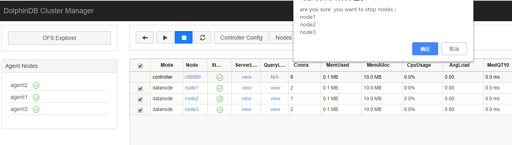

# 集群扩容

本教程讲述如何水平扩展一个 DolphinDB 集群，以增强其数据容量及计算能力。

## 基本方法

离线扩展数据节点的主要步骤如下：

* 在新服务器上部署 agent，并且配置好 agent.cfg
* 向 controller 注册新的 data node 信息和 agent 信息
* 重启集群内 controller 和所有 data node

在线扩展数据节点的主要步骤如下：

* 在新服务器上部署 agent，并且配置好 agent.cfg
* 向 controller 注册新的 data node 信息和 agent 信息
* 启动新节点

若仅对某数据节点存储空间进行扩展，例如增加磁盘卷，只需要修改节点配置文件，为指定节点 volumes 参数 增加路径。

## 扩展数据节点

本例中，我们将为已有集群增加一台新的物理服务器，并在其上增加一个新的数据节点。1.30.4 之前版本 DolphinDB 只支持离线方式扩展，需要重启集群 (详细步骤见[离线增加数据节点](#%E7%A6%BB%E7%BA%BF%E5%A2%9E%E5%8A%A0%E6%95%B0%E6%8D%AE%E8%8A%82%E7%82%B9))，1.30.4 版本新增动态方式扩展数据节点，无需重启集群 (详细步骤见[在线增加数据节点](#%E5%9C%A8%E7%BA%BF%E5%A2%9E%E5%8A%A0%E6%95%B0%E6%8D%AE%E8%8A%82%E7%82%B9))。

原集群的配置情况为：服务器 4 台，操作系统均为 ubuntu 16.04，部署了 DolphinDB 1.30.4 版本。

```
172.18.0.10 : controller
172.18.0.11 : datanode1
172.18.0.12 : datanode2
172.18.0.13 : datanode3
```

具体的配置文件如下：

controller.cfg

```
localSite=172.18.0.10:8990:ctl8990
```

cluster.nodes

```
localSite,mode
172.18.0.11:8701:agent1,agent
172.18.0.12:8701:agent2,agent
172.18.0.13:8701:agent3,agent
172.18.0.11:8801:node1,datanode
172.18.0.12:8802:node2,datanode
172.18.0.13:8803:node3,datanode
```

启动 controller 脚本：

```
nohup ./dolphindb -console 0 -mode controller -script dolphindb.dos -config config/controller.cfg -logFile log/controller.log -nodesFile config/cluster.nodes &
```

启动 agent 脚本：

```
./dolphindb -mode agent -home data -script dolphindb.dos -config config/agent.cfg -logFile log/agent.log
```

为了在扩展集群工作完成之后验证效果，在集群内创建一个分布式数据库，并写入初始数据：

```
data = table(1..1000 as id,rand(`A`B`C,1000) as name)
//分区时预留了1000的余量，预备后续写入测试用
db = database("dfs://scaleout_test_db",RANGE,cutPoints(1..2000,10))
tb = db.createPartitionedTable(data,"scaleoutTB",`id)
tb.append!(data)
```

执行完后点击集群 web 管理界面的 DFS Explorer 按钮，查看生成的数据分布情况。


在后续完成集群扩展之后，我们会向此数据库中追加数据，来验证拓展部分是否已经启用。

**注意**：需要了解集群初始化配置可以参考 [多物理机上部署集群教程](multi_machine_cluster_deployment.md)。

需要新增的物理机 IP：

```
172.18.0.14
```

新增的节点信息：

```
172.18.0.14:8804:datanode4
```

### 离线增加数据节点

#### 配置 agent

原服务器上的 agent 部署在/home/<DolphinDBRoot>目录下，将该目录下文件拷贝到新机器的/home/<DolphinDBRoot>目录，并对/home/<DolphinDBRoot>/config/agent.cfg 做如下修改：

```
//指定新的agent node的IP和端口号
localSite=172.18.0.14:8701:agent4

//controller信息
controllerSite=172.18.0.10:8990:ctl8990

mode=agent
```

#### 配置 controller

修改节点清单配置 cluster.nodes，配置新增加的 data node 和 agent node:

```
localSite,mode
172.18.0.11:8701:agent1,agent
172.18.0.12:8701:agent2,agent
172.18.0.13:8701:agent3,agent
172.18.0.11:8801:node1,datanode
172.18.0.12:8802:node2,datanode
172.18.0.13:8803:node3,datanode
//新增agent和data node
172.18.0.14:8704:agent4,agent
172.18.0.14:8804:node4,datanode
```

#### 重启集群

集群扩展数据节点必须重启整个集群，包括集群 controller 和所有的 data node。

* 访问集群 web 管理界面 `http://172.18.0.10:8990` ，关闭所有的数据节点。



* 在 172.18.0.10 服务器上执行 `pkill -9 dolphindb`以关闭 controller。。
* 重新启动 controller。
* 回到 web 管理界面，可以看到已经新增了一个 agent4，在 web 界面上启动所有数据节点。


至此我们已经完成了离线方式新节点的增加。

### 在线增加数据节点

服务器配置文件的修改同前述离线增加数据节点相关章节，修改完 agent.cfg 以及 cluster.nodes，启动该服务器上的 agent 节点，然后通过 web 或 GUI 连接集群的控制节点并执行以下代码：

```
addAgentToController("172.18.0.14",8704,"agent4");
addNode("172.18.0.14",8804,"node4");
```

回到 web 管理界面，可以看到已经新增了一个 agent4 并且是未启动状态，再在 web 界面上启动所有数据节点。

至此我们已经完成了在线方式新节点的增加。

### 验证

下面我们通过向集群写入一些数据来验证 node4 是否已经在集群中启用。

```
tb = database("dfs://scaleout_test_db").loadTable("scaleoutTB")
tb.append!(table(1001..2000 as id,rand(`A`B`C,1000) as name))
```

点击 DFS Explorer 并打开 scaleout\_test\_db，可以看到数据已经分布到新添加的 node4 节点上。


### 扩展数据节点后的数据分布机制

在流行的 MPP 架构的集群中，添加节点后因为 hash 值变了，必须要对一部分数据 resharding，而通常对海量数据做 resharding 需要很长时间。DolphinDB 的数据存储基于底层分布式文件系统，通过元数据进行数据副本的管理，所以扩展了节点之后，不需要对原有的数据进行 resharding，新增的数据会保存到新的数据节点去。通过 resharding 可以让数据分布更加均匀，DolphinDB 正在开发这样的工具。

## 扩展存储

本例中沿用上例中的原有集群。由于 node3 所在服务器本身的磁盘空间不足，为 node3 扩展了一块磁盘，路径为/dev/disk2。

### 步骤

DolphinDB 的节点存储可以通过配置参数 volumes 来配置，默认的存储路径为`<HomeDir>/<Data Node Alias>/storage`，本例中为`/home/server/data/node3/storage`目录。

**注意**：若从默认路径增加磁盘，那么在设置 volumes 参数时，必须要将原默认路径显式设置，否则会导致默认路径下元数据丢失。

默认的 volumes 参数值如下，如果 cluster.cfg 中没有这一行，需要手工添加。

cluster.cfg

```
node3.volumes=/home/server/data/node3/storage
```

要增加新的磁盘路径`/dev/disk2/node3`到 node3 节点，只要将路径添加到上述配置后，用逗号分隔即可。

cluster.cfg

```
node3.volumes=/home/server/data/node3/storage,/dev/disk2/node3
```

修改配置文件后，在 controller 上执行`loadClusterNodesConfigs()`使得 controller 重新载入节点配置。如果上述步骤在集群管理 web 界面上完成，这个重载过程会自动完成，无需手工执行`loadClusterNodesConfigs()`。配置完成后无需重启 controller，只要在 web 界面上重启 node3 节点即可使新配置生效。

**注意**：如果希望 node3 暂不重启，但是新的存储马上生效，可以在 node3 上执行 addVolumes("/dev/disk2/node3") 函数动态添加 volumes，此函数的效果并不会持久化，重启后会被新配置覆盖。

### 验证

配置完成后，使用下面的语句向集群写入新数据，查看数据是否被写入新的磁盘卷。

```
tb = database("dfs://scaleout_test_db").loadTable("scaleoutTB")
tb.append!(table(1501..2000 as id,rand(`A`B`C,500) as name))
```

数据已被写入：


## 常见问题

* 在验证节点的数据写入分布情况时 , 从 dfs explorer 里经常会发现 site 信息有时候会发生变化，比如原来保存在 node3 的数据迁移到其他节点了？

这个问题涉及到 DolphinDB 的 Recovery 机制：DolphinDB 的集群支持数据自动 Recovery 机制，当侦测到集群内部分节点长时间没有心跳时 (判定宕机)，将会从其他副本中自动恢复数据并且保持整个集群的副本数稳定，这也是当某个节点长时间未启动，系统后台会发生数据迁移的原因。需要注意的是，这个数据稳定的前提是宕掉的节点数少于系统设置的数据副本数。这个机制涉及到的配置项及默认值如下：

controller.cfg

```
//集群内每个数据副本数，默认2
dfsReplicationFactor=2
//副本安全策略，0 多个副本允许存在一个节点 1 多个副本必须分存到不同节点,默认0
dfsReplicaReliabilityLevel=1
//节点心跳停止多久开启Recovery,默认不启用，单位ms
dfsRecoveryWaitTime=30000
```

这 3 个参数对于系统的数据稳定性非常重要。

dfsRecoveryWaitTime 控制 recovery 的启动，默认不设置即关闭 recovery 功能。这个等待时间的设置主要是为了避免一些计划内的停机维护导致不必要的 recovery，需要用户根据运维的实际情况来设置。

从稳定性上来讲，副本数越多数据越不容易因意外丢失，但是副本数过多也会导致系统保存数据时性能低下，所以 dfsReplicationFactor 的值不建议低于 2，但是具体设置多高需要用户根据整体集群的节点数、数据稳定性需求、系统写入性能需求来综合考虑。

dfsReplicaReliabilityLevel 这个设置在生产环境下建议设置为 1，0 只建议作为学习或者测试环境下使用。

