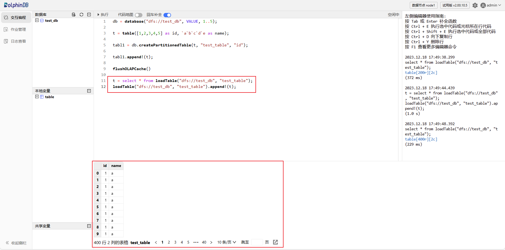

# 在服务器一上面执行如下命令
scp -r /home/dolphindb_1 root@172.0.0.4:/home/dolphindb_4
scp -r /home/dolphindb_1 root@172.0.0.5:/home/dolphindb_5
```

**第三步**：在服务器一（172.0.0.1）、服务器二（172.0.0.2）和服务器三（172.0.0.3）上面的 server/clusterDemo/config 下面执行如下命令来修改所有涉及 controller 集群信息的配置文件以及在 *cluster.nodes* 添加新增的两个 controller

```
sed -i '/^sites/s/$/,172.0.0.4:9912:controller4:controller,172.0.0.5:9913:controller5:controller/' agent.cfg

echo 172.0.0.4:9912:controller4,controller >> cluster.nodes
echo 172.0.0.5:9913:controller5,controller >> cluster.nodes
```

**注意**：主要修改 *agent.cfg* 里面 controller 集群的信息，*cluster.nodes* 里面添加 controller4 和 controller5 的节点信息。

**第四步**：在服务器四（172.0.0.4）上面的 dolphindb\_4 的 server/clusterDemo/config 下面执行如下命令来修改所有涉及 controller 集群信息的配置文件以及在 *cluster.nodes* 添加新增的两个 controller

```
sed -i.bak -E -e 's/([0-9]+\.[0-9]+\.[0-9]+\.[0-9]+):([0-9]+):controller1/172.0.0.4:9912:controller4/' controller.cfg
sed -i.bak -E -e 's/([0-9]+\.[0-9]+\.[0-9]+\.[0-9]+):([0-9]+):agent1/172.0.0.4:9910:agent4/' agent.cfg
sed -i '/^sites/s/$/,172.0.0.4:9912:controller4:controller,172.0.0.5:9913:controller5:controller/' agent.cfg

echo 172.0.0.4:9912:controller4,controller >> cluster.nodes
echo 172.0.0.4:9913:controller5,controller >> cluster.nodes
```

**注意**：主要修改 *cluster.nodes* 里面添加 controller4 和 controller5 的节点信息，*controller.cfg* 里面当前节点的信息。服务器四和服务器五主要是用来扩展 controller，所以服务器四和服务器五上面的 *agent.cfg* 可以不修改。

**第五步**：在服务器五（172.0.0.5）上面的 dolphindb\_5 的 server/clusterDemo/config 下面执行如下命令来修改所有涉及 controller 集群信息的配置文件以及在 *cluster.nodes* 添加新增的两个 controller

```
sed -i.bak -E -e 's/([0-9]+\.[0-9]+\.[0-9]+\.[0-9]+):([0-9]+):controller1/172.0.0.5:9913:controller5/' controller.cfg
sed -i.bak -E -e 's/([0-9]+\.[0-9]+\.[0-9]+\.[0-9]+):([0-9]+):agent1/172.0.0.5:9911:agent5/' agent.cfg
sed -i '/^sites/s/$/,172.0.0.4:9912:controller4:controller,172.0.0.5:9913:controller5:controller/' agent.cfg

echo 172.0.0.4:9912:controller4,controller >> cluster.nodes
echo 172.0.0.5:9913:controller5,controller >> cluster.nodes
```

**第六步**：在集群的每台机器的 dolphindb 安装包下面的 server/clusterDemo 下面执行如下命令启动 controller

```
sh startController.sh
```

**第七步**：在服务器一（172.0.0.1）、服务器二（172.0.0.2）和服务器三（172.0.0.3）的 dolphindb 安装包下面的 server/clusterDemo 下面执行如下命令启动 agent

```
sh startAgent.sh
```

**第八步**：在浏览器输入 https://172.0.0.1:9901 进入 controller 的 web 页面，然后启动所有的 data node 即可


**注意**：172.0.0.1:9901 不一定是 controller 的 leader 连接信息，登录该节点会显示 leader 节点是哪一个，点击跳转即可。

**第九步**：登录 data node 查询之前建立的库表信息



集群能够正常对外提供服务。

## 常见问题解答（FAQ）

### 什么情况下需要迁移 controller 的元数据？

升级之前的集群是 controller 伪高可用，即有两个或两个以上的 controller 运行在同一台服务器，在这种情况下升级需要迁移相关元数据信息。

### 低于三台服务器如何搭建高可用集群？

高可用集群要求 controller 是奇数，如果服务器数量低于 3 台，那么建议在单台机器运行多个 controller，使 controller 的服务数为奇数。

### 网页无法访问集群？

首先检查集群是否正常启动，在集群内部能否正常访问服务。其次检查防火墙，因为 web 客户端很可能与集群不在同一网络，检查相关端口是否开放。

### controller 和 agent 服务运行后，data node 无法启动，报出 agent 不存在的错误信息？

首先检查 *agent.cfg* 的配置文件，确保 agent 的配置没有问题。如果仍然启动不了，接下来排查 *cluster.nodes* 里面各个节点的 IP 配置是否正确。

### 迁移数据时应该注意什么？

迁移前后的路径应该保持一致，即从根路径到文件的绝对路径保持一致。

### 如何部署 DolphinDB，避免频繁迁移？

* **详细的规划和设计**： 在部署 DolphinDB 之前，确保对系统的需求和使用场景进行详细规划和设计。理解数据量、并发访问、性能需求等方面的特点，以便选择合适的部署和配置选项。
* **监控和警报系统**： 部署监控和警报系统，对关键指标进行实时监控，以及时发现并解决潜在的问题。监控系统可以帮助你在问题发生之前采取预防措施。
* **合理的容量规划**： 根据数据增长和用户需求进行合理的容量规划。确保系统在未来有足够的扩展能力，避免因为容量不足而导致的迁移。

## 附件

[DolphinDB如何将高可用服务切换到高可用服务相关配置文件.zip](script/service_deployment_and_migration.zip)

