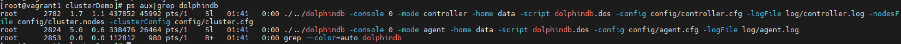
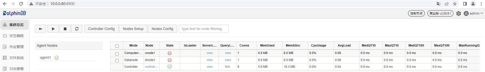
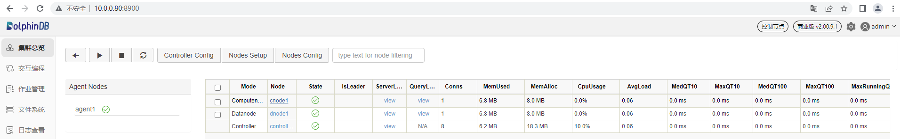
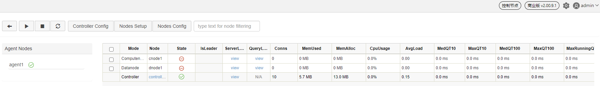
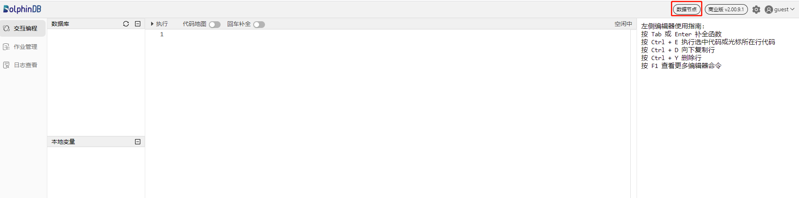
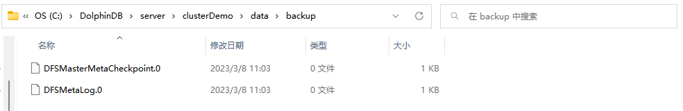
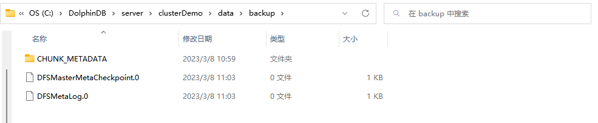

# 单服务器集群部署与升级

DolphinDB 集群包括四种类型节点：控制节点（controller），代理节点（agent），数据节点（datanode）和计算节点（compute node）。

* **控制节点**：控制节点是 DolphinDB 集群的核心部分，负责收集代理节点和数据节点的心跳，监控每个节点的工作状态，管理分布式文件系统的元数据和事务日志。单服务器集群中只有一个控制节点。
* **代理节点**：代理节点负责执行控制节点发出的启动和关闭数据节点或计算节点的命令。在一个集群中，每台物理服务器有且仅有一个代理节点。
* **数据节点**：数据节点既可以存储数据，也可以用于数据的查询和计算。每台物理服务器可以配置多个数据节点。
* **计算节点**：计算节点承担数据节点查询和计算的相关职能，负责响应客户端的请求并返回结果，与数据节点共同实现存储资源和计算资源有效隔离。每台物理服务器可以配置零到多个计算节点。

  本教程用于单服务器集群的部署、升级、过期 License 升级，并对常见问题做出解答，便于用户快速上手 DolphinDB。包含以下主题：

## 在 Linux 操作系统部署 DolphinDB 单服务器集群

使用 DolphinDB 安装包默认集群配置文件，部署一个最简单的单服务器集群：1 个控制节点，1 个代理节点，1 个数据节点，1 个计算节点。

### 第一步：下载

* 官方下载地址：https://dolphindb.cn/product#downloads
* 也可以通过 Shell 指令下载。下载方式如下：

  ```
  wget https://www.dolphindb.cn/downloads/DolphinDB_Linux64_V${release}.zip -O dolphindb.zip
  ```

  其中，`${release}` 代表版本。例如：下载 2.00.11.3 版本的 Linux64 server，使用以下指令：

  ```
  wget https://www.dolphindb.cn/downloads/DolphinDB_Linux64_V2.00.11.3.zip -O dolphindb.zip
  ```

  如需下载 ABI 或 JIT 版本 server，则需要在版本号后以下划线连接 ABI 或 JIT。例如：下载 2.00.11.3 版本的 Linux64 ABI server, 使用以下指令：

  ```
  wget https://www.dolphindb.cn/downloads/DolphinDB_Linux64_V2.00.11.3_ABI.zip -O dolphindb.zip
  ```

  下载 2.00.11.3 版本的 Linux64 JIT 版本 server，使用以下指令：

  ```
  wget https://www.dolphindb.cn/downloads/DolphinDB_Linux64_V2.00.11.3_JIT.zip -O dolphindb.zip
  ```

  以此类推。
* 执行以下 Shell 指令解压安装包至指定路径(`/path/to/directory`)：

  ```
  unzip dolphindb.zip -d </path/to/directory>
  ```

  **注意**：安装路径的目录名中不能含有空格字符或中文字符，否则启动数据节点时会失败。

### 第二步：更新软件授权许可

如果用户拿到企业版试用授权许可，只需用其替换如下文件即可。

```
/DolphinDB/server/dolphindb.lic
```

如果用户没有申请企业版试用授权许可，可以直接使用程序包中的社区版试用授权许可。社区试用版指定 DolphinDB 单节点最大可用内存为 8 GB ，有效期为 20 年。

### 第三步：启动集群

进入 */DolphinDB/server* 目录，第一次启动时需要修改文件权限，执行以下 Shell 指令：

```
chmod +x dolphindb
```

进入 */DolphinDB/server/clusterDemo* 目录，启动控制节点和代理节点，启动顺序无要求。

* **启动控制节点**

  执行以下 Shell 指令启动控制节点：

  ```
  sh startController.sh
  ```
* **启动代理节点**

  运行以下 Shell 指令启动代理节点：

  ```
  sh startAgent.sh
  ```

  可以执行以下 Shell 指令，查看节点是否成功启动：

  ```
  ps aux|grep dolphindb
  ```

  返回如下信息说明控制节点和代理节点启动成功：

  
* **启动数据节点和计算节点**

  可以在 Web 管理界面启动或关闭数据节点和计算节点，以及修改集群的配置。在浏览器中输入部署服务器 IP 地址和控制节点部署端口号即可进入 Web 管理界面，教程中的部署服务器 IP 地址为 10.0.0.80，控制节点默认部署端口为 8900，所以访问地址为 10.0.0.80:8900 ，打开后的 Web 管理界面如下。以管理员身份（默认账号：admin ，默认密码：123456）登录 Web 管理界面后，用户可以通过勾选想要启动的数据节点和计算节点，再点击启动（关闭）按键即可启动（关闭）相应的数据节点和计算节点：

  

  刷新页面后可看到对应的数据节点和计算节点已启动，如下图所示：

  

  **注意**：如果浏览器与 DolphinDB 不是部署在同一台服务器，应事先关闭防火墙或者打开对应的部署端口，Web 管理界面才能正常打开。

### 第四步：连接数据节点创建数据库和分区表

数据节点既可以存储数据，也可以用于数据的查询和计算。接下来通过一个例子介绍如何在 DolphinDB 集群数据节点创建数据库并写入数据。首先，打开控制节点的 Web 管理界面，点击对应的数据节点打开其 Web 交互编程界面，如下图所示：


也可以在浏览器直接输入数据节点的 IP 地址和端口号进入数据节点的 Web 交互编程界面。

在数据节点的 Web 交互编程界面执行以下语句创建数据库和分区表：

```
  // 创建存储的数据库和分区表
  login("admin", "123456")
  dbName = "dfs://testDB"
  tbName = "testTB"
  if(existsDatabase(dbName)){
          dropDatabase(dbName)
  }
  db = database(dbName, VALUE, 2021.01.01..2021.12.31)
  colNames = `SecurityID`DateTime`PreClosePx`OpenPx`HighPx`LowPx`LastPx`Volume`Amount
  colTypes = [SYMBOL, DATETIME, DOUBLE, DOUBLE, DOUBLE, DOUBLE, DOUBLE, INT, DOUBLE]
  schemaTable = table(1:0, colNames, colTypes)
  db.createPartitionedTable(table=schemaTable, tableName=tbName, partitionColumns=`DateTime)
```

然后，执行以下语句模拟生成 5000 个股票 1 天的 1 分钟 K 线数据并写入上面创建的分区表：

```
  // 模拟数据并写入分区表
  n = 1210000
  randPrice = round(10+rand(1.0, 100), 2)
  randVolume = 100+rand(100, 100)
  SecurityID = lpad(string(take(0..4999, 5000)), 6, `0)
  DateTime = (2023.01.08T09:30:00 + take(0..120, 121)*60).join(2023.01.08T13:00:00 + take(0..120, 121)*60)
  PreClosePx = rand(randPrice, n)
  OpenPx = rand(randPrice, n)
  HighPx = rand(randPrice, n)
  LowPx = rand(randPrice, n)
  LastPx = rand(randPrice, n)
  Volume = int(rand(randVolume, n))
  Amount = round(LastPx*Volume, 2)
  tmp = cj(table(SecurityID), table(DateTime))
  t = tmp.join!(table(PreClosePx, OpenPx, HighPx, LowPx, LastPx, Volume, Amount))
  dbName = "dfs://testDB"
  tbName = "testTB"
  loadTable(dbName, tbName).append!(t)
```

可以在交互编程界面选中函数语句跳转至弹出的网页查看函数说明。


语句执行成功后可在交互编程界面的左边，**数据库**一栏查看已创建的库表及字段信息。


也可在**本地变量**一栏查看已创建的变量和表，展示了变量名、变量类型、变量维度大小、占用内存大小等信息，并且可以直接点击变量名进行变量预览。


### 第五步：连接计算节点进行查询和计算

计算节点主要用于数据的查询和计算。接下来通过一个例子介绍如何在计算节点对数据库内的分区表执行查询和计算。首先，打开控制节点的 Web 管理界面，点击对应的计算节点打开其 Web 交互编程界面，如下图所示：




也可以在浏览器直接输入计算节点的 IP 地址和端口号进入计算节点的 Web 交互编程界面。

在计算节点的 Web 交互编程界面执行以下语句加载分区表对象，此时只加载了分区表的元数据，并未加载分区表全量数据，所以响应时间非常快：

```
  // 加载分区表对象
  pt = loadTable("dfs://testDB", "testTB")
```

然后，执行以下语句查询股票表中每天包含的数据条数：

```
  // SQL 返回数据量少的时候，可以直接取回客户端展示
  select count(*) from pt group by date(DateTime) as Date
```

语句执行成功后，查询结果会在 Web 界面下方展示：


执行以下语句计算每支股票每天的 OHLC 值：

```
  // SQL 返回数据量较大时，可以赋值给变量，占用 server 端内存，客户端分页取回展示
  result = select first(LastPx) as Open, max(LastPx) as High, min(LastPx) as Low, last(LastPx) as Close from pt group by date(DateTime) as Date, SecurityID
```

在这里，把计算结果赋值给了 `result` 变量，这样就不会直接在客户端界面直接展示，减少客户端内存占用，用户可以通过点击**本地变量**栏目下的 `result` 变量进行分页展示查看：


## 在 Windows 操作系统部署 DolphinDB 单服务器集群

使用 DolphinDB 安装包默认集群配置文件，部署一个最简单的单服务器集群：1 个控制节点，1 个代理节点，1 个数据节点，1 个计算节点。

### 第一步：下载

官方下载地址：[http://www.dolphindb.cn/downloads.html](https://dolphindb.cn/product#downloads)

解压安装包，例如解压到如下目录：

```
C:\DolphinDB
```

**注意**：安装路径的目录名中不能含有空格字符或中文字符，否则启动数据节点时会失败。例如不要装到 Windows 系统的 *Program Files* 目录下。

### 第二步：更新软件授权许可

如果用户拿到企业版试用授权许可，只需用其替换如下文件即可。

```
C:\DolphinDB\server\dolphindb.lic
```

如果用户没有申请企业版试用授权许可，可以直接使用程序包中的社区版试用授权许可。社区试用版指定 DolphinDB 单节点最大可用内存为 8 GB，有效期为 20 年。

### 第三步：启动集群

* **前台启动控制节点和代理节点**

  进入 *C:\DolphinDB\server\clusterDemo* 目录，双击 *startController.bat* 启动控制节点，双击 *startAgent.bat* 启动代理节点。
* **后台启动控制节点和代理节点**

  进入 *C:\DolphinDB\server\clusterDemo* 目录，双击 *backgroundStartController.vbs* 启动控制节点，双击 *backgroundStartAgent.vbs* 启动代理节点。
* **启动数据节点和计算节点**

  可以在 Web 管理界面启动或关闭数据节点和计算节点，以及修改集群的配置。在浏览器中输入部署服务器 IP 地址和控制节点部署端口号即可进入 Web 管理界面，教程中的部署服务器 IP 地址为 10.0.0.80，控制节点默认部署端口为 8900，所以访问地址为 10.0.0.80:8900，打开后的 Web 管理界面如下。以管理员身份（默认账号：admin ，默认密码：123456）登录 Web 管理界面后，用户可以通过勾选想要启动的数据节点和计算节点，再点击启动（关闭）按键即可启动（关闭）相应的数据节点和计算节点：

  

  刷新页面后可看到对应的数据节点和计算节点已启动，如下图所示：

  

  **注意**：如果浏览器与 DolphinDB 不是部署在同一台服务器，应事先关闭防火墙或者打开对应的部署端口，Web 管理界面才能正常打开。

### 第四步：连接数据节点创建数据库和分区表

数据节点既可以存储数据，也可以用于数据的查询和计算。接下来通过一个例子介绍如何在 DolphinDB 集群数据节点创建数据库并写入数据。首先，打开控制节点的 Web 管理界面，点击对应的数据节点打开其 Web **交互编程**界面，如下图所示：




也可以在浏览器直接输入数据节点的 IP 地址和端口号进入数据节点的 Web 交互编程界面。

在数据节点的 Web 交互编程界面执行以下语句创建数据库和分区表：

```
  // 创建存储的数据库和分区表
  login("admin", "123456")
  dbName = "dfs://testDB"
  tbName = "testTB"
  if(existsDatabase(dbName)){
          dropDatabase(dbName)
  }
  db = database(dbName, VALUE, 2021.01.01..2021.12.31)
  colNames = `SecurityID`DateTime`PreClosePx`OpenPx`HighPx`LowPx`LastPx`Volume`Amount
  colTypes = [SYMBOL, DATETIME, DOUBLE, DOUBLE, DOUBLE, DOUBLE, DOUBLE, INT, DOUBLE]
  schemaTable = table(1:0, colNames, colTypes)
  db.createPartitionedTable(table=schemaTable, tableName=tbName, partitionColumns=`DateTime)
```

然后，执行以下语句模拟生成 5000 个股票 1天的 1 分钟 K 线数据并写入上面创建的分区表：

```
  // 模拟数据并写入分区表
  n = 1210000
  randPrice = round(10+rand(1.0, 100), 2)
  randVolume = 100+rand(100, 100)
  SecurityID = lpad(string(take(0..4999, 5000)), 6, `0)
  DateTime = (2023.01.08T09:30:00 + take(0..120, 121)*60).join(2023.01.08T13:00:00 + take(0..120, 121)*60)
  PreClosePx = rand(randPrice, n)
  OpenPx = rand(randPrice, n)
  HighPx = rand(randPrice, n)
  LowPx = rand(randPrice, n)
  LastPx = rand(randPrice, n)
  Volume = int(rand(randVolume, n))
  Amount = round(LastPx*Volume, 2)
  tmp = cj(table(SecurityID), table(DateTime))
  t = tmp.join!(table(PreClosePx, OpenPx, HighPx, LowPx, LastPx, Volume, Amount))
  dbName = "dfs://testDB"
  tbName = "testTB"
  loadTable(dbName, tbName).append!(t)
```

可以在交互编程界面选中函数语句跳转至弹出的网页查看函数说明。


语句执行成功后可在交互编程界面的左边，**数据库**一栏查看已创建的库表及字段信息。


也可在**本地变量**一栏查看已创建的变量和表，展示了变量名、变量类型、变量维度大小、占用内存大小等信息，并且可以直接点击变量名进行变量预览。


### 第五步：连接计算节点查询和计算

计算节点主要用于数据的查询和计算。接下来通过一个例子介绍如何在计算节点对数据库内的分区表执行查询和计算。首先，打开控制节点的 Web 管理界面，点击对应的计算节点打开其 Web **交互编程** 界面，如下图所示：


也可以在浏览器直接输入计算节点的 IP 地址和端口号进入计算节点的 Web 交互编程界面。

在计算节点的 Web 交互编程界面执行以下语句加载分区表对象，此时只加载了分区表的元数据，并未加载分区表全量数据，所以响应时间非常快：

```
  // 加载分区表对象
  pt = loadTable("dfs://testDB", "testTB")
```

然后，执行以下语句查询股票表中每天包含的数据条数：

```
  // SQL 返回数据量少的时候，可以直接取回客户端展示
  select count(*) from pt group by date(DateTime) as Date
```

语句执行成功后，查询结果会在 Web 界面下方展示：


执行以下语句计算每支股票每天的 OHLC 值：

```
  // SQL 返回数据量较大时，可以赋值给变量，占用 server 端内存，客户端分页取回展示
  result = select first(LastPx) as Open, max(LastPx) as High, min(LastPx) as Low, last(LastPx) as Close from pt group by date(DateTime) as Date, SecurityID
```

在这里，将计算结果赋值给了 `result` 变量，这样就不会直接在客户端界面直接展示，减少客户端内存占用，用户可以通过点击**本地变量**栏目下的 `result` 变量进行分页展示查看：


## 集群升级

### Linux 集群升级

**第一步：正常关闭集群所有节点**

进入 */DolphinDB/server/clusterDemo* 目录执行以下 Shell 指令：

```
  ./stopAllNode.sh
```

**第二步：备份旧版本的元数据文件**

单服务器集群只有写入过数据才会创建相应的元数据文件，如果集群没有数据写入行为则可直接跳过此步骤进行升级。

* 备份控制节点元数据

  控制节点元数据默认存储在服务器的 */DolphinDB/server/clusterDemo/data* 目录下的 *DFSMetaLog.0* 文件，如果数据量超过一定的大小则还会生成 *DFSMasterMetaCheckpoint.0* 文件。本教程示例集群的控制节点元数据的默认存储目录：

  ```
  /DolphinDB/server/clusterDemo/data
  ```

  可进入 */DolphinDB/server/clusterDemo/data* 目录执行以下 Shell 指令进行备份：

  ```
  mkdir backup
  cp -r DFSMetaLog.0 backup
  cp -r DFSMasterMetaCheckpoint.0 backup
  ```
* 备份数据节点元数据

  数据节点的元数据默认存储在控制节点服务器的 */DolphinDB/server/clusterDemo/data/数据节点别名/storage/CHUNK\_METADATA* 目录下，本教程示例集群的数据节点元数据的默认存储目录：

  ```
  /DolphinDB/server/clusterDemo/data/dnode1/storage/CHUNK_METADATA
  ```

  可进入上述目录执行以下 Shell 指令备份到上面创建的 *backup* 文件夹：

  ```
  cp -r CHUNK_METADATA ../../backup
  ```

  **注意**：元数据文件可能通过配置文件指定存储在其它目录，如果在默认路径没有找到上述文件，可以通过查询配置文件中的 *dfsMetaDir* 参数和 *chunkMetaDir* 参数确认元数据文件的存储目录。若配置中未指定 *dfsMetaDir* 参数和 *chunkMetaDir* 参数，但是配置了 *volumes* 参数，*CHUNK\_METADATA* 目录在相应的 *volumes* 参数指定的目录下。

**第三步：升级**

当 server 在线升级到某个版本后，使用的插件也应升级到与此对应的版本。

* 在线升级

  进入 */DolphinDB/server/clusterDemo* 目录执行以下 Shell 指令：

  ```
  ./upgrade.sh
  ```

  运行后将会出现如下提示：

  

  输入 y 并点击回车后会出现如下提示：

  

  输入 1 选择在线更新，并点击回车后会出现如下提示：

  

  输入所需更新的版本号再点击回车即可，以更新至 2.00.9.1 版本为例，输入 2.00.9.1 后点击回车，出现如下界面则表示升级成功：

  
* 离线升级

  下载升级所需版本的安装包，官方下载地址：[http://www.dolphindb.cn/downloads.html](https://gitee.com/link?target=http%3A%2F%2Fwww.dolphindb.cn%2Fdownloads.md)

  将下载好的安装包上传至 */DolphinDB/server/clusterDemo* 目录下，以更新至 2.00.9.1 版本为例：

  

  进入 */DolphinDB/server/clusterDemo* 目录执行以下 Shell 指令：

  ```
  ./upgrade.sh
  ```

  运行后将会出现如下提示：

  

  输入 y 并点击回车后会出现如下提示：

  

  输入 2 选择离线更新，并点击回车后会出现如下提示：

  

  输入所需更新的版本号再点击回车即可，以更新至 2.00.9.1 版本为例，输入 2.00.9.1 后点击回车，出现如下界面则表示升级成功：

  

  如所需更新的版本是 JIT 或 ABI 版本，则版本号应与安装包保持一致。例如，安装包名称是"DolphinDB\_Linux64\_V2.00.9.1\_JIT.zip"时，需要输入的版本号是"2.00.9.1\_JIT"。

**第四步：重新启动集群**

进入 */DolphinDB/server/clusterDemo* 目录，启动控制节点和代理节点，启动顺序无要求。

* **启动控制节点**

  执行以下 Shell 指令启动控制节点：

  ```
  sh startController.sh
  ```
* **启动代理节点**

  运行以下 Shell 指令启动代理节点：

  ```
  sh startAgent.sh
  ```

  成功启动后，打开控制节点 Web 管理界面，在交互编程界面执行以下代码，查看 DolphinDB 当前版本：

  ```
  version()
  ```

## Windows 集群升级

**第一步：正常关闭集群所有节点**

* 如果是前台运行，关闭前台程序窗口
* 如果是后台运行，打开 Windows 任务管理器，找到 DolphinDB 的后台进程并关闭

**第二步：备份旧版本的元数据文件**

单服务器集群只有写入过数据才会创建相应的元数据文件，如果集群没有数据写入行为则可直接跳过此步骤进行升级。

* 备份控制节点元数据

  控制节点元数据默认存储在服务器的 *C:\DolphinDB\server\clusterDemo\data* 目录下的 *DFSMetaLog.0* 文件，如果数据量超过一定的大小则还会生成 *DFSMasterMetaCheckpoint.0* 文件。本教程示例集群的控制节点元数据的默认存储目录：

  ```
  C:\DolphinDB\server\clusterDemo\data
  ```

  在该目录下创建文件夹 *backup*，然后把 *C:\DolphinDB\server\clusterDemo\data* 文件夹下的 *DFSMetaLog.0* 文件及 *DFSMasterMetaCheckpoint.0* 文件复制到上面创建的 *backup* 文件夹下，如下图所示：

  
* 备份数据节点元数据

  数据节点的元数据默认存储在服务器的 *C:\DolphinDB\server\clusterDemo\data\数据节点别名\storage\CHUNK\_METADATA* 目录下，本教程示例集群的数据节点元数据的默认存储目录：

  ```
  C:\DolphinDB\server\clusterDemo\data\dnode1\storage\CHUNK_METADATA
  ```

  把 *C:\DolphinDB\server\clusterDemo\data\dnode1\storage* 文件夹下的 *CHUNK\_METADATA* 文件夹复制到上面创建的 *backup* 文件夹下，如下图所示：

  

  **注意**：元数据文件可能通过配置文件指定存储在其它目录，如果在默认路径没有找到上述文件，可以通过查询配置文件中的 *dfsMetaDir* 参数和 *chunkMetaDir* 参数确认元数据文件的存储目录。若配置中未指定 *dfsMetaDir* 参数和 *chunkMetaDir* 参数，但是配置了 *volumes* 参数，*CHUNK\_METADATA* 目录在相应的 *volumes* 参数指定的目录下。

**第三步：升级**

* 下载所需升级版本的安装包，官方下载地址：[http://www.dolphindb.cn/downloads.html](https://gitee.com/link?target=http%3A%2F%2Fwww.dolphindb.cn%2Fdownloads.md)
* 将新版本 *server* 目录下除 *dolphindb.cfg*, *clusterDemo* 以及 *dolphindb.lic* 外的所有文件覆盖替换旧版文件

**注意**：当 server 升级到某个版本后，使用的插件也应升级到与此对应的版本。

**第四步：重新启动集群**

* **前台启动控制节点和代理节点**

  进入 *C:\DolphinDB\server\clusterDemo* 目录，双击 *startController.bat* 启动控制节点，双击 *startAgent.bat* 启动代理节点。
* **后台启动控制节点和代理节点**

  进入 *C:\DolphinDB\server\clusterDemo* 目录，双击 *backgroundStartController.vbs* 启动控制节点，双击 *backgroundStartAgent.vbs* 启动代理节点。

  成功启动后，打开控制节点 Web 管理界面，在交互编程界面执行以下代码，查看 DolphinDB 当前版本：

  ```
  version()
  ```

## 授权许可文件过期更新

在更新授权许可文件前，可以打开控制节点 Web 管理界面，在交互编程界面执行以下代码查看当前授权许可文件的到期时间：

```
use ops
getAllLicenses()
```


在更新授权许可文件后，可通过对比更新前后授权许可文件的到期时间确认是否更新成功。

### 第一步：替换授权许可文件

用新的授权许可文件 *dolphindb.lic* 替换老的授权许可文件。

Linux 环境授权许可文件位置：

```
/DolphinDB/server/dolphindb.lic
```

Windows 环境授权许可文件位置：

```
C:\DolphinDB\server\dolphindb.lic
```

### 第二步：更新授权许可文件

* 在线更新

  打开控制节点 Web 管理界面，在交互编程界面执行以下代码完成更新，代码成功运行会返回新授权许可证的到期时间：

  ```
  use ops
  updateAllLicenses()
  ```

  

  **注意**：在线更新有如下要求：

  + License 授权的客户名称必须与原来的 License 相同。
  + 授权的节点个数，内存大小，CPU 核个数不能比原来的小。
  + 该函数只在执行该函数的节点生效。因此在集群环境下，需要在所有控制节点，代理节点、计算节点和数据节点上运行该函数。
  + License 的类型必须是 commercial（付费）类型和 free 类型，如果是 trial（试用）类型不支持在线更新。
* 离线更新

  关闭 DolphinDB 集群的所有节点，然后重新启动集群，即可完成更新。

## 单服务器集群配置文件介绍

为了方便用户部署集群，DolphinDB 安装包内置了集群配置文件，默认配置可以启动一个最简单的单服务器集群： 1 个控制节点， 1 个代理节点， 1 个数据节点， 1 个计算节点。

Linux 环境集群配置文件位于 */DolphinDB/server/clusterDemo/config* 目录，Windows 环境集群配置文件位于 *C:\DolphinDB\server\clusterDemo\config* 目录。性能调优时往往需要手动修改集群配置文件，进行集群配置参数优化，单服务器集群配置文件主要包含：*controller.cfg* 配置文件、*agent.cfg* 配置文件、*cluster.nodes* 配置文件和 *cluster.cfg* 配置文件。

### 配置控制节点参数文件

执行以下 Shell 指令修改 *controller.cfg* 配置文件：

```
vim ./controller.cfg
```

```
  mode=controller
  localSite=localhost:8900:controller8900
  dfsReplicationFactor=1
  dfsReplicaReliabilityLevel=2
  dataSync=1
  workerNum=4
  maxConnections=512
  maxMemSize=8
  lanCluster=0
```

默认控制节点启动端口是 8900，可以通过修改 *localSite* 参数指定控制节点的 IP 地址、端口号和别名。

例如，IP 地址为 10.0.0.80，端口号为 8900，别名为 controller8900，则可配置为：

```
localSite=10.0.0.80:8900:controller8900
```

其余参数用户应结合自身服务器硬件配置进行合理参数调优。

### 配置代理节点参数文件

执行以下 Shell 指令修改 *agent.cfg* 配置文件：

```
vim ./agent.cfg
```

```
  mode=agent
  localSite=localhost:8901:agent1
  controllerSite=localhost:8900:controller8900
  workerNum=4
  maxMemSize=4
  lanCluster=0
```

*agent.cfg* 的 *controllerSite* 必须与 *controller.cfg* 中的 *localSite* 保持一致，因为代理节点使用 *agent.cfg* 中的 *controllerSite* 来寻找集群中的控制节点。若 *controller.cfg* 中的参数 *localSite* 有变化，即使只是控制节点别名有改变，*agent.cfg* 中的 *controllerSite* 都必须做相应的改变。默认代理节点启动端口是 8901，可以通过修改 *localSite* 参数指定代理节点的 IP 地址、端口号和别名。agent.cfg 中的 sites 配置当前代理节点和集群控制节点的信息，需要依次填写当前代理节点和控制节点的 IP 地址、端口号和别名，例如 `sites=10.0.0.80:8901:agent1:agent,10.0.0.80:8900:controller8900:controller`。只有设置了配置项 sites，才允许在代理节点登录。

例如， IP 地址为 10.0.0.80 ，端口号为 8901 ，别名为 agent1，则可配置为：

```
localSite=10.0.0.80:8901:agent1
```

其余参数用户应结合自身服务器硬件配置进行合理参数调优。

### 配置集群成员参数文件

执行以下 Shell 指令修改 *cluster.nodes* 配置文件：

```
vim ./cluster.nodes
```

```
  localSite,mode
  localhost:8901:agent1,agent
  localhost:8902:dnode1,datanode
  localhost:8903:cnode1,computenode
```

*cluster.nodes* 用于存放集群代理节点、数据节点和计算节点的信息。默认集群配置文件使用 1 个代理节点，1 个数据节点和1个计算节点，用户可以根据实际要求配置节点个数。该配置文件分为两列，第一例存放节点 IP 地址、端口号和节点别名，这三个信息由冒号分隔；第二列是说明节点类型，比如代理节点类型为 `agent` ，数据节点类型为 `datanode` ，计算节点类型为 `computenode` 。

**注意**：节点别名是大小写敏感的，而且在集群内必须是唯一的。

### 配置数据节点和计算节点参数文件

执行以下 Shell 指令修改 *cluster.cfg* 配置文件：

```
vim ./cluster.cfg
```

```
  maxMemSize=32
  maxConnections=512
  workerNum=4
  maxBatchJobWorker=4
  OLAPCacheEngineSize=2
  TSDBCacheEngineSize=1
  newValuePartitionPolicy=add
  maxPubConnections=64
  subExecutors=4
  lanCluster=0
  enableChunkGranularityConfig=true
```

*cluster.cfg* 的配置适用于集群中所有数据节点，用户应结合自身服务器硬件配置进行合理参数调优。

## 常见问题解答（FAQ）

### 端口被其它程序占用导致节点启动失败怎么办？

如果遇到无法启动 DolphinDB 节点的情况，建议打开 */DolphinDB/server/clusterDemo/log* 目录下对应节点的日志文件，若出现如下错误：

```
<ERROR> :Failed to bind the socket on port 8900 with error code 98
```

说明选用的端口被其他程序占用，导致 DolphinDB 节点无法正常启动，修改配置文件中的端口为其它空闲端口后即可正常启动。

### Web 管理界面无法访问怎么办？

DolphinDB 正常启动后，在浏览器输入正确的访问地址，但是 Web 管理界面无法正常打开，如下图所示：


出现上述问题的原因基本上都是因为浏览器与 DolphinDB 不是部署在同一台服务器，且部署 DolphinDB 的服务器开启了防火墙。可以通过关闭部署了 DolphinDB 的服务器的防火墙或者打开对应的部署端口，解决这个问题。

### Linux 升级失败如何版本回退？

如果升级以后，不能正常开启 DolphinDB 单服务器集群，可按以下方式回退到旧版本。

**第一步：恢复旧版本元数据文件**

在 */DolphinDB/server/clusterDemo/data* 目录执行以下 shell 指令恢复已备份的控制节点和数据节点元数据：

```
cp -r backup/DFSMetaLog.0 ./
cp -r backup/DFSMasterMetaCheckpoint.0 ./
cp -r backup/CHUNK_METADATA ./dnode1/storage
```

**第二步：恢复旧版本程序文件**

在官方下载旧版本程序包，把重新下载的旧版本 *server* 目录下除 *dolphindb.cfg* 、*clusterDemo* 以及 *dolphindb.lic* 外的所有文件覆盖替换升级失败的文件。

### Windows 升级失败如何版本回退？

如果升级以后，不能正常开启 DolphinDB 单服务器集群，可按以下方式回退到旧版本。

**第一步：恢复旧版本元数据文件**

把升级前备份在 *C:\DolphinDB\server\clusterDemo\data\backup* 目录下的 *DFSMetaLog.0* 和 *DFSMasterMetaCheckpoint.0* （若存在）文件复制替换 *C:\DolphinDB\server\clusterDemo\data* 目录下的 *DFSMetaLog.0 和 DFSMasterMetaCheckpoint.0* 文件。

把升级前备份在 *C:\DolphinDB\server\clusterDemo\data\backup* 目录下的 *CHUNK\_METADATA* 文件复制替换 *C:\DolphinDB\server\clusterDemo\data\dnode1\storage* 目录下的 *CHUNK\_METADATA* 文件。

**第二步：恢复旧版本程序文件**

在官方下载旧版本程序包，把重新下载的旧版本 *server* 目录下除 *dolphindb.cfg* 、*clusterDemo* 以及 *dolphindb.lic* 外的所有文件覆盖替换升级失败的文件。

### 在线更新授权文件失败怎么办？

在线更新授权文件需要满足[更新授权许可文件](#%E6%8E%88%E6%9D%83%E8%AE%B8%E5%8F%AF%E6%96%87%E4%BB%B6%E8%BF%87%E6%9C%9F%E6%9B%B4%E6%96%B0)中在线更新的要求。如果不满足其中的要求，可以通过离线方式进行更新，或前往DolphinDB官网申请企业版 License。

### 如何进行配置参数调优？

可以参考 DolphinDB 官方参数配置说明进行配置参数调优。

如果遇到性能问题，请添加微信号13306510479 或扫描下面二维码，客服会邀您进群，由 DolphinDB 技术支持工程师会解答您的问题。


