# 最优化函数 socp 的使用及转化案例

## 1. SOCP 问题的背景介绍

在金融量化领域，最优化函数能够根据最大化或最小化特定目标（如利润、收益、风险），有效解决各种复杂的决策问题，包括投资组合优化、风险管理以及资产和衍生品定价等。为了满足不同应用场景的需求，DolphinDB
提供了一系列最优化函数，包括 [linprog](../funcs/l/linprog.html)、[quadprog](../funcs/q/quadprog.html)、[qclp](../funcs/q/qclp.html)、[socp](../funcs/s/socp.html)，帮助用户将业务问题转化为数学规划模型，并利用合适的求解器寻求最优解或可行解，从而辅助做出更明智的决策。

其中，二阶锥规划（socp）函数在金融问题求解中展现了独特的优势，特别是在处理不确定性、非线性约束以及复杂的风险控制问题时。例如，在风险管理中，socp
可以处理方差、标准差等二次项约束；在投资组合优化中，它能够有效应对杠杆限制、市场约束和资本要求等复杂条件。此外，socp
在应对大规模数据问题时具有高效的求解能力，以确保快速找到全局最优解。本文将详细介绍 socp
函数的使用，并通过实际的投资组合优化案例，展示如何将实际问题转化为二阶锥规划形式进行求解。

## 2. SOCP 问题的数学模型

[socp](../funcs/s/socp.html) 函数用于求解二阶锥规划（SOCP, Second Order Cone
Programming）问题，其数学模型具有较强的通用性，有很广泛的适用场景。针对线性规划（LP）、二次规划（QP）、二次约束线性规划（QCLP）， DolphinDB
提供了对应的最优化求解函数来求解，除此之外，这些规划问题都可以转化成更一般的二阶锥规划问题，从而通过 socp
函数进行求解，具体的转换问题方式将在下一节详细介绍。为了更好地理解 socp 函数的各个参数以及如何将规划问题转换为二阶锥形式，接下来我们将简要介绍 SOCP
问题的数学模型，并通过数学模型说明 socp 函数适用的优化问题类型。

### 2.1 SOCP 问题的锥表述形式


其中 **K** 为锥，**s** 为松弛变量，其值在优化过程中会被确定。

**f** 是数值型向量，表示目标函数的系数向量。

**G** 是数值型矩阵，表示锥约束的系数矩阵。

**h** 是数值型向量，表示锥约束的右端向量。

**Aeq** 是数值型矩阵，表示等式约束的系数矩阵。

**beq** 是数值型向量，表示等式约束的右端向量。

Gx + s = h 包含了 SOCP 问题中所有的不等式约束条件，包括线性不等式以及二阶锥约束。[socp](../funcs/s/socp.html) 函数中的参数 l 表示线性不等式约束个数的维度的整数标量；q
表示各个二阶锥约束的维度大小的正数向量，形式为 [r0, r1,…, rN-1]。注意： q 中每个二阶锥维度要
+1，因为除了二阶锥不等式约束左边的二范数维度，还要加上右端的常数式子。所以最后 l+sum(q) 应该等于矩阵 G 的行数。 SOCP
问题的标准形式都可根据此规则转换为上述锥表述形式，从而通过 socp 函数求解。

### 2.2 SOCP 问题的标准形式


SOCP 问题的标准形式可以转化成上述的锥表述形式，从而确定 socp 函数中对应的参数 G, h,l, q
进行求解。下面将从数学原理的角度出发说明如何由该标准形式得到锥表述形式，以帮助读者更好地理解。

1. 重写二阶锥约束：将该问题中的二阶锥约束进行重写

   
2. 对约束进行整合，并引入约束变量 **s**

   

因此矩阵 **G** 以及向量 **h** 的形式分别为：

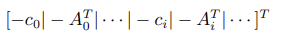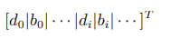

### 2.3 socp 函数适用的优化问题

从上述数学模型可以看出，SOCP 二阶锥问题是一种凸优化问题，其目标函数为线性函数，约束条件是线性约束和二阶锥约束的组合，符合上述模型的问题均可通过
DolphinDB 中的 socp
函数求解。另外，该问题具有一定的局限性，主要体现在非凸性以及非线性上，如非凸优化问题、整数规划问题、非线性规划问题、半定规划问题等，这些问题将无法通过 socp
函数求解。

## 3. 常见优化问题的二阶锥规划形式转换

在使用 SOCP（二阶锥规划）求解规划问题时，首先需要将原问题转换为 SOCP 的标准形式。这个过程依赖于二阶锥的几何特性及其与标准形式的对应关系，从而确定 socp
函数所需的参数。接下来我们将详细介绍如何将不同的目标函数和约束条件转化为二阶锥形式，包括线性规划问题、二次规划问题、二次约束规划问题，并提供相应问题形式的转化示例。

### 3.1 线性规划的二阶锥形式

线性规划问题为线性约束条件下的线性目标函数的最优化问题，可以直接通过 DolphinDB 中的 [linprog](../funcs/l/linprog.html)
或转换为二阶锥问题进行求解。原问题形式为：


上述数学模型中，对于线性不等式约束：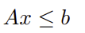

移项可得：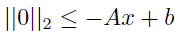

同理对于 x 上下界的约束：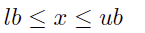

可以转化为：

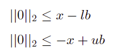

对应二阶锥的标准形式为：

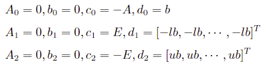

其中 E 是维度与 x 相同的单位矩阵。

因此得到二阶锥参数：

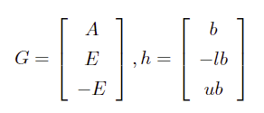

### 3.2 二次不等式约束的二阶锥形式

二次不等式约束问题为二次线性约束条件下的线性目标函数的最优化问题，可以直接通过 DolphinDB 中的 [qclp](../funcs/q/qclp.html?hl=qclp) 或转换为二阶锥问题进行求解。原问题形式为：


对于二次不等式约束：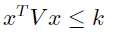

其中 V 为正定矩阵，k 为正标量。V 可以通过 cholesky 分解得到：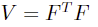

则原约束可转化为：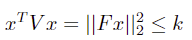

即可得到二阶锥的标准形式：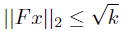

得到锥形式参数：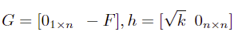

其中 n 为变量 x 的长度

### 3.3 绝对值约束的二阶锥形式

绝对值约束问题为线性约束条件下（包含绝对值约束）的线性目标函数的最优化问题。原问题形式为：

对于包含绝对值约束的线性规划：


其中 1 范数约束即为绝对值约束：

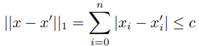

引入辅助变量：

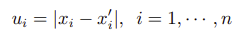

将原问题改写为关于 [xT, u1, ··· , un]T 的优化问题，即可转换为二阶锥规划的形式：

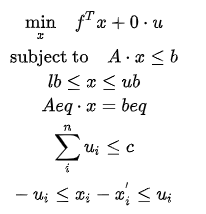

相对应的锥形式参数为：

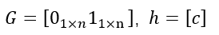

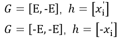

### 3.4 二次规划的二阶锥形式

二次规划问题为线性约束条件下的二次目标函数的最优化问题，可以直接通过 DolphinDB 中的 [quadprog](../funcs/q/quadprog.html) 或转换为二阶锥问题进行求解。原问题形式为：


对于目标函数中含有二次项的规划问题，引入辅助变量 y：

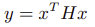

由于 H 为正定矩阵，可以通过 cholesky 分解得到：

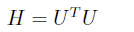

原问题改写为：

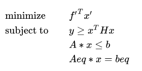

通过转化代入到问题二次约束中即可得到：

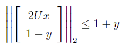

最终得到与原问题等价的规划问题：

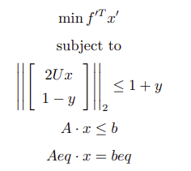

其中，

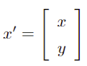

相对应的锥形式参数为：

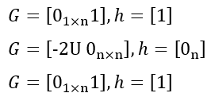

## 4. 应用场景示例

本节将通过两个经典的金融场景问题，详细介绍如何将具体的投资组合优化问题转换成二阶锥规划问题，并通过 socp 函数求最优解。

### 4.1 基于线性规划模型的股票投资组合优化问题

本案例将演示如何将包含多重权重约束条件的线性股票投资组合优化问题转换为二阶锥规划形式，并在确定相应参数后，通过 socp
函数进行求解，以实现期望收益率的最大化。

#### 4.1.1 建立数学规划模型

将上述问题转化为数学模型后，其目标函数（期望收益率最大化）为：

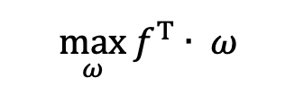

其中：

ω 为投资组合中各股票的目标的权重

ƒ 为投资组合中各股票的预期收益率

约束条件为：

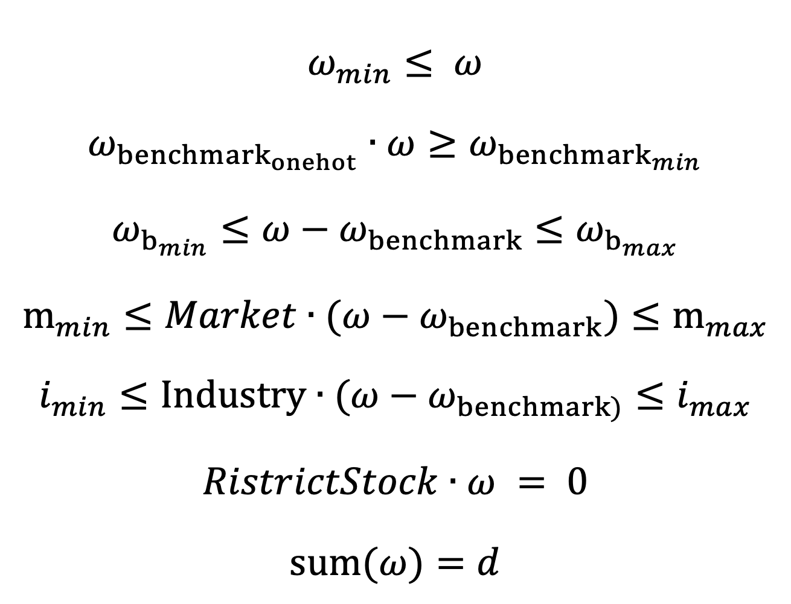

上述七项约束条件分别为：个股权重限制、成分股权重限制、成分股偏离限制、市值权重限制、行业权重限制、公司禁投股票限制以及目标个股权重限制。其中前六项约束条件均为线性不等式约束，可直接按照章节3.1
中的步骤进行转化，最后一个目标个股权重限制的约束则需通过 socp 中的 Aeq 和 beq 来实现。

#### 4.1.2 转换 socp 所需参数

DolphinDB 中 socp 函数的使用语法如下，接下来我们将按照该语法逐步转换并确定相关参数：

`socp(f, [G], [h], [l], [q], [A], [b])`

表示目标函数的系数向量 **f** ：由于 socp 标准形式中的目标函数为最小化，所以此处需要对原始预期收益率取负数。

```
f_1 = -f
```

表示锥约束的系数矩阵 **G**

```
unit_matrix = eye(vector_size)//vector_size为投资组合中股票数量
G = concatMatrix([-unit_matrix, -transpose(matrix(w_b_onehot))], false)  // 个股限制、成分股权重限制
G = concatMatrix([G, unit_matrix], false)  // 成分股偏离限制<最大值>
G = concatMatrix([G, -unit_matrix], false)  // 成分股偏离限制<最小值>
G = concatMatrix([G, transpose(matrix(market_vector))], false)  // 市值权重限制<最大值>
G = concatMatrix([G, -transpose(matrix(market_vector))], false)  // 市值权重限制<最小值>
G = concatMatrix([G, transpose(matrix(industry_matrix))], false)  // 行业权重限制<最大值>
G = concatMatrix([G, -transpose(matrix(industry_matrix))], false)  // 行业权重限制<最小值>
```

表示锥约束的右端向量 **h**

```
h = array(DOUBLE).append!(w_min)  // 个股限制
h.append!(-w_b_t_min)  // 成份股权重限制
cs_max_temp = w_b_max + w_b  // 成份股偏离限制<最大值>
h.append!(cs_max_temp)
cs_min_temp = -w_b_min - w_b  // 成份股偏离限制<最小值>
h.append!(cs_min_temp)
mk_max_temp = m_max + transpose(matrix(market_vector))**w_b // 市值权重限制<最大值>
h.append!(mk_max_temp[0])
mk_min_temp = -m_min - transpose(matrix(market_vector))**w_b  // 市值权重限制<最小值>
h.append!(mk_min_temp[0])
ind_max_temp = ind_max + transpose(matrix(industry_matrix))**w_b // 行业权重限制<最大值>
h.append!(ind_max_temp[0])
ind_min_temp = -ind_min - transpose(matrix(industry_matrix))**w_b  // 行业权重限制<最小值>
h.append!(ind_min_temp[0])
```

表示非负象限约束维度标量 **l：**本例中所有约束均为线性，所以 **l** 即为锥约束向量 **h** 的个数

```
l = h.size()
```

表示各个二阶锥约束维度大小的向量 **q：**本例中无二阶锥约束，因此可设置 **q** 为空向量

```
q = []
```

表示等式约束的系数矩阵 **Aeq** 以及表示等式约束的右端向量 **beq**

```
one_vector = matrix(DOUBLE, 1, vector_size, , 1)
Aeq = concatMatrix([one_vector, transpose(matrix(restrict_stock))], false)  // 目标个股权重限制、公司禁用股票限制

beq = array(DOUBLE).append!(d) // 目标个股权重限制
beq.append!(0)  // 公司禁用股票限制
```

#### 4.1.3 调用 socp 函数进行求解

```
res = socp(f_1, G, h, l, q, Aeq, beq)
```

### 4.2 包含换手率约束及平衡收益与风险的投资组合优化问题

本案例基于 MVO（均值-方差优化）
模型，通过优化投资组合来最大化收益并最小化风险。除了延续上一个案例的权重约束条件外，还引入了换手率以及跟踪误差的约束条件。

#### 4.2.1 建立数学规划模型

MVO
模型的基本目标是通过最大化预期收益和最小化风险来优化投资组合。在上一案例的约束条件基础上，添加换手率约束条件，可以在优化组合时，避免过度交易，以帮助管理交易成本。将该问题转化为数学模型后的目标函数为：

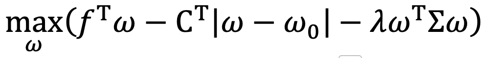

其中：

∑ 为收益率协方差矩阵

ω0 为上次持仓即上次的个股权重

CT 为换手成本系数

λ 为风险系数

约束条件为：

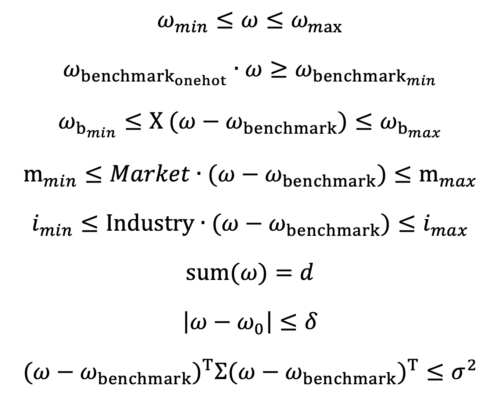

#### 4.2.2 对目标函数与约束条件进行二阶锥转换

基于上述数学模型，我们进一步将其转化为二阶锥规划的标准形式，方便后续函数参数的确定。首先对于目标函数中的二次项的规划问题，参考章节 2.4
的方法，我们可引入辅助变量 y，而针对带有绝对值的换手率规划问题，我们同样引入辅助变量 u：

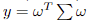

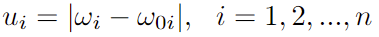

因此原目标函数可优化为：

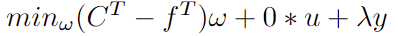

对于该问题的约束条件，其中前六项约束条件与上一案例类似，均为线性约束，此处不做重复赘述。

第七项约束为换手率约束，为一范数约束，即绝对值约束。 基于上述引入的辅助变量 u，原约束条件可转换为如下二阶锥规划的形式：

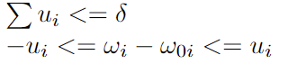

第八项约束条件为跟踪误差约束，即投资组合相对于基准波动率的限制条件，为二次不等式约束，可通过 cholesky 分解得到可以得到：

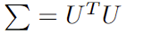

则原约束条件可以转化为如下二阶锥规划的形式（具体推导步骤可参考章节 2.2）：

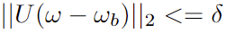

#### 4.2.3 转换 socp 所需参数

根据上述转化，下面我们将具体介绍 socp 函数各个参数生成转换的具体过程。

表示目标函数的系数向量 **f** ：上述二阶锥转换中我们引入了新的目标函数的求解变量

```
// minimize f^T * w + 0 * u + lamda*y 引入新的求解变量
c = f // w的系数
c.append!(take(0, N)) // 0 * u
c.append!(take(lamda, 1)) // lamda*y
```

表示锥约束的系数矩阵 **G**

```
E = eye(N)// N 为 w 的个数
zeros = matrix(DOUBLE, N, N, ,0)//为辅助变量u设置
//线型不等式约束
G = concatMatrix([E,zeros]) // w<=wmax
G = concatMatrix([G, concatMatrix([-E,zeros])], false) // -w <= -wmin
G = concatMatrix([G, concatMatrix([ -wb_one, matrix(DOUBLE,1,N,,0) ] ) ], false) // -w*wb_one <= -w_bmin
G = concatMatrix([G, concatMatrix([ X, matrix(DOUBLE,1,N,,0) ])], false) // Xw <= xn+Xwb 成分股偏离限制
G = concatMatrix([G, concatMatrix([-X, matrix(DOUBLE,1,N,,0)])], false) // -Xw <= -x1+Xwb
G = concatMatrix([G, concatMatrix([H, zeros ] ) ], false) // Hw <= hn+Hwb 市值权重限制
G = concatMatrix([G, concatMatrix([-H, zeros ])], false) // -Hw <= -h1+Hwb
G = concatMatrix([G, concatMatrix([F, matrix(DOUBLE,1,N,,0)])], false) // F<= fn+Fwb 行业权重限制
G = concatMatrix([G, concatMatrix([-F, matrix(DOUBLE,1,N,,0)])], false) // -Fw <= -f1+wb

//换手率约束
G = concatMatrix([G, concatMatrix([ matrix(DOUBLE,1,N,,0), matrix(DOUBLE,1,N,,1) ] ) ], false) // sum( u_i ) <= delta
G = concatMatrix([G, concatMatrix([E,-E])], false) // w_i -u_i <= w`_i
G = concatMatrix([G, concatMatrix([-E,-E])], false) // -w_i-u_i <= -w`_i
G = concatMatrix([G, concatMatrix([matrix(DOUBLE,1,N,,0), matrix(DOUBLE,1,N,,0)])], false)  // || Uw - Uwb ||2 <= delta   delta=0.5
G = concatMatrix([G, concatMatrix([-UT, Z]) ], false)  // UT为协方差矩阵经过cholesky分解得到

//一次性补充辅助变量y的系数
GZ = matrix(DOUBLE, G.shape()[0], 1, , 0)
G = concatMatrix([G, GZ])

//辅助变量y的二阶锥系数矩阵
GY = concatMatrix([ matrix(DOUBLE, 1, N, , 0) , matrix(DOUBLE, 1, N, , 0)   ])
G = concatMatrix([G, concatMatrix([GY, matrix([-1]) ] ) ], false)  // || [2Uw, -y] +[0 , 1]  ||2 <= y + 1   y
ZY = matrix(DOUBLE, U.shape()[0], N, , 0)
GY = concatMatrix([2*U, ZY ])
G = concatMatrix([G, concatMatrix([GY, matrix(DOUBLE, U.shape()[0], 1, , 0)  ])], false)  // || [2Uw, -y] +[0 , 1]  ||2 <= y + 1   2U
GY = concatMatrix([matrix(DOUBLE,1,N,,0), matrix(DOUBLE,1,N,,0)])
G = concatMatrix([G, concatMatrix([GY, matrix([1])  ] ) ], false)  // || [2Uw, -y] +[0 , 1]  ||2 <= y + 1   -y
```

表示锥约束的右端向量 **h** 以及表示非负象限约束维度标量 **l**

```
h = array(DOUBLE).append!(take(w_max, N)) // w<=w_max
h.append!(take(-wmin, N)) // -w <= -w_min
h.append!(-w_bmin) // -w*wb_one <= -w_bmin
temp = -X[N-1]+X**wb
h.append!(temp[0]) // Xw <= X[0]+X*wb
temp = -X[0]+X**wb
h.append!(-temp[0]) // -Xw <= xn+Xwb
temp = -H[,N-1]+H**wb
temp = exec * from table(temp)
h.append!( temp ) // Hw <= hn+Hwb
temp = -H[,0]+H**wb
temp = exec * from table(temp)
h.append!(-temp) //  -Hw <= -h1+Hwb
temp = -F[N-1]+F**wb
h.append!(temp[0]) // F<= fn+Fwb
temp = -F[0]+F**wb
h.append!(-temp[0]) //  -Fw <= -f1+wb
h.append!(delta)
h.append!(w0)
h.append!(-w0)

l = h.size()

//以上部分为线性不等式约束的右端向量部分，下面部分为二次规划部分
h.append!(delta)
temp = exec * from table(U**wb)
h.append!(temp)
h.append!(take(1, 1)) //|| [2Uw, -y] +[0 , 1]  ||2 <= y + 1
h.append!(take(0, N)) //|| [2Uw, -y] +[0 , 1]  ||2 <= y + 1
h.append!(take(1, 1)) //|| [2Uw, -y] +[0 , 1]  ||2 <= y + 1
```

表示各个二阶锥约束维度大小的向量 **q**

```
q = [ U.shape()[0]+1, U.shape()[0]+1+1 ]
```

表示等式约束的系数矩阵 **Aeq** 以及表示等式约束的右端向量 **beq**

```
temp = concatMatrix([matrix(DOUBLE, 1, N, ,1), matrix(DOUBLE, 1, N, ,0)])
Aeq = concatMatrix([ temp , matrix(DOUBLE, 1, 1, ,0)])
beq = array(DOUBLE).append!(1)
```

#### 4.2.4 调用 socp 函数进行求解

```
res = socp(c, G, h, l, q, Aeq, beq)
```

## 5. 小结

socp 是 DolphinDB
最优化求解系列函数中应用最广泛的优化问题求解器。许多复杂的凸优化问题都可以通过转换为二阶锥规划（SOCP）来进行求解。由于二阶锥规划具备成熟且高效的求解算法，其在处理大规模优化问题时展现出优越的计算性能和极高的求解效率。

