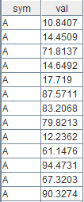
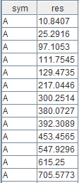

# 使用 DolphinDB Class 来开发流计算状态算子

## 前言

随着实时数据流处理需求的不断增长，高效、可扩展的流计算框架变得愈发重要。DolphinDB 作为一款高性能分布式时间序列数据库，不仅在数据存储和查询上表现出色，还通过引入面向对象编程（OOP）编程范式，使得开发者能够通过封装、继承、多态等特性，提升代码的灵活性、可维护性和复用性。本文通过两个实际应用案例，详细介绍如何利用 OOP 在 DolphinDB 中开发状态引擎算子，展示 OOP 在流计算中的应用。

## 1. 关于OOP

DolphinDB 从 3.00.0 版本开始支持面向对象编程。面向对象编程（OOP）是非常重要的编程范式，其通过封装、继承、多态等特性，提升代码的灵活性、可维护性和复用性，提升代码的模块化，实现低耦合高内聚。

在 DolphinDB 中，OOP 可应用于多种场景，例如：

* 用于开发流计算状态引擎中的状态算子。在未提供 OOP 时，某些状态算子的开发过程中需要使用复杂的高阶函数，不便于理解代码；某些状态算子需要通过状态函数插件进行开发，开发成本过高。而通过 OOP 编程自定义算子则可以使代码结构清晰，容易理解。
* 在复杂事件处理（CEP）引擎中，可以利用 OOP 定义事件和编写 Monitor。

本教程将主要介绍 OOP 在状态引擎中的应用。

## 2. DolphinDB OOP 编程概要

### 2.1 类的定义

类的定义格式如下：

```
class 类名 {
  属性1 :: 类型1
  属性2 :: 类型2
  // ...
  // 和类名同名的方法成为构造函数，有且只有一个
  def 类名(arg1, arg2 /*,...*/) {
    属性1 = arg1
    属性2 = arg2
    // ...
  }
  // 需要注意，成员变量和成员函数不能同名。
  def 方法(arg1, arg2 /*, ...*/) {
    // ...
  }
}
```

例如，我们要定义一个 Person 类，包含两个成员变量：name 和 age。其中，name 是字符串，age 是整数。该类还包含了一个构造函数和 name 成员变量的 getter/setter。

定义如下：

```
class Person {
  // 变量声明在方法声明之前
  name :: STRING
  age :: INT
  // 定义构造函数
  def Person(name_, age_) { // 参数名不能和属性名相同，否则会覆盖属性名
    name = name_
    age = age_
  }
  def setName(newName) {
    name = newName
  }
  def getName() {
    return name
  }
}
```

### 2.2 对象的使用

可以通过 `object.method()` 的形式调用对象的成员函数；通过 `object.member` 的形式访问对象的属性。需要注意，和 Python 等脚本语言不同，无法直接通过对 `object.member` 赋值修改成员变量。如果需要为成员变量赋值，需要创建并使用相应的 setter 方法进行赋值。

```
p = Person("Zhang San", 30)
print(p.getName())
// 调用对象的方法
p.setName("Li Si")
print(p.getName())
// 引用对象的属性
print(p.name)
p.name = "Wang Wu" // 报错：禁止对对象的属性直接赋值
```

### 2.3 对象属性类型标注

定义成员变量的格式为：`成员变量名 :: 类型标注`。

其中类型标注可以是：

* 标量：包括所有的基本类型，如 INT, DOUBLE, STRING，以及时间类型。
* 向量：如 DOUBLE VECTOR, STRING VECTOR 或者 Array Vector：INT[] VECTOR。
* 其他形式/类型不限：如果是其他类型（如字典、函数等），或者不希望限定变量类型，可以把类型标注写成 ANY。

例如：

```
a :: INT
b :: DOUBLE VECTOR
handler :: ANY
```

### 2.4 变量解析

方法中使用到的变量的解析顺序：

1. 方法参数
2. 对象属性
3. 共享变量

```
share table(1:0, `sym`val, [SYMBOL, INT]) as tbl
go
class Test2 {
  a :: INT
  b :: DOUBLE
  def Test2() {
    a = 1
    b = 2.0
  }
  def method(b) {
    print(b) // 解析为函数参数 b；如果需要访问成员变量 b，需要使用 self，见下一小节
    print(a) // 解析为对象属性 a
    print(tbl) // 解析为共享变量 tbl
    print(qwert) // 变量不存在，报错
  }
}
```

### 2.5 self 语法

通过 “self” 变量在类的方法中获取对象本身，其类似于 Python 中的 self，或者 Java、C++ 中的 this。

```
def doSomething(a) {
  // ...
}

class A{
	a :: INT
	b :: INT
	def A() {
		a = 1
		b = 2
	}
	def createCallback() {
		return doSomething{self}
	}
	def nameShadow(b) {
		print(b)
		print(self.b)
	}
}
a = A()
handler = a.createCallback()
a.nameShadow(3)
```

## 3. 应用案例

Reactive State Engine（RSE）是DolphinDB中的一个高性能、可扩展的计算框架，专门用于处理实时流数据。RSE 通过状态算子在数据流中捕捉并维护状态，从而实现增量计算和复杂事件处理。下面我们通过两个案例介绍一下如何利用 OOP 来开发状态引擎算子。

### 3.1 累计求和算子：MyCumSum

在状态引擎内部，`cumsum` 算子实现了累计求和的功能。这个功能在状态引擎内的实现非常简单，本节不展开说明，仅说明如何利用 OOP 重新实现该算子。

首先，定义一个类 `MyCumSum`，并将算子的状态定义为类的成员变量。

其次，在类中实现 `append` 方法，用于实现累计求和的功能。`append` 的参数是逐行输入的数据，返回的结果将作为计算结果输出。

最后，定义一个状态引擎，并指定 `MyCumSum.append()` 为引擎的算子。向引擎中输入数据，并查看计算结果。

代码如下：

```
class MyCumSum {
  sum :: DOUBLE
  def MyCumSum() {
    sum = 0.0
  }
  def append(value) {
    sum = sum + value
    return sum
  }
}

inputTable = table(1:0, `sym`val, [SYMBOL, DOUBLE])
result = table(1000:0, `sym`res, [SYMBOL, DOUBLE])

rse = createReactiveStateEngine(
          name="reactiveDemo",
          metrics = [<MyCumSum().append(val)>],
          dummyTable=inputTable,
          outputTable=result,
          keyColumn="sym")

data = table(take(`A, 100) as sym, rand(100.0, 100) as val)
rse.append!(data)

select * from data
select * from result
```

进行一次运行，随机生成出来的输入数据和对应输出为：


输入数据


输出数据

可以看到，我们编写的 OOP 算子实现了分组的累加求和，与状态引擎内置的 `cumsum` 算子的功能一致。

### 3.2 线性递归

在未提供 OOP 时，状态引擎计算线性递归时需要通过内置函数 `stateIterate` 实现。使用`stateIterate` 需要指定用于迭代计算的函数，迭代结果和 *X* 的关联系数，使用的输入数据列，以及初始化窗口的长度，并最终在指定的输出列中输出结果。`stateIterate` 的计算规则参考文档：[statelterate](https://docs.dolphindb.cn/zh/funcs/s/stateIterate)。实现代码如下：

```
trade = table(take("A", 6) join take("B", 6) as sym,  1..12 as val0,  take(10, 12) as val1)

inputTable = streamTable(1:0, `sym`val0`val1, [SYMBOL, INT, INT])
outputTable = table(100:0, `sym`factor, [STRING, DOUBLE])
engine = createReactiveStateEngine(
  name="rsTest",
  metrics=<[stateIterate(val0, val1, 3, msum{, 3}, [0.5, 0.5])]>,
  dummyTable=inputTable,
  outputTable=outputTable,
  keyColumn=["sym"],
  keepOrder=true)

engine.append!(trade)
select * from outputTable
```

上例中的 `stateIterate(val0, val1, 3, msum{, 3}, [0.5, 0.5])` 基于 `stateIterate` 的计算规则，实现了线性递归，但仅从这一行代码无法理解其中的计算规则，对用户的使用可能造成困扰。如果通过 OOP 改写此函数的实现逻辑，则代码结构会清晰很多：

```
trade = table(take("A", 6) join take("B", 6) as sym,  1..12 as val0,  take(10, 12) as val1)

inputTable = streamTable(1:0, `sym`val0`val1, [SYMBOL, INT, INT])
outputTable = table(100:0, `sym`factor, [STRING, DOUBLE])

class MyIterateOperator {
	movingWindow :: DOUBLE VECTOR
	k :: INT
	def	MyIterateOperator() {
		k = 0
		movingWindow = double([])
	}
	def append(X, initial) {
		if (k < 3) {
			k = k + 1
			movingWindow = movingWindow join initial
			return double(initial)
		}
		result = 0.5 * X + 0.5 * sum(movingWindow)
		movingWindow = movingWindow[1:] join result
		return double(result)
	}
}
engine2 = createReactiveStateEngine(
  name="rsTest2",
  metrics=<[MyIterateOperator().append(val0, val1)]>,
  dummyTable=inputTable,
  outputTable=outputTable,
  keyColumn=["sym"],
  keepOrder=true)

engine2.append!(trade)
select * from outputTable
```

可以看到，当窗口长度小于3时，算子直接返回init中的结果；当窗口长度大于等于3时，算子的append方法将长度为3的窗口中数据的和与X中的值做加权平均；最终实现了和 `stateIterate(val0, val1, 3, msum{, 3}, [0.5, 0.5])` 相同的功能。

虽然通过 OOP 实现线性递归的代码行数有所增加，但它结构清晰，提高了代码的可读性，同时简化了调试过程。

## 4. 小结和展望

通过本教程的两个应用案例，我们可以看到如何在 DolphinDB 中利用 OOP（面向对象编程）开发状态引擎算子。这种方式相比直接调用引擎提供的算子，具有可读性强、结构清晰的优点。在当前实现中，DolphinDB的 OOP 仍然采用解释执行的方式，相比原生 C++ 实现速度较慢。

目前，在响应式状态引擎中，一些有状态的高阶函数迭代算子和无状态的自定义函数算子已经可以通过即时编译（JIT）技术优化，用脚本编写的自定义函数算子的性能可以达到原生 C++ 实现的水平；但是，目前状态引擎中使用 OOP 编写的有状态的算子还没有支持 JIT 。未来，我们计划使用 JIT 技术进一步优化响应式状态引擎中的 OOP 的应用，直接将类中定义的有状态算子编译为机器码运行，以期望实现在当前较高的开发效率下也不会损失运行时的效率。

