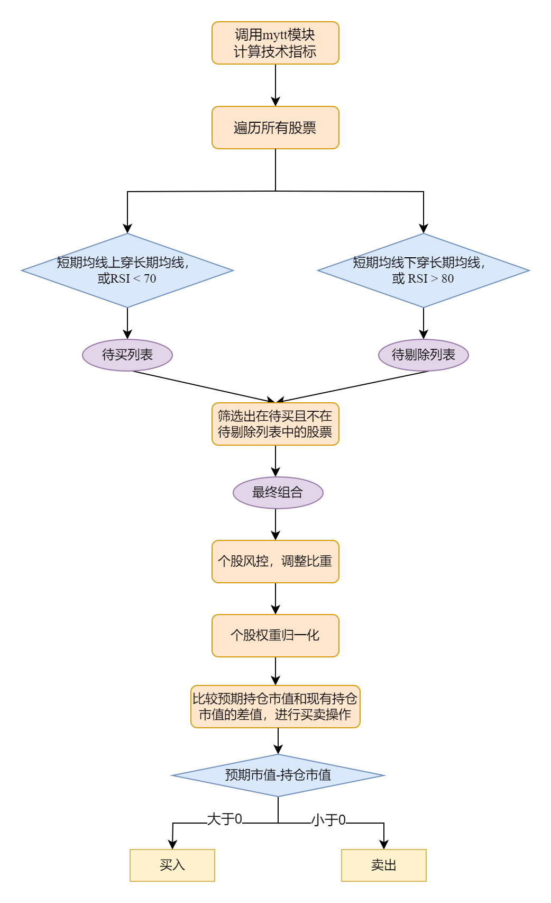
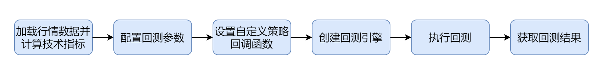
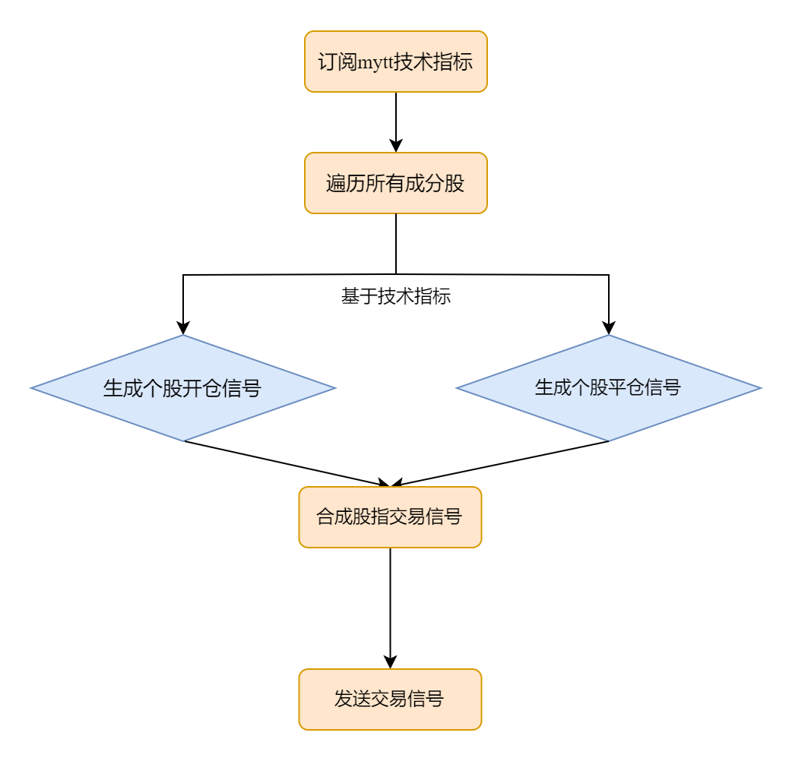

# 股票中低频投资组合回测案例实现

在量化交易中，中低频交易策略因其相对稳健的收益特性和较低的技术门槛，受到广大投资者的青睐。中低频策略通常基于日频或分钟级别的数据，通过分析市场趋势、估值指标、风险因子等，捕捉更长时间尺度上的投资机会。策略的核心在于设计一套科学有效的选股与仓位管理机制，从而实现收益最大化与风险控制。相比高频交易的短线博弈，中低频交易更关注策略在复杂市场条件下的适应性与风险控制，追求更高的资金利用效率和更稳定的回报。

在此背景下，本篇文档将以两个典型的中低频交易回测案例为核心内容：一个是基于指数信号的股票投资组合交易策略，另一个是基于成分股信号的股指期货交易策略。通过这些案例，我们将系统讲解如何利用
DolphinDB 的回测引擎构建策略框架、模拟交易过程并分析回测结果。

## 1. 背景介绍

本文将详细展示如何通过 DolphinDB 中低频回测引擎实现股票投资组合交易策略、股指期货交易策略。在展示如何使用 DolphinDB
脚本来编写案例策略之前，为使读者更好地理解，本章将简要介绍两种股票中低频策略。

### 1.1 基于指数信号的股票投资组合交易策略

近年来，金融市场的复杂性和不确定性显著增加，投资者面临着市场波动性增强、指数与个股联动性加剧以及多因子模型应用场景多样化的挑战。在此背景下，基于指数信号的股票投资组合交易策略应运而生，该策略通过结合指数信号的市场趋势分析和个股多因子筛选，旨在解决投资组合管理中仓位动态调整、个股筛选优化和风险控制的复杂难题。策略的核心逻辑分为选股、权重分配、整体持仓调整等主要步骤。

1. 选股：
   * 通过灵活配置的多因子模型和预设的买入、卖出条件筛选满足条件的投资组合。
2. 权重分配：
   * 根据个股的具体条件（如技术指标、风险因子等）分配预期权重。
3. 整体持仓调整：
   * 通过跟踪指数信号动态调整整体持仓，若实际持仓与预期持仓不一致，则立即执行买入或卖出操作，确保投资组合的结构始终符合预期。

### 1.2 基于成分股信号的股指期货交易策略

基于成分股信号的股指期货交易策略是一种通过分析指数成分股的信号来预测指数走势，并据此进行股指期货交易的策略。该策略的核心思想是利用成分股的微观信号来捕捉指数的宏观趋势，从而在股指期货市场上实现收益。策略的核心逻辑分为个股信号生成、成分股信号合成、指数信号决策、风险管理等主要步骤。

1. 个股信号生成：
   * 对指数成分股进行技术分析和基本面分析，生成个股信号。
   * 每个成分股的信号可以是买入、卖出或持有。
2. 指数信号合成：
   * 在每一分钟的时间截面上，通过等权、市值加权、流动性加权等合成方法，将所有成分股的信号进行加权合成，生成指数的综合信号。
3. 指数信号决策：
   * 根据合成的指数信号，决定是否买入或卖出股指期货。常见的决策规则包括：
     + 多头信号：当指数信号达到一定的买入阈值时，买入股指期货。
     + 空头信号：当指数信号达到一定的卖出阈值时，卖出股指期货。
     + 持有信号：当指数信号在买入和卖出阈值之间时，保持现有持仓。

## 2. 基于 DolphinDB 的股票中低频组合交易策略实现

在本章节中，我们将详细讲解如何利用 DolphinDB
内置脚本语言编写事件驱动函数，以实现股票中低频组合交易策略，内容包括策略逻辑介绍、策略实现过程、初始参数的配置、事件函数的定义等。

### 2.1 策略逻辑介绍

该策略通过结合技术指标信号和动态风控机制，进行股票投资组合的筛选与调整，以实现风险控制和收益优化。整体交易逻辑如图 2.1 所示。

图 1. 图2.1 股票中低频组合交易策略流程图



1. 计算技术指标：首先调用 mytt 模块计算所需技术指标，用于后续操作。mytt 模块的使用说明可参考文档 [MyTT 指标库](../modules/mytt/mytt.md)
2. 初始建仓标的选择：遍历所有股票，根据一系列趋势指标和动量指标，对股票进行评分和排序，筛选符合买入条件且不符合剔除条件的股票，作为最终投资组合。在本策略中，选取
   RSI （Relative Strength Index，相对强弱指数，后文简称为 RSI）、长短期均线交叉两个指标构建投资组合。
3. 个股风控：根据股票波动率和 RSI 进行个股风险控制，限制波动率超标的股票权重、限制单只股票的最大和最小持仓比例；当检测到 RSI
   信号小于70时，解除风控。
4. 个股权重归一化：将风控后确定的最终权重进行归一化，作为各种建仓各个标的的权重。
5. 仓位调整：根据各个股票的预期权重算出预期市值，和现有持仓市值进行比较，当预期市值大于持仓市值时，执行买入操作；当预期市值小于持仓市值时，执行卖出操作。

### 2.2 策略实现流程

使用 DolphinDB 股票中低频投资组合回测引擎进行回测流程如图 2.2 所示，包括 6 个步骤。本节将以通用案例为例，分别介绍如何使用 DolphinDB
股票中低频投资组合回测引擎实现以上两种回测模式。

图 2. 图 2.2 股票中低频组合交易策略实现流程



#### 2.2.1 加载行情数据并计算技术指标

首先在执行回测逻辑前采用 MyTT 模块预先计算如下指标，计算完毕后合并至分钟行数数据库表 *messageTable* 的
*signal*列 （完整脚本可参考附件 loadData1.dos）。

1. 计算个股的短期均线 *shortMA* 和长期均线 *longMA*
   用于判断趋势信号，通过均线交叉识别买入或卖出的时机。

   ```
   use mytt
   // 短期均线
   def getShortTermMA(close, period=5){
       return MA(close, period)
   }
   // 长期均线
   def getLongTermMA(close, period=20){
       return MA(close, period)
   }
   ```
2. 利用 `prev` 函数获取个股的前一期短期均线 *prevShortMA* 和长期均线
   *prevLongMA*，用于判断是否有均线交叉。

   ```
   update facTable set prevShortMA = prev(shortMA).bfill(),
                       prevLongMA = prev(longMA).bfill()
   ```
3. 计算个股的相对强弱指标*RSI*用于评估超买或超卖状态，帮助控制买卖时的市场情绪风险。

   ```
   use mytt
   def getRSI(close, N = 24){
       return RSI(close, N = 24) //直接调用mytt的 RSI 函数
   }
   ```
4. 计算个股的波动率 *volatility*
   用于衡量价格的波动幅度，提供风控依据以避免高风险资产对组合的不利影响。

   ```
   use mytt
   def getVolatility(close, period=10){
       returns = DIFF(close) / REF(close, 1)
       return STD(returns, period)
   }
   ```
5. 交易状态判断。自定义 `checkTradingStatus`
   函数，在发送个股交易信号前，先通过该函数判断个股交易状态是否异常，若存在停牌、涨跌停等异常情况，则不进行交易。

   ```
   def checkTradingStatus(
       open, high,
       low, volume,
       turnover, close,
       upLimitPrice, downLimitPrice
   ){
       // 检查是否停牌
       isHalted = (open==0 || high==0 || low==0 || volume==0 || turnover==0)

       // 检查是否涨跌停
       isPriceLimited = (close>=upLimitPrice || close<=downLimitPrice)

       // 返回交易状态
       return iif(isHalted || isPriceLimited, 0, 1)
   }
   ```

#### 2.2.2 配置回测参数

回测的开始与结束日期、初始资金、行情类型等均可以通过该参数进行配置。这些参数允许用户灵活地调整回测条件，以模拟不同的市场环境和交易策略的效果。具体的初始参数配置代码示例如下，其中详细回测参数配置要求可参考[引擎配置说明](../plugins/backtest/stock.md)文档。

```
config=dict(STRING,ANY) // 以字典形式存储回测参数
config["startDate"]= 2024.01.01 // 设置回测开始时间
config["endDate"]= 2024.12.31 // 设置回测结束时间

config["strategyGroup"] = "stock" // 选择回测模式，本案例中为股票模式
config["frequency"] = 0 // 指定逐笔数据合成快照的频率
config["cash"] = 10000000.        // 初始资金,1000万
config["commission"] = 0.0005  // 交易佣金
config["tax"] = 0.0      // 忽略税
config["dataType"] = 3 // 分钟频
config["matchingMode"] = 3 // 选择交易模式，本案例以委托价格成交
config["msgAsTable"] = false // 以字典形式传入行情数据

// 设置逻辑全局上下文
config["context"] = dict(STRING,ANY)
context = dict(STRING,ANY)
context["activeTime"] = 14:30m // 设置每天交易时间
context["maxPosition"] = 0.1 // 设置单只股票最大持仓比例
context["minPosition"] = 0.001 // 设置单只股票最小持仓比例
config["context"] = context
```

#### 2.2.3 设置自定义策略回调函数

**1. 设置辅助函数**

辅助函数主要用于支持 `onBar`函数中的核心逻辑实现，处理买卖单生成、每日持仓更新等功能。

* `getSellVolume`：计算卖出量，确保股数符合交易规则。

  ```
  def getSellVolume(price, value, position){
      // 若卖出=持仓,清仓;小于持仓,按照100的倍数卖出
      // 此处/代表整除
      vol = int(value/price)/100*100
      // 确保卖出的股数为100倍
      return int(iif(vol < position, vol , position))
  }
  ```
* `getBuyVolume`：计算买入量，确保符合不同股票交易规则（科创板需为 200 的倍数，其他为 100
  的倍数）。

  ```
  def getBuyVolume(symbol, price, value){
      // 若symbol以688开头,则需要是200的倍数;否则是100的倍数
      vol = int(value/price)
      return int(iif(symbol like "688%",vol/200*200, vol/100*100))
  }
  ```
* `executeSellOrders`：根据策略逻辑提交卖单。
  + 首先判断标的是否停牌或涨跌停，若均没有则可交易。
  + 其次调用 `Backtest::getPosition` 接口获取标的现有持仓量，从 msg
    行情字典提取标的收盘价，并从 `sellDeltaValueDict`
    提取标的现有持仓市值和预期市值的差异。
  + 根据现有持仓市值和预期市值的差异计算需要卖出的数量，并提交卖单执行卖平操作。

  ```
  def executeSellOrders(mutable context, msg, sellDeltaValueDict,
      sellSymbol, label="SellClose"){
      /* 卖出函数
      @Parameters
      ---------------------
      context: `DICT`
          回测上下文
      msg: `DICT`
          行情数据
      sellDeltaValueDict: `DICT`
          待卖出股票的持仓变化值
      sellSymbol: `STRING`
          待卖出股票代码
      label: `STRING`
          卖出订单标识，用于区分不同卖出场景
      */

      // 判断是否停牌或涨跌停，若满足条件则跳过
      &tradeFlag = checkTradingStatus(
          msg[sellSymbol]["open"],
          msg[sellSymbol]["high"],
          msg[sellSymbol]["low"],
          msg[sellSymbol]["volume"],
          msg[sellSymbol]["signal"][0],
          msg[sellSymbol]["close"],
          msg[sellSymbol]["upLimitPrice"],
          msg[sellSymbol]["downLimitPrice"]
      )
      if (tradeFlag == 1){
          // 获取持仓信息
          &pos = Backtest::getPosition(context["engine"], sellSymbol)["longPosition"]
          if (pos == NULL){
              pos = 0.0
          }
          &price = msg[sellSymbol]["close"]
          &value = abs(sellDeltaValueDict[sellSymbol])

          // 计算需要卖出的股数
          &sellVolume = getSellVolume(price, value, pos)
          if (pos > 0 and sellVolume > 0) {
              Backtest::submitOrder(context["engine"],
                 (sellSymbol, context["tradeTime"], 5, price, sellVolume, 3), label)
          }

      }

  }
  ```
* `executeBuyOrders`：根据策略逻辑提交买单。
  + 首先判断标的是否停牌或涨跌停，若均没有则可交易。
  + 其次调用 `Backtest::getPosition` 接口获取标的现有持仓量，从 msg
    行情字典提取标的收盘价，并从 `buyDeltaValueDict`
    提取标的现有预期市值和持仓市值的差异。
  + 根据现有预期市值和持仓市值的差异计算需要买入的数量，并提交买单执行买开操作。

  ```
  def executeBuyOrders(mutable context, msg, buyDeltaValueDict,
      buySymbol, label="BuyOpen"){
      /*买入函数
          @Parameters
          ---------------------
          context: `DICT`
              回测上下文
          msg: `DICT`
              行情数据
          buyDeltaValueDict: `DICT`
              待买入股票的持仓变化值
          buySymbol: `STRING`
              待买入股票代码
          label: `STRING`
              买入订单标识，用于区分不同买入场景
      */
      // 判断是否停牌或涨跌停，若满足条件则跳过
      &tradeFlag = checkTradingStatus(
          msg[buySymbol]["open"],
          msg[buySymbol]["high"],
          msg[buySymbol]["low"],
          msg[buySymbol]["volume"],
          msg[buySymbol]["signal"][0],
          msg[buySymbol]["close"],
          msg[buySymbol]["upLimitPrice"],
          msg[buySymbol]["downLimitPrice"]
      )
      if (tradeFlag == 1){
          // 获取可用资金
          &cash = Backtest::getTotalPortfolios(context["engine"])["cash"][0]
          &price = msg[buySymbol]["close"]
          &value = buyDeltaValueDict[buySymbol]

          // 计算转换前的数量
          &buyVolume = getBuyVolume(buySymbol, price, min(cash, value))

          // 检查可用资金是否足够，若不足则退出函数
          if (cash < buyVolume * price * (1 + context["commission"])) return

          if (buyVolume > 0) {
              Backtest::submitOrder(context["engine"],
              (buySymbol, context["tradeTime"], 5, price, buyVolume, 1), label)
          }

      }

  }

  ```
* `sortDict`
  ：对字典根据value值进行排序

  ```
  def sortDict(x, ascending=true){
      // 对字典排序
      x_idx = isort(x.values(), ascending)
      res = dict(x.keys()[x_idx], x.values()[x_idx],true)
      return res
  }
  ```

**2. 设置策略回调函数**

**(1) 回测初始化函数 initialize**

该函数在回测开始时触发调用，用户可在此函数中直接设置全局变量。

```
def initialize(mutable context){
    //初始化回调函数
    print("initialize")
}
```

**(2) 盘中回调交易函数 onBar**

本策略根据市场条件和风控规则优化持仓结构。在每分钟触发的交易回调中，该模式首先判断当前时间是否为指定的交易分钟，若到了交易分钟，则进入交易逻辑，对当前市场数据和历史持仓状态进行全面分析，筛选出符合买入但不符合剔除条件的股票，并在回测过程中动态调整仓位权重，构建出最终的建仓投资组合。

**核心特点：**

* **集中建仓**：用于初始建仓阶段，对未持仓的股票筛选和分配权重。
* **买入逻辑**：短期均线上穿长期均线或 *RSI* < 70。
* **剔除逻辑**：短期均线下穿长期均线或 *RSI* > 80。
* **权重分配**：根据筛选出的股票数量进行初始权重分配，权重设置为 1\股票数量。
* **风控管理**：
  + 降低波动率高的股票权重：
    - 0.005 < 波动率 < 0.01 时权重变为原来的 0.5。
    - 波动率 > 0.01 时权重变为原来的 0.1。
  + 限制单只股票的权重在最小和最大持仓比例之间。
* **权重归一化**：确保总权重为 1。
* **持仓调整**：
  + 根据当前持仓和预期市值的差异进行卖出或买入操作。
  + 优先处理卖出逻辑，再执行买入逻辑。

**交易逻辑：**

* **检查是否为交易时间。**首先检查当前时间是否为预设的交易时间（`activeTime`），如果不是交易时间，直接返回，避免不必要的运算。

  ```
  if (context["activeTime"] != minute(context["tradeTime"])) {// 非交易分钟直接返回
      return
  }
  ```
* **初始化信号和列表。**初始化两个列表，buyList（买入列表）和
  deleteList（剔除列表），分别用于存储符合买入条件的股票和符合剔除条件的股票。

  ```
  // 初始化
  &buyList = array(SYMBOL)
  &deleteList = array(SYMBOL)
  ```
* **遍历每只股票，计算买卖信号，筛选出待买和待卖标的。**
  + 待买标的`buyList`：短期均线向上穿越长期均线（getCross 返回 [True,
    False]）或 RSI < 70，如果满足上述条件且交易状态正常，将该股票加入 buyList。
  + 待剔除标的`deleteList`：短期均线向下穿越长期均线（getCross 返回
    [False, True]）或 RSI > 80，如果满足上述条件且交易状态正常，将该股票加入 deleteList。

  ```
  for (istock in msg.keys()){
      &istock = istock
      &pos = Backtest::getPosition(context["engine"], istock)["longPosition"]
      &price = msg[istock]["close"]
      &tradeFlag = checkTradingStatus(msg[istock]["open"],
                                      msg[istock]["high"],
                                      msg[istock]["low"],
                                      msg[istock]["volume"],
                                      msg[istock]["signal"][0],
                                      msg[istock]["close"],
                                      msg[istock]["upLimitPrice"],
                                      msg[istock]["downLimitPrice"])

      // 买入逻辑：短期均线上穿长期均线，或 RSI < 70
      if (getCross(msg[istock]["signal"][3], msg[istock]["signal"][2],
                   msg[istock]["signal"][6], msg[istock]["signal"][5])[0]
                   or msg[istock]["signal"][1] < 70
                   and tradeFlag) {
          buyList.append!(istock)
      }

      // 剔除逻辑：短期均线下穿长期均线，或 RSI > 80
      if (getCross(msg[istock]["signal"][3], msg[istock]["signal"][2],
                   msg[istock]["signal"][6], msg[istock]["signal"][5])[1]
                   or msg[istock]["signal"][1] > 80
                   and tradeFlag) {
          deleteList.append!(istock)
      }
  }
  ```
* **筛选出最终投资组合列表并进行个股风控。**
  + 剔除满足剔除条件的股票，得到需要重点关注的股票列表 posList 为最终投资组合列表。
  + 初始化每只股票的权重为等权分配（1\股票数量）。
  + 根据波动率和 *RSI* 指标调整权重：0.005 < 波动率 < 0.01 时权重变为原来的
    0.5，波动率 > 0.01 时权重变为原来的 0.1，记录风控状态； *RSI*
    指标<70时，风控解除。
  + 个股权重限制在 maxPosition 和 minPosition 范围内。

  ```
  // 筛选满足买入条件后没有满足剔除条件的股票，对该股票池进行操作
  &posList = (set(buyList) - set(deleteList)).keys()

  if (count(posList) != 0) {
      // 新建权重字典
      weightDict = dict(SYMBOL,DOUBLE)
      for (istock in posList) {
          // 先初始化权重, 1\股票数量
          weightDict[istock] = 1 \ posList.size()

          // 个股风控
          &volatility = msg[istock]["signal"][4]
          &RSI = msg[istock]["signal"][1]
          // 风控重置逻辑
          if (context["riskDict"][istock] == 1 && RSI < 70) {
              context["riskDict"][istock] = 0  // 风控状态置为 0
          }
          // 个股风控逻辑：限制波动率超标的权重
          if (0.005 < volatility < 0.01) {
              weightDict[istock] *=  0.5  // 降低波动率高的股票的权重
              context["riskDict"][istock] = 1  // 风控状态置为 1
          }
          else if (volatility > 0.01) {
              weightDict[istock] *=  0.1  // 降低波动率高的股票的权重
              context["riskDict"][istock] = 1  // 风控状态置为 1
          }

          // 限制单只股票的最大和最小持仓比例
          weightDict[istock] = min(weightDict[istock], context["maxPosition"])
          weightDict[istock] = max(weightDict[istock], context["minPosition"])

      }
  ```
* **个股权重归一化。**

  进行个股权重归一化，使所有个股权重的总和等于
  1，保证所有资金被合理分配到投资组合中的每只股票。

  ```
  // 个股权重归一化
  weightSum = sum(weightDict.values())
  if (weightSum != 0) {
      for (istock in posList) {
          weightDict[istock] /= weightSum
      }
  }
  ```
* **根据预期市值和现有持仓市值计算持仓市值变化。**
  + 创建预期市值、持仓市值、卖出差值字典、买入差值字典，分别用于存储各标的的预期市值、现有持仓市值、待卖股票持仓市值变化、待买股票持仓市值变化。
  + 首先调用 `Backtest::getTotalPortfolios`
    接口，获取当前账户总权益，得到账户持仓总市值和可用资金，并结合各标的权重算出预期市值。
  + 其次调用 `Backtest::getPosition`
    接口，获取各标的现有持仓量，结合收盘价计算出现有持仓市值。
  + 最后比较预期市值和持仓市值：
    - 预期市值 < 持仓市值，则加入待卖字典。
    - 预期市值 > 持仓市值，则加入待买字典。

  ```
  // 新建预期市值、持仓市值、deltaValue字典
  expectValueDict = dict(SYMBOL,DOUBLE)
  positionValueDict = dict(SYMBOL,DOUBLE)
  sellDeltaValueDict = dict(SYMBOL,DOUBLE)
  buyDeltaValueDict = dict(SYMBOL,DOUBLE)

  // 获取净资产
  &equity = Backtest::getTotalPortfolios(context["engine"])["totalEquity"][0]

  // 计算预期市值和持仓市值
  for (istock in posList) {
      ExpectValue = equity * weightDict[istock]
      expectValueDict[istock] = ExpectValue
      // 使用 Backtest::getPosition 获取每日持仓信息
      longPosition = Backtest::getPosition(context["engine"], istock)["longPosition"]

      if (longPosition == NULL) {
          positionValue = 0.0
      } else {
          positionValue = longPosition * msg[istock]["close"]
      }
      positionValueDict[istock] = positionValue
      deltaValue = ExpectValue - positionValue
      if (deltaValue > 0) {
          buyDeltaValueDict[istock] = deltaValue
      } else if (deltaValue < 0) {
          sellDeltaValueDict[istock] = deltaValue
      }
  }
  ```
* **遍历待卖字典和待买字典，根据预期市值和现有持仓市值的差异绝对值从大到小卖出和买入。**

  ```
  // 卖出逻辑
  sellSymbol = sellDeltaValueDict.keys()

  if (count(sellSymbol) != 0) {
      sortedSellDeltaValueDict = sortDict(sellDeltaValueDict, true)//字典排序
      sortedSellSymbol = sortedSellDeltaValueDict.keys()
      // 遍历卖出列表，卖出股票
      for (istock in sortedSellSymbol) {
          executeSellOrders(context, msg, sortedSellDeltaValueDict, istock)
          // 更新持仓信息
          longPosition = Backtest::getPosition(context["engine"],
                                               istock)["longPosition"]
          if (longPosition == NULL) {
              positionValue = 0.0
          } else {
              positionValue = longPosition * msg[istock]["close"]
          }
          positionValueDict[istock] = positionValue
      }

  }

  // 买入逻辑
  buySymbol = buyDeltaValueDict.keys()

  if (count(buySymbol) != 0) {
      sortedBuyDeltaValueDict = sortDict(buyDeltaValueDict, false) // 字典排序
      sortedBuySymbol = sortedBuyDeltaValueDict.keys()

      // 遍历买入列表，买入股票
      for (istock in sortedBuySymbol) {
          executeBuyOrders(context, msg, sortedBuyDeltaValueDict, istock)
          // 更新持仓信息
          longPosition = Backtest::getPosition(context["engine"],
                                               istock)["longPosition"]
          if (longPosition == NULL) {
              positionValue = 0.0
          } else {
              positionValue = longPosition * msg[istock]["close"]
          }
          positionValueDict[istock] = positionValue
      }

  }
  ```

#### 2.2.4 创建回测引擎

调用 `Backtest::createBacktester`
创建回测引擎，参数为引擎名称和各事件函数。详情可参考文档[接口说明](../plugins/backtest/interface_description.md)。

```
strategyName="StockBackTest"
callbacks = dict(STRING, ANY)
callbacks["initialize"] = initialize
callbacks["beforeTrading"] = beforeTrading
callbacks["onBar"] = onBar
callbacks["onTick"] = onTick
callbacks["onOrder"] = onOrder
callbacks["onTrade"] = onTrade
callbacks["afterTrading"] = afterTrading
callbacks["finalize"] = finalize
try{Backtest::dropBacktestEngine(strategyName)}catch(ex){print ex}
engine = Backtest::createBacktester(strategyName, config, callbacks,true, )
```

#### 2.2.5 运行回测

通过 `Backtest::createBacktester`
创建回测引擎之后，可以通过以下方式将行情数据传入回测引擎，执行回测。`messageTable`
为相应的行情数据，以字典格式传入，行情数据字段和类型说明可参考文档[Backtest](../plugins/backtest.md)。

```
timer Backtest::appendQuotationMsg(engine,messageTable)

a = select * from messageTable where tradeTime=max(tradeTime) limit 1
update a set symbol = "END"
Backtest::appendQuotationMsg(engine, a) // 字典结构
```

#### 2.2.6 获取回测结果

调用`Backtest::getTradeDetails(engine)`、`Backtest::getDailyTotalPortfolios(engine)`、`getReturnSummary(long(engine))`
等接口可以查看对应回测结果，如检查退单情况、查看投资组合总体情况、查看回报情况等。具体接口的返回结果可参考接口说明文档[接口说明](../plugins/backtest/interface_description.md)。

```
// 获取交易详情
select * from Backtest::getTradeDetails(engine) where orderStatus==1

// 检查退单情况
select * from Backtest::getTradeDetails(engine) where orderStatus==-1

// 查看投资组合总体情况
dailyTotalPortfolios=Backtest::getDailyTotalPortfolios(engine)

// 查看回报情况
returnSummary=Backtest::getReturnSummary(long(engine))
```

## 3. 基于 DolphinDB 的股指期货交易策略实现

在本章节中，我们将详细介绍如何利用 DolphinDB
内置脚本编写时间驱动函数，实现股指期货交易策略，内容包括策略逻辑的实现过程、初始化参数的配置、策略逻辑上下文中如何生成个股信号及指数信号等。

### 3.1 策略逻辑介绍

以下是一个基于均线交叉和 RSI
指标的简单的股指期货策略，主要用于生成个股的买卖信号，并通过合成这些信号来决定是否对股指期货进行开仓或平仓操作。本策略的核心逻辑包括**个股信号生成**和**指数信号合成**两部分，最终通过回测引擎进行模拟交易。

图 3. 图3.1 股指期货交易策略流程图



* **股信号生成:** 首先基于双均线、RSI、波动率等指标生成个股开仓信号(多头信号标记为1、空头信号标记为-1)、平仓信号(标记为0)
* **指数信号合成:** 基于个股信号, 等权加权得到指数信号, 并得到对应指数标的的开仓信号(标记为1)、平仓信号(标记为0)

在本案例中，我们以沪深300股指期货为例，将股指期货以及成分股作为分钟频期货行情数据传入回测引擎进行回测，策略的委托订单以委托价格成交。此外，本案例的回测流程与之前介绍的投资组合回测案例相似，对于重复的步骤将不再详细说明。

### 3.2 策略实现流程

#### 3.2.1 个股信号生成

**1. 初始化函数**

首先，可以在初始化函数 `initialize` 中通过参数逻辑上下文 `context`
设置策略参数。策略初始化函数 `initialize` 只在创建引擎之后触发一次。在本案例中，须在初始化函数中通过
`subscribeIndicator`
实时订阅双均线、RSI、波动率等指标，并在初始化函数中定义买入、卖出信号阈值、个股信号、指数信号、双均线等全局参数。

```
def initialize(mutable contextDict){
    d = dict(STRING, ANY)
    d["shortMA"] = <MA(close, 5)>
    d["longMA"] = <MA(close, 20)>
    d["RSI"] = <RSI(close, 24)>
    d["volatility"] = <getVolatility(close, 10)>
    Backtest::subscribeIndicator(contextDict["engine"], "kline", d)

    // 买入信号阈值
    contextDict["buySignal"] = 0.995
    // 卖出信号阈值
    contextDict["sellSignal"] = 0.995
    // 信号字典
    contextDict["stockSignal"] = dict(STRING, ANY)
    contextDict["indexSignal"] = dict(STRING, ANY)
    // 短期均线长期均线的信号字典
    // 当短期均线大于长期均线更新为-1,当长期均线大于短期均线更新为1,其他标记为0
    contextDict["shortLongMA"] = dict(STRING, ANY)
}

```

**2. 开仓信号判断**

订阅得到上述指标后，在策略逻辑上下文 `onBar` 函数基于 *shortMA、longMA 、RSI
、volatility* 等指标，以及全局字典 *shortLongMA* 分别生成对应的开仓信号:

* 开盘时，当短均线穿过长均线、*RSI* 指标小于 70 且波动率因子 *volatility* 小于 0.02
  生成多头信号，标记为 1。
* 开盘时，当长均线穿过短均线、或 *RSI* 指标大于 80 、或波动率因子 *volatility* 大于0.08
  时，则生成空头信号，标记为 -1。

```
def onBar(mutable contextDict, msg, indicator){
    lowDict = contextDict["lowPrice"]
    highDict = contextDict["highPrice"]
    stockSignalDict = contextDict["stockSignal"] // 个股信号字典
    indexSignalDict = contextDict["indexSignal"] // 指数信号字典
    keysAll = msg.keys()

    // 先针对股票生成信号,假设只传入沪深300成分股+股指IF
    keys1 = keysAll[!(keysAll like "IF%")]
    for (i in keys1){
        &istock = msg[i].symbol
        &close = msg[i].close
        &shortMA = indicator[i].shortMA
        &longMA = indicator[i].longMA
        &RSI = indicator[i].RSI
        &volatility = indicator[i].volatility

        // 开仓信号
        if (minute(contextDict["tradeTime"])==09:31m){
            stockSignalDict[istock] = iif(
                contextDict[istock]==1 && shortMA>longMA &&
                RSI<70 && volatility<0.02,
                1,
                iif(
                    (contextDict[istock]==-1 && longMA>shortMA) ||
                    RSI>80 || volatility>0.05,
                    -1,
                    0
                )
            )
        }

        // 记录收盘时刻下的短期均线和长期均线关系
        if (minute(contextDict["tradeTime"])==15:00m){
            shortLongMADict[istock] = iif(
                shortMA>longMA,
                -1,
                iif(shortMA<longMA, 1, 0)
            )
        }

    //其他逻辑代码在下文展示，此处不再展示
}
```

**3. 平仓信号判断**

当开盘生成个股开仓信号后，在策略逻辑上下文 `onBar` 函数基于个股分钟频收盘价 *close*、短均线指标
*shortMA* 分别生成对应的平仓信号：

* 多头：当收盘价跌破短均线，生成平仓信号，标记为0。
* 空头：当收盘价超过短均线，生成平仓信号，标记为0。

```
// 平仓信号
if (stockSignalDict[istock]==1){
    stockSignalDict[istock] = iif(close<shortMA, 0, stockSignalDict[istock])
}
else if (stockSignalDict[istock]==-1){
    stockSignalDict[istock] = iif(close>shortMA, 0, stockSignalDict[istock])
}
```

#### 3.2.2 指数信号合成

在生成得到成分股的信号以后，本案例以沪深300股指期货为例，在 `onBar`
函数中首先通过等权合成得到沪深300股指的信号 *indexSignal* ，基于该信号分别生成对应的开仓、平仓信号，并通过 [Backtest::submitOrder](../plugins/backtest/interface_description.md) 接口提交买入、卖出信号。

* 开仓信号：
  + *indexSignal* >0.75，则开多
  + *indexSignal* <-0.75，则开空
* 平仓信号：
  + 若开多且 *indexSignal* <0.25，则平仓
  + 若开空且 *indexSignal* >-0.25，则平仓

```
    // 股指合成逻辑
    keys2 = keysAll[keysAll like "IF%"]
    for (i in keys2){
        &index = msg[i].symbol
        &symbolSource = msg[i].symbolSource
        // 等权合成指数信号
        &indexSignal = stockSignalDict.values().sum()/300
        &price = msg[i].close
        if (indexSignal>0.75){
            // 标记开多信号
            indexSignalDict[index] = 1
            Backtest::submitOrder(contextDict["engine"],
                      (index, symbolSource,contextDict["tradeTime"],
                      5, price+0.02, 0., 2, 1, 0), "buyOpen")
        }
        if (indexSignal<-0.75){
            // 标记开空信号
            indexSignalDict[index] = -1
            Backtest::submitOrder(contextDict["engine"],
                    (index, symbolSource,contextDict["tradeTime"],
                      5, price+0.02, 0., 2, 2, 0), "sellOpen")

        }
        if (indexSignalDict[index]==1 and indexSignal<0.25){
            // 平仓信号
            indexSignalDict[index] = 0
            Backtest::submitOrder(contextDict["engine"],
                    (index, symbolSource,contextDict["tradeTime"],
                    5, price-0.02, 0., 2, 3, 0), "sellClose")
        }
        if (indexSignalDict[index]==-1 and indexSignal<-0.25){
            // 平仓信号
            indexSignalDict[index] = 0
            Backtest::submitOrder(contextDict["engine"],
                    (index, symbolSource,contextDict["tradeTime"],
                    5, price-0.02, 0., 2, 4, 0), "buyClose")
        }
    }
```

## 4. 总结

我们成功构建了基于 DolphinDB 的股票与股指期货中低频组合交易策略，涵盖从信号生成、回测执行到策略优化的完整流程。DolphinDB
以其卓越的分布式架构和高性能时序数据处理能力，在海量数据的实时分析、信号生成、动态调整和策略验证中展现了极高的效率和稳定性。通过模块化设计，我们实现了多种策略模式的灵活切换，验证了策略的稳健性与可行性。

## 5. 附录

* **投资组合回测**
  + [加载数据脚本](script/stock_backtest/loadData1.dos)
  + [回测脚本](script/stock_backtest/backTest1.dos)
* **股指期货回测**
  + [数据模拟脚本](script/stock_backtest/loadData2.dos)
  + [回测脚本](script/stock_backtest/backtest2.dos)

