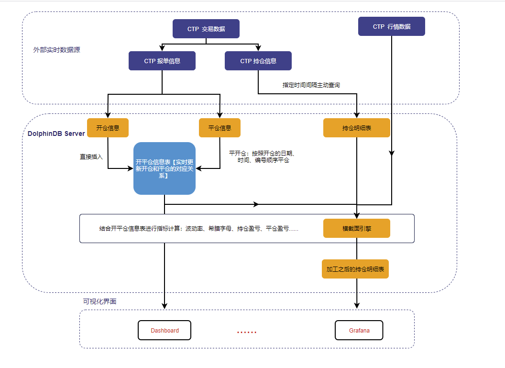
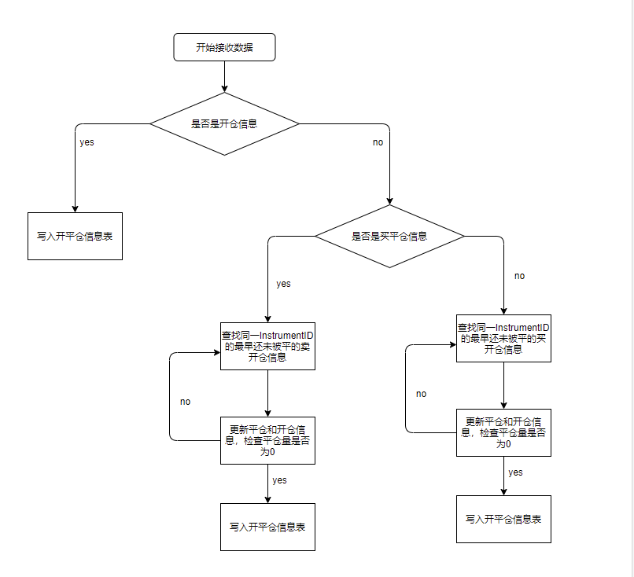
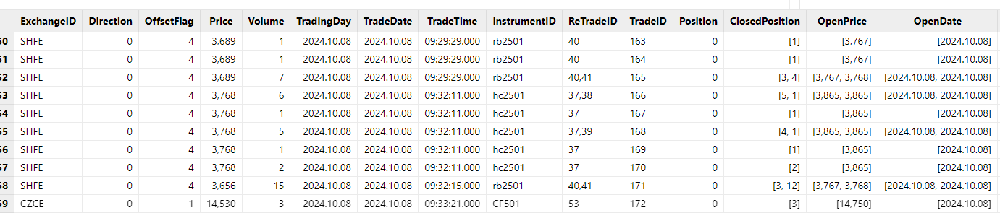

# DolphinDB 流计算在商品期货交易的应用：持仓信息指标定制化设计与扩展

在 CTP 接口体系中，OnRspQryInvestorPosition 和 OnRtnTrade
是实现账户管理与交易处理的两大核心回调接口。OnRspQryInvestorPosition
主要用于返回账户的详细持仓信息，包括合约代码、持仓方向、持仓量、冻结数量及浮动盈亏等，通常用于系统启动时的持仓初始化或风控分析。而 OnRtnTrade
则实时推送每笔成交的详细信息，如成交价格、成交量及成交时间，支持账户状态的动态更新和策略执行。这两个接口的有机结合，为交易系统的静态持仓管理与动态交易响应提供了坚实的技术支撑。

每当发生一笔成交，OnRtnTrade 所推送的成交数据将直接更新至账户的持仓和资金状态。通过 OnRtnTrade
的实时动态同步，系统能够确保账户状态的即时性和准确性，从而保证下一次调用 OnRspQryInvestorPosition
时返回的持仓信息能真实反映最新的交易结果。因此，可以说 OnRspQryInvestorPosition 接口在很大程度上依赖于 OnRtnTrade
接口的实时推送，二者共同构建了交易系统中账户状态更新与持仓管理的完整闭环。

本文针对 OnRspQryInvestorPosition 接口的一些问题进行优化开发，例如因指标计算方式不透明或部分值缺失导致的局限性，充分利用 OnRtnTrade
的实时推送功能，完成对这些指标的定制化设计与扩展。

DolphinDB 通过丰富的函数库、流计算引擎、灵活的编程方式和高性能计算能力，能够快速实现持仓信息指标的定制化和扩展计算，极大地提高交易系统的效率和决策能力。

## 1. 实时计算方案

DolphinDB 提供了功能强大的内置流计算引擎，能够针对不同场景下的实时数据需求提供高效的解决方案。在本文中，CTP
系统负责实时推送报单信息，这些数据通过流表即时处理；而持仓信息则由程序以指定的时间间隔主动查询，并写入流表进行统一管理。

当 CTP 数据写入流表后，DolphinDB
会按照预设的计算逻辑，实时生成开平仓信息表。而当持仓信息加载到持仓流表后，系统会结合开平仓信息表进一步计算关键指标，例如持仓盈亏、平仓盈亏、波动率以及希腊字母等。最终，这些计算结果会输出到一张键值表中，该键值表仅保存每个
InstrumentID 的最新数据，以保证用户看到的是最新的数据结果。此外，这些数据还会同步输出至可视化平台（如 DolphinDB 的 Dashboard 或
Grafana），为用户提供直观的图表与实时监控功能，从而更高效地辅助交易决策与系统运维。整个流程耗时在毫秒级别。

图 1. 图 1-1 计算方案架构图



## 2. 数据结构与建库建表

OnRspQryInvestorPosition 和 OnRtnTrade 接口的数据都是由 CTP
实时推送过来的，所以采用持久化流表进行接收，既能够处理流式数据，也能够很好管控内存。开平仓信息表是一张很重要的中间表，这里用的磁盘表存储。加工之后的持仓明细表，即最终的结果表，只需要最新的截面信息，所以用一张键值内存表接收，保存每个键最新的数据即可。

### 2.1 建表语句

OnRspQryInvestorPosition 接口流表创建【原持仓明细表】：

```
colNames = [
    "BrokerID","InvestorID","PosiDirection","HedgeFlag","PositionDate",
    "YdPosition","Position","LongFrozen","ShortFrozen","LongFrozenAmount","ShortFrozenAmount",
    "OpenVolume","CloseVolume","OpenAmount","CloseAmount","PositionCost","PreMargin","UseMargin",
    "FrozenMargin","FrozenCash","FrozenCommission","CashIn","Commission","CloseProfit","PositionProfit",
    "PreSettlementPrice","SettlementPrice","TradingDay","SettlementID","OpenCost","ExchangeMargin",
    "CombPosition","CombLongFrozen","CombShortFrozen","CloseProfitByDate","CloseProfitByTrade",
    "TodayPosition","MarginRateByMoney","MarginRateByVolume","StrikeFrozen","StrikeFrozenAmount",
    "AbandonFrozen","ExchangeID","YdStrikeFrozen","InvestUnitID","PositionCostOffset",
    "TasPosition","TasPositionCost","InstrumentID","ReceivedTime"
]
colTypes = [
    STRING,STRING,STRING,STRING,STRING,INT,INT,INT,INT,DOUBLE,DOUBLE,INT,INT,DOUBLE,
    DOUBLE,DOUBLE,DOUBLE,DOUBLE,DOUBLE,DOUBLE,DOUBLE,DOUBLE,DOUBLE,DOUBLE,DOUBLE,
    DOUBLE,DOUBLE,DATE,INT,DOUBLE,DOUBLE,INT,INT,INT,DOUBLE,DOUBLE,INT,DOUBLE,DOUBLE,
    INT,DOUBLE,INT,STRING,INT,STRING,DOUBLE,INT,DOUBLE,STRING,NANOTIMESTAMP
]
enableTableShareAndPersistence(table=streamTable(10000:0, colNames, colTypes), tableName=`InvestorPositionTable, cacheSize=1200000)
```

OnRtnTrade 接口流表创建：

```
colNames = [
    "BrokerID", "InvestorID", "OrderRef", "UserID", "ExchangeID",
    "TradeID", "Direction", "OrderSysID", "ParticipantID", "ClientID",
    "TradingRole", "OffsetFlag", "HedgeFlag", "Price", "Volume",
    "TradeDate", "TradeTime", "TradeType", "PriceSource", "TraderID",
    "OrderLocalID", "ClearingPartID", "BusinessUnit", "SequenceNo", "TradingDay",
    "SettlementID", "BrokerOrderSeq", "TradeSource", "InvestUnitID", "InstrumentID",
    "ExchangeInstID"
]
colTypes = [
STRING, STRING, STRING, STRING, STRING,
STRING, STRING, STRING, STRING, STRING,
STRING, STRING, STRING, DOUBLE, INT,
DATE, TIME, STRING, STRING, STRING,
STRING, STRING, STRING, INT, DATE,
INT, INT, STRING, STRING, STRING,
STRING
]
enableTableShareAndPersistence( streamTable(10000:0, colNames, colTypes), `OnTradeStreamTable, 1200000)
```

开平仓信息表创建：

```
if(existsDatabase("dfs://onStreamTable")){
    dropDatabase("dfs://onStreamTable")
}
colNames = [
        "ExchangeID","Direction","OffsetFlag","Price","Volume","TradingDay","TradeDate","TradeTime","InstrumentID",
        "ReTradeID","TradeID","Position","ClosedPosition","OpenPrice","OpenDate","PreClosePrice"
 ]
colTypes = [
        STRING,STRING,STRING,DOUBLE,INT,DATE,DATE,TIME,STRING,STRING,STRING,INT,INT[],DOUBLE[],DATE[],DOUBLE
]
dt = createDimensionTable(dbHandle=db, table=table(1:0,colNames, colTypes),
    tableName=`OpenPositionMessage ,sortColumns=`TradeDate`TradeTime)
```

加工之后的持仓明细表：

```
colNames = [
    "ReceivedTime","PosiDirection","InstrumentID","Commission","CloseProfit",
    "PositionCost","OpenCost","VolumeMultiple",
    "PreSettlementPrice","SpotPrice","Position","FloatingProfitByTrade","FloatingProfitByDate",
    "CloseProfitByDate","CloseProfitByTrade","Direction","IV","Delta_手","Delta",
    "Gamma_手","Gamma","Vega","Theta"
]
colTypes = [
    NANOTIMESTAMP,SYMBOL,STRING,DOUBLE,DOUBLE,
    DOUBLE,DOUBLE,DOUBLE,
    DOUBLE,DOUBLE,INT,DOUBLE,DOUBLE,
    DOUBLE,DOUBLE,STRING,DOUBLE,DOUBLE,DOUBLE,
    DOUBLE,DOUBLE,DOUBLE,DOUBLE
]
share keyedTable(`PosiDirection`InstrumentID,10:0,colNames,colTypes) as `GreekTable
```

### 2.2 数据接入

CTP 行情数据接入：

[DolphinDB CTP
行情插件最佳实践指南](../plugins/ctp_best_practice.html)。

CTP 交易数据接入：

通用插件还在开发之中，目前只有一个针对融航数据分发的程序包来对接数据。

CTP 官方接口文档：

完整 CTP 接口规范请查阅[上海期货信息技术有限公司官网](https://www.shfe.com.cn/sfit/)。

## 3. 合成开平仓信息表

利用 CTP 的交易接口，可以很好的管理单个用户的持仓信息，包括持仓量、盈亏、保证金、手续费等。这些基础指标利用 OnRspQryInvestorPosition
接口即可获取。但是在实际生产中，我们发现存在以下痛点：

* 没有计算隐含波动率、计算希腊字母。
* 部分期权交易的盈亏指标为空。
* 持仓盈亏和平仓盈亏的计算公式不透明，且不能修改。
* 原 CTP 体系中，持仓信息中上期所区分昨仓和今仓，数据是维持的是两条数据，没有形成真正的汇总。

为了解决这些问题，我们可以利用 OnRtnTrade 接口构建"开平仓信息表"，完整记录所有交易明细，为自定义计算提供数据基础。

### 3.1 开平仓信息表的作用

报单信息可分为两类：开仓信息和平仓信息，在期货与期权交易中，开仓信息决定交易的起点，平仓信息确定交易的终点，两者共同决定最终盈亏并形成完整的交易闭环。类比到商品交易中，开仓信息类似于以特定价格和数量采购商品的行为，决定了交易的初始成本；而平仓信息则类似于以某个价格出售商品的行为，确定交易的最终收益或亏损。因此，完成一次完整的交易最关键的步骤是平仓，且平仓必须与开仓信息精确匹配，即平仓操作需与开仓的方向、数量及合约类型一致。只有确保开平仓信息的一致性，才能准确实现盈亏结算，确保交易的完整性和风险的有效管控。

为了确保开仓与平仓操作的一致性和精确性，进而准确计算盈亏并有效管理风险，合成一张开平仓信息对应表显得尤为必要。这张表能够直观地展示每一笔交易的开仓与平仓数据，包括方向、数量、价格等关键信息，帮助交易者实时监控和管理头寸，从而在复杂的交易环境中保持策略的执行力与风险可控性。

### 3.2 在 DolphinDB 中合成开平仓信息表

利用 DolphinDB 的流计算和自定义函数可以很方便的实现开平仓信息表的合成。

前提：

* TradeID (成交编号) 在同一交易日内具有唯一性，并且按照生成顺序递增，不会发生重复。
* TradeDate 和 TradingDay 已按照标准模式处理，即每天21:00:00-24:00:00的夜盘信息的 TradingDay 为
  TradeDate 的下一个交易日。
* 平仓信息按照 TradeID 和 TradeTime 的先后顺序进行匹配，必须在完成前一个开仓信息的平仓后，才能依次对下一个开仓信息进行平仓。

合成步骤：

* 实时接收报单信息，将数据存放在流表之中，订阅该流表并传入自定义回调函数来处理信息。
* 当每来一条或者一批数据，将其按照开仓和平仓分成两部分，开仓信息直接存入开平仓信息表，平仓信息先放在内存中。
* 按 InstrumentID 遍历所有平仓记录，在开平仓信息表中查找相同 InstrumentID
  且剩余持仓量大于零的开仓记录并进行抵扣，直到该平仓记录的持仓量归零。
  抵扣时需记录平仓与开仓记录的对应关系、实际抵扣数量、对应开仓价和开仓日期。
* 最后根据上诉信息更新开平仓信息表里面对应的开仓信息以及内存中的平仓信息，更新后的平仓信息也存入开平仓信息表中，开平仓信息表更新完成。

图 2. 图 3-1 开平仓信息表计算流程图



### 3.3 合成结果展示

开平仓信息表的表结构：

| **列名** | **字段类型** | **字段说明** | **备注** |
| --- | --- | --- | --- |
| **ExchangeID** | STRING | 交易所代码 |  |
| **Direction** | CHAR | 买卖方向 | * 0 : 买入 * 1 : 卖出 |
| **OffsetFlag** | CHAR | 开平标志 | * 0 : 开仓 * 1-4 : 平仓 |
| **Price** | DOUBLE | 价格 |  |
| **Volume** | INT | 数量 |  |
| **TradingDay** | DATE | 交易日 |  |
| **TradeDate** | DATE | 成交时期 |  |
| **TradeTime** | TIME | 成交时间 |  |
| **ReTradeID** | STRING | 匹配订单编号 | 平仓信息：对应开仓的订单编号；开仓记录：关联的平仓订单编号（列表） |
| **TradeID** | STRING | 成交编号 |  |
| **Position** | INT | 剩余持仓量 | 为0表示已完全处理 |
| **Close** | INT[] | 平仓量 | 只有平仓信息该栏有数据，开仓信息该栏为[null] |
| **OpenPrice** | DOUBLE[] | 开仓价 | 同上 |
| **OpenDate** | DATE[] | 开仓日期 | 同上 |
| **PreClosePrice** | DOUBLE | 昨收价 |  |

图 3. 图 3-2 开平仓信息表示例



## 4. 指标计算

构建开平仓信息表后，可结合持仓与行情数据，实时合成市场预期和交易绩效指标等，为交易决策提供精准支持，优化投资策略。因为持仓信息是每间隔几秒发送最新的交易结果，且是累计的结果，所以只需要对最新的一批持仓信息进行处理就可以了。DolphinDB
提供了横截面引擎，对实时数据中每组的最新数据计算相关指标，并存入一张键值表里面，用户就可以实时查看到这些指标的最新状态。

### 4.1 数据 ETL

**从 CTP 行情数据表里面获取数据**

```
/**
 * ==================== 从 CTP 行情数据表里面获取数据 =========================
 */
def getInfoFromCtp(instrumentID_, posReceiveTime, cpMode){
    /*
    * instrumentID_：标的代码
    * posReceiveTime：数据接收时间
    * cpMode：0表示期货,1和-1表示看涨看跌期权
    */
    /*
    * 获取ExpireDate【到期日】,VolumeMultiple【合约乘数】,PreSettlementPrice【昨日结算价】,optionPrice【期权价】,futurePrice【期货价】,KPrice【执行价】
    */
    if(cpMode == 0){
        // 从ctpInfo 表里面 获取 ,VolumeMultiple  字段:
        option_info =
            select top 1 ExpireDate,VolumeMultiple
            from loadTable("dfs://option_info","data")
            where InstrumentID = instrumentID_ and insertTime <= posReceiveTime
            context by InstrumentID csort insertTime desc

        // ExpireDate:
        expireDate = option_info.ExpireDate[0]

        // 合约乘数
        volumeMultiple = option_info.VolumeMultiple[0]

        // 期货价格
        futurePrice =
            exec top 1 LastPrice
            from ctp_market_data1
            where InstrumentID = instrumentID_ and ReceivedTime <= posReceiveTime
            context by InstrumentID csort TradingDay desc,UpdateTime desc ,UpdateMillisec desc

        if(futurePrice[0].isNull()){
            futurePrice =
                exec LastPrice from (
                select *
                from loadTable("dfs://ctp_market_data","ctp_market_data")
                where InstrumentID = instrumentID_ and ReceivedTime <= posReceiveTime
                context by InstrumentID limit -1 )
        }
        //昨日收盘价
        preSettlementPrice =
            (exec PreClosePrice.nullFill(0) from (
            select *
            from loadTable("dfs://ctp_market_data","ctp_market_data")
            where InstrumentID = instrumentID_ and ReceivedTime <= posReceiveTime
            context by InstrumentID limit -1 ))[0]

        optionPrice = 0
        kPrice = 0
    }else{
        instrumentID_underlying = instrumentID_.regexReplace("-?(C|P|c|p)-?[0-9]+$","");

        // 从ctpInfo 表里面 获取 ,VolumeMultiple  字段:
        option_info =
            select top 1 ExpireDate,VolumeMultiple
            from loadTable("dfs://option_info","data")
            where InstrumentID = instrumentID_ and insertTime <= posReceiveTime
            context by InstrumentID csort insertTime desc

        // ExpireDate:
        expireDate = option_info.ExpireDate[0]
        // 合约乘数
        volumeMultiple = option_info.VolumeMultiple[0]

        // 昨日收盘价 -- 期权合约,用昨日最后一笔的（bid + ask ）/2来计算逐日盈亏
        preSettlementPrice =
                (exec  ((AskPrice1 + BidPrice1)\2).nullFill(0)
                from  loadTable("dfs://ctp_market_data","ctp_market_data")
                where InstrumentID = instrumentID_ and TradingDay = date(temporalAdd(date(ReceivedTime),-1,"CZCE")) and time(ReceivedTime)<= 15:00:00
                context by InstrumentID limit -1)[0]

        // 期权价格
        optionPrice =
            exec top 1  ((BidPrice1+AskPrice1)\2).nullFill(0)
            from ctp_market_data1
            where InstrumentID = instrumentID_ and ReceivedTime <= posReceiveTime
            context by InstrumentID csort ReceivedTime desc

        if(optionPrice[0].isNull()){
           optionPrice =
                exec  (BidPrice1+AskPrice1)\2 from (
                select  *
                from loadTable("dfs://ctp_market_data","ctp_market_data")
                where InstrumentID = instrumentID_ and ReceivedTime <= posReceiveTime context by InstrumentID limit -1)
        }

        // 期货价格
        futurePrice =
            exec top 1 LastPrice
            from ctp_market_data1
            where InstrumentID = instrumentID_underlying and ReceivedTime <= posReceiveTime
            context by InstrumentID csort TradingDay desc,UpdateTime desc ,UpdateMillisec desc

        if(futurePrice[0].isNull()){
            futurePrice =
                exec LastPrice from (
                select *
                from loadTable("dfs://ctp_market_data","ctp_market_data")
                where InstrumentID = instrumentID_underlying and ReceivedTime <= posReceiveTime
                context by InstrumentID limit -1 )
        }

        kPrice = instrumentID_.regexReplace("^.{3,}(C|P|c|p)-?","").cast(INT)
    }
    return expireDate, volumeMultiple, preSettlementPrice, optionPrice, futurePrice, kPrice
}
```

**从持仓信息表里面获取数据，并合并上期所的今仓与昨仓**

```
/**
 * ==================== 从持仓信息表获取数据 =========================
 */
def getInfoFromInvestorPositionTable(instrumentID_, posReceiveTime, posiDirection_){
    /*
    * instrumentID_：标的代码
    * 插入时间
    * 持仓多空方向
    */
    msg =
    select
        Commission,TradingDay, CloseProfit, PositionProfit,
        PositionCost as PositionCost,
        OpenCost as OpenCost,PreSettlementPrice,CloseProfitByDate,CloseProfitByTrade,
        Position,PosiDirection,InstrumentID,YdPosition,TodayPosition,
        // '1'=净仓, '2'=多仓, '3'=空仓
        case
            when PosiDirection = '1' then '净仓'
            when PosiDirection = '2' then '多仓'
            when PosiDirection ='3' then '空仓'
        end as Direction,OpenAmount
    from InvestorPositionTable
    where InstrumentID = instrumentID_ and ReceivedTime = posReceiveTime  and PosiDirection = posiDirection_

    result =
    select
        sum(Commission) as Commission,last(TradingDay) as TradingDay, sum(CloseProfit) as CloseProfit,
        sum(PositionProfit) as PositionProfit,
        sum(PositionCost)\sum(Position)\VolumeMultiple  as PositionCost,
        sum(OpenCost)\sum(Position)\VolumeMultiple  as OpenCost,
        last(PreSettlementPrice) as PreSettlementPrice,sum(CloseProfitByDate) as CloseProfitByDate,
        sum(CloseProfitByTrade) as CloseProfitByTrade,sum(Position) as Position,
        last(Direction) as Direction,sum(OpenAmount) as OpenAmount,sum(YdPosition) as YdPosition,
        sum(TodayPosition) as TodayPosition
    from msg
    group by InstrumentID,PosiDirection

    return result
}
```

### 4.2 持仓盈亏和平仓盈亏计算

在期货与期权交易中，开仓盈亏与平仓盈亏是评估交易效果和管理风险的重要指标，贯穿于整个交易流程。开仓盈亏反映的是持仓期间的浮动盈亏，帮助交易者实时掌握头寸的风险和潜在收益，便于及时调整策略或管理仓位；而平仓盈亏则体现了交易结束时的实际盈亏结果，直接影响账户资金变化，是衡量交易策略成败与优化的重要依据。在实际生产中，这两个指标不仅是交易策略执行的核心参考，还在风险控制、资金管理、绩效评估等方面发挥着至关重要的作用。

| **区别项** | **开仓盈亏** | **平仓盈亏** |
| --- | --- | --- |
| **定义** | 指开仓后未平仓期间的浮动盈亏（即持仓期间的盈亏） | 指平仓时实际锁定的已实现盈亏 |
| **计算时机** | 开仓后持仓期间，根据市场价格变动实时计算 | 平仓时，根据平仓价格与开仓价格或结算价的差异计算 |
| **盈亏性质** | 未实现盈亏，随市场波动变化 | 已实现盈亏，锁定交易结果 |
| **风险性质** | 浮动风险，可能随市场波动扩大或缩小 | 无风险，盈亏已确定，不受后续市场波动影响 |
| **作用** | 帮助投资者实时评估当前持仓状况，及时调整风险 | 确定最终交易结果，为账户权益变动和资金管理提供依据 |

**计算逐笔持仓盈亏**

* 买卖方向 \* 合约乘数 \* 持仓量 \* （期权价 - 开仓成本）

```
/**
 * ==================== 计算逐笔持仓盈亏 =========================
 */
 def calFloatingProfitByTrade(posiDirection, volumeMultiple, position, futurePrice, openCost){
    /*
    * posiDirection:持仓多空方向
    * volumeMultiple:合约乘数
    * position:今日持仓
    * futurePrice:期权价
    * openCost:开仓成本
    */
    floatingProfitByTrade =
        iif(posiDirection == '2',1,-1) * volumeMultiple * position * (futurePrice - openCost)
    return floatingProfitByTrade
}
```

**计算逐日持仓盈亏**

* 当日开新持仓，没有历史持仓：买卖方向 \* 合约乘数 \* 持仓量 \* （期权价 - 开仓成本）
* 有历史持仓的前提下，当日没有开新仓 ：买卖方向 \* 合约乘数 \* 持仓量 \* （期权价 - 昨结算价）
* 有历史持仓的前提下，当日有开新仓： (买卖方向 \* 合约乘数 \* 持仓量 \* （持仓量 - 今日持仓）\*（期权价 - 昨结算价)) + (买卖方向 \*
  合约乘数 \* 持仓量 \* 今日持仓\*（期权价 - 开仓价))

```
/**
 * ==================== 计算逐日持仓盈亏 =========================
 */
 def calFloatingProfitByDate(symbol, ydPosition, todayPosition, posiDirection, volumeMultiple, position, optionPrice, openCost, preSettlementPrice){
    /*
    * symbol: 期权合约
    * ydPosition:昨仓
    * todayPosition:今仓
    * posiDirection:持仓多空方向
    * volumeMultiple:合约乘数
    * position:今日持仓
    * optionPrice:期权价
    * openCost:开仓成本
    * preSettlementPrice：昨结算价
    */
    if(ydPosition == 0){
    //1）：当日开新持仓,没有历史持仓：买卖方向 * 合约乘数 * 持仓量 * （期权价 - 开仓成本）
        floatingProfitByDate =
            iif(posiDirection == '2',1,-1) * volumeMultiple * position * (optionPrice - openCost)
      }else{
             if(todayPosition == 0){
            //2）：有历史持仓的前提下,当日没有开新仓 ：买卖方向 * 合约乘数 * 持仓量 * （期权价 - 昨结算价）
                 floatingProfitByDate =
                    iif(posiDirection == '2',1,-1) * volumeMultiple * position *  (optionPrice - preSettlementPrice)
             }else{
            //3）：有历史持仓的前提下,当日有开新仓： (买卖方向 * 合约乘数 * 持仓量 * （持仓量 - 今日持仓）*（期权价 - 昨结算价))
            // + (买卖方向 * 合约乘数 * 持仓量 * 今日持仓*（期权价 - 开仓价))
                toDayFloatProfit =
                    exec (iif(Direction == '0',1,-1) * volumeMultiple * Position * (optionPrice-price)).sum() as toDayFloatProfit
                    from OpenPositionMessage
                    where InstrumentID = symbol and OffsetFlag = '0'  and TradingDay = date(now()) and Position > 0

                floatingProfitByDate =
                    (iif(posiDirection == '2',1,-1) * volumeMultiple *(position - todayPosition) * (optionPrice-preSettlementPrice))  + toDayFloatProfit.nullFill(0)
             }
     }
     return floatingProfitByDate
}
```

**计算逐日、逐笔平仓盈亏：**

* 逐日
  + 平昨日仓：（成交价-昨收价） \* 买卖方向 \* 平仓量 \* 合约乘数
  + 平今日仓：（成交价-开仓价） \* 买卖方向 \* 平仓量 \* 合约乘数
* 逐笔
  + （成交价-开仓价） \* 买卖方向 \* 平仓量 \* 合约乘数

```
/**
 * ==================== 计算逐笔平仓盈亏 =========================
 */
 def calCloseingProfitByTrade(symbol, posiDirection, volumeMultiple){
    /*
    * symbol: 期权合约
    * posiDirection:持仓多空方向
    * volumeMultiple:合约乘数
    */
    CloseMsg =
        select
            //1）：逐日：平的不是今天的开仓：（成交价-昨收价） * 买卖方向 * 平仓量 * 合约乘数
            ((OpenDate!=date(now())).cast(INT[])*(Price - PreClosePrice)* iif(posiDirection == '2',1,-1) * ClosedPosition * volumeMultiple) as CloseingProfitByDate1,
            //2）：逐日：平的是今天的开仓：（成交价-开仓价） * 买卖方向 * 平仓量 * 合约乘数
            ((OpenDate=date(now())).cast(INT[])*(Price - OpenPrice)* iif(posiDirection_ == '2',1,-1) * ClosedPosition * volumeMultiple) as CloseingProfitByDate2,
            //3）：逐笔计算：（成交价-开仓价） * 买卖方向 * 平仓量 * 合约乘数
            (((Price - OpenPrice) * iif(posiDirection == '2',1,-1) * ClosedPosition * volumeMultiple)) as CloseingProfitByTrade
        from (
                select * from OpenPositionMessage  where InstrumentID= symbol and OffsetFlag != '0'  and Direction = iif(posiDirection =='2','1','0')
        )

    closeingProfitByDateSum = (exec CloseingProfitByDate1 + CloseingProfitByDate2 from CloseMsg).flatten().sum().nullFill(0)
    closeingProfitByTradeSum= (exec CloseingProfitByTrade from CloseMsg).flatten().sum().nullFill(0)

    return closeingProfitByDateSum, closeingProfitByTradeSum
}
```

### 4.3 隐含波动率和希腊字母计算

在期权交易中，**​**隐含波动率（IV）​与希腊字母（Greeks）**​**是衡量风险与收益的核心工具。隐含波动率通过期权价格反推市场对未来波动的预期，既是定价的“隐形引擎”，也是判断市场高估或低估的信号灯——高
IV 预示风险溢价，低 IV
则暗藏机会。而希腊字母则精准刻画了期权价格对市场变量的敏感度：Delta管理方向风险，Gamma捕捉价格曲率变化，Theta量化时间衰减效应，Vega控制波动敞口。两者结合，不仅为策略提供动态对冲依据，更能优化组合在收益、风险与成本间的平衡，成为驾驭复杂市场的关键坐标。

#### 4.3.1 隐含波动率计算函数

隐含波动率是衡量市场对标的资产未来价格波动性预期的重要指标，在期权定价和风险管理中具有核心作用。它反映了市场情绪，隐含了投资者对未来不确定性的看法：高隐含波动率通常预示市场波动较大，低隐含波动率则表明市场较为平稳。作为期权定价模型的关键参数，隐含波动率帮助交易者评估期权的合理性，同时为波动率套利、对冲风险和制定交易策略提供了重要参考。

**方法一：基于 Black-Scholes 模型定价模型，计算隐含波动率。**

```
/**
 * ==================== BSM模型和牛顿法,计算隐含波动率=========================
 */
def pdfNorm(x,mean=0,var=1){
	return exp(-pow((x - mean) , 2) \ (2 * pow(var , 2)) ) \ sqrt(2 * pi) * var
}
def bs_price(options_type, spot, strike, maturity, r, vol, q=0.0){ // vol = sigma
	/*
	 * options_type:期权类型 ,1或-1,代表C' or 'P'
	 * spot：现货价,float:
	 * strike：行权价,float
	 * maturity：剩余天数,float、int
	 * r：无风险利率,float
	 * vol：波动率,float
	*/
	 if (options_type in [1, -1]){
	 	phi = options_type
	 }else{
	 	print("The Options Type is Wrong!")
	 	return
	 }
	if (vol == 0 or maturity == 0){
		return max(0.0, phi * (spot - strike))

	}
	if (strike == 0){
		print('The strike_price price cannot be zero')
	}
	d1 = (log(spot \strike) + (r + 0.5 * vol * vol) * maturity) \vol \sqrt(maturity)
	d2 = d1 - vol * sqrt(maturity)
	return phi * spot * cdfNormal(0,1,phi * d1) - phi * strike * exp(-r * maturity) * cdfNormal(0,1,phi * d2)
}

def bs_vega(spot, strike, maturity, r, vol, q=0.0){
	/*
	 * spot：现货价,float:
	 * strike：行权价,float
	 * maturity：剩余天数,float、int
	 * r：无风险利率,float
	 * vol：波动率,float
	*/
	d1 = (log(spot \ strike) + (r + 0.5 * vol * vol ) * maturity) \ (vol * sqrt(maturity))
	return spot * sqrt(maturity) * pdfNorm(d1)
}

def implied_volatility_Newton(options_price, options_type, spot, strike, maturity, r){
	/*
	 * 牛顿法实现期权隐含波动率计算
	 * options_price,期权价格,float:
	 * spot：现货价,float:
	 * strike：行权价,float
	 * maturity：剩余天数,float、int
	 * r：无风险利率,float
	 * vol：波动率,float
	 * options_type:'期权类型 ,1或-1,代表C' or 'P'
	 *
	*/
	max_iterations= 100
	precision= 1.0e-6
	sigma = 0.5
	for (i in 1..max_iterations){ // i = 1
	    price = bs_price(options_type, spot, strike, maturity, r, sigma)
	    vega = bs_vega( spot, strike, maturity, r, sigma)
	    diff = price - options_price
	    if (abs(diff) < precision){
	        return sigma
	    }
	    sigma = sigma - diff \ vega
	}
	return 0.0
}
```

**方法2：基于 Black-76 期货期权定价模型，通过Brentq数值迭代算法，计算隐含波动率。**

```

/**
 * ===================== black76+brentq方法（欧式期权),计算隐含波动率========================
 */
// Black 76公式
def black_76(F, K, T, r, sigma, option_type){
    d1 = (log(F \ K) + (0.5 * pow(sigma , 2) ) * T) \ (sigma * sqrt(T))
    d2 = d1 - sigma * sqrt(T)
    if (option_type == 1){
        return exp(-r * T) * (F * cdfNormal(0,1,d1) - K * cdfNormal(0,1,d2))
    }else if( option_type == -1){
        return exp(-r * T) * (K * cdfNormal(0,1,-d2) - F * cdfNormal(0,1,-d1))
    }else{
        return ("Option type must be 1 or -1.")
    }
}

def loss_function(sigma, F, K, T, r, option_type, market_price){
    return black_76(F, K, T, r, sigma, option_type) - market_price
}

/**
 * @ Function name:
 * @ Brief:
 * @ Param:
 * sigma : /none
 * F : 现货价,期货价格
 * K : 执行价
 * T : 剩余期限
 * r : 无风险利率
 * option_type : 期权类型 ,1或-1,代表'C' or 'P'
 * market_price : 期权价格
 * @ Return:
 * @ Sample usage:
 */
def implied_volatility_Black76Brentq(F, K, T, r, option_type, market_price){
	iv = double(NULL)
	try{
		iv = brentq(f=loss_function, a=1e-6, b=2, xtol=2e-12, rtol=1e-9, maxIter=100, funcDataParam=[F, K, T, r, option_type, market_price])[1]
	}catch(ex){
		writeLog("calculate error : " + ex)
	}
	return iv
}
```

#### 4.3.2 希腊字母计算函数定义

希腊字母是用于量化期权价格对不同市场因素（如标的资产价格、波动率、时间和利率等）敏感性的指标，是期权定价和风险管理中的核心工具。通过希腊字母，交易者可以评估和管理期权组合的风险敞口，了解价格变化、时间衰减和波动性等因素对期权价值的具体影响。例如，Delta
表示期权价格对标的资产价格变化的敏感性，Gamma 衡量 Delta 的变化率，Theta
反映时间价值的衰减速度等。希腊字母的综合运用帮助投资者优化交易策略，制定风险对冲计划，并在复杂市场条件下做出更精确的决策。

```
/**
 * ============================= 计算greeks==============================
 */
/** 计算 delta**/
def calculateD1(etfTodayPrice, KPrice, r, dayRatio, HLMean){
        skRatio = etfTodayPrice / KPrice
        denominator = HLMean * sqrt(dayRatio)
        result = (log(skRatio) + (r + 0.5 * pow(HLMean, 2)) * dayRatio) / denominator
        return result
}

def cdfNormalMatrix(mean, stdev, X){
        originalShape = X.shape()
        X_vec = X.reshape()
        result = cdfNormal(mean, stdev, X_vec)
        return result.reshape(originalShape)
}
def calculateDelta(etfTodayPrice, KPrice, r, dayRatio, impvMatrix, CPMode){
        delta = iif(
                        impvMatrix <= 0,
                        0,
                        CPMode *cdfNormal(0, 1, CPMode * calculateD1(etfTodayPrice, KPrice, r, dayRatio, impvMatrix))
                )
        return delta
}

/**计算gamma**/
def normpdf(x){
        return exp(-pow(x, 2)/2.0)/sqrt(2*pi)
}

def calculateGamma(etfTodayPrice, KPrice, r, dayRatio, impvMatrix){
        gamma = iif(
                        impvMatrix <= 0,
                        0,
                        (normpdf(calculateD1(etfTodayPrice,  KPrice, r, dayRatio, impvMatrix)) \ (etfTodayPrice * impvMatrix * sqrt(dayRatio)))
                )
        return gamma
}

/**计算vega**/

def calculateVega(etfTodayPrice, KPrice, r, dayRatio, impvMatrix){
        vega = iif(
                        impvMatrix <= 0,
                        0,
                        etfTodayPrice * normpdf(calculateD1(etfTodayPrice, KPrice, r, dayRatio, impvMatrix)) * sqrt(dayRatio)
                )
        return vega\100.0
}

/**计算theta**/

def calculateTheta(etfTodayPrice, KPrice, r, dayRatio, impvMatrix, CPMode){
        annualDays = 365
        d1 = calculateD1(etfTodayPrice, KPrice, r, dayRatio, impvMatrix)
        d2 = d1 - impvMatrix * sqrt(dayRatio)
        theta = (-etfTodayPrice * normpdf(d1) * impvMatrix \ (2 * sqrt(dayRatio)) - CPMode * r * KPrice * exp(-r * dayRatio) *cdfNormal(0, 1, CPMode * d2))\annualDays
        result = iif(impvMatrix<= 0, 0, theta)
        return result
}

```

#### 4.3.3 隐含波动率和希腊字母计算

```
/**
 * ==================== 计算波动率和希腊字母 =========================
 */
def calIvAndGreek(futurePrice, kPrice, cpMode, optionPrice, expireDate, posReceiveTime, volumeMultiple, posiDirection, r = 0.0116){
    /*
    * expireDate：到期日
    * dayRatio：剩余到期时间
    * optionPrice：期权价
    * futurePrice：期货价
    * cpMode：0表示期货,1和-1表示看涨看跌期权
    * kPrice：执行价
    * expireDate:到期日
    * posReceiveTime：接收时间
    * r:无风险利率
    */
    if(cpMode == 0){
        // 希腊字母计算：期货的delta =+-1, 其他为0
        delta = 1.0 * volumeMultiple
        delta_手 = (delta \ volumeMultiple).round(4)

        if(posiDirection == '3'){
            delta = - delta
            delta_手 = - delta_手
        }
        // 注意不要把 0.0 修改为 0
        iv = 0.0
        gamma = 0.0
        gamma_手 = 0.0
        vega = 0.0
        theta = 0.0
    }else{
        dayRatio = ( timestamp(concatDateTime(expireDate, 15:00:00)) - timestamp(posReceiveTime)  ) \365.0\24\60\60\1000
        iv = round(implied_volatility_Black76Brentq(futurePrice, kPrice, dayRatio, r, cpMode, optionPrice), 4)
        delta  = round(calculateDelta(futurePrice, kPrice, r, dayRatio, iv, cpMode)* volumeMultiple, 4)
        delta_手 = delta\volumeMultiple
        gamma = round(calculateGamma(futurePrice, kPrice, r, dayRatio, iv)*volumeMultiple, 4)
        gamma_手 = gamma\volumeMultiple
        vega = round(calculateVega(futurePrice, kPrice, r, dayRatio, iv)*volumeMultiple, 4)
        theta = round(calculateTheta(futurePrice, kPrice, r, dayRatio, iv, cpMode)*volumeMultiple,4)

        if(posiDirection == '3'){
            delta = -delta
            delta_手= -delta_手
            gamma = -gamma
            gamma_手=-gamma_手
            vega = -vega
            theta = -theta
        }
    }

    return iv, delta, delta_手, gamma, gamma_手, vega, theta
}
```

### 4.4 实时合成持仓明细

在对以上指标进行定义和封装之后，订阅 ctp 3s
推送一次的持仓明细，每当数据到来就推送给横截面引擎计算上述指标，从而实现对持仓明细表的二次开发，将最终的持仓明细数据存到键值表里面，来保证用户能够实时看见最新的持仓明细，辅助交易。

```
/**
 * ==================== 实时合成持仓信息表 =========================
 */
 def calGreeksByPos(instrumentID,posReceiveTime,posiDirection){
    /*
    * InstrumentID: 期权合约
    * posiDirection:持仓多空方向
    * volumeMultiple:合约乘数
    */
    instrumentID_ = instrumentID[0]
    posReceiveTime_ = posReceiveTime[0]
    posiDirection_ = posiDirection[0]
    instrumentID_underlying = instrumentID_.regexReplace("-?(C|P|c|p)-?[0-9]+$","");
    cpMode = iif(instrumentID_.regexReplace("^[a-zA-Z]{0,}","").regexReplace("^[0-9|-]{0,}","").regexReplace("[0-9|-]{0,}$","") in ["C","c"],1,iif(instrumentID_.regexReplace("^[a-zA-Z]{0,}","").regexReplace("^[0-9|-]{0,}","").regexReplace("[0-9|-]{0,}$","") in ["P",'p'], -1, 0)) //10ms

    // 数据 ETL

    // 从持仓信息表获取数据
    msg = getInfoFromInvestorPositionTable(instrumentID_, posReceiveTime_, posiDirection_)

    // 从ctp行情接口获取数据
    // 获取ExpireDate【到期日】,VolumeMultiple【合约乘数】,PreSettlementPrice【昨日结算价】,optionPrice【期权价】,futurePrice【期货价】,KPrice【执行价】
    expireDate,volumeMultiple,preSettlementPrice,optionPrice,futurePrice,kPrice = getInfoFromCtp(instrumentID_, posReceiveTime_, cpMode)

    // 指标计算

    // 计算波动率和希腊字母
    iv, delta, delta_手, gamma, gamma_手, vega, theta  = calIvAndGreek(futurePrice[0], kPrice[0], cpMode, optionPrice[0], expireDate[0], posReceiveTime_,volumeMultiple, posiDirection_)

    // 逐笔持仓盈亏
    floatingProfitByTrade = calFloatingProfitByTrade(posiDirection_, volumeMultiple, msg.Position[0], optionPrice[0], msg.OpenCost[0])
    // 逐日持仓盈亏
    floatingProfitByDate = calFloatingProfitByDate(instrumentID_, msg.YdPosition[0], msg.TodayPosition[0], posiDirection_, volumeMultiple, msg.Position[0], optionPrice[0], msg.OpenCost[0], preSettlementPrice)
    // 平仓盈亏
    closeingProfitByDateSum,closeingProfitByTradeSum = calCloseingProfitByTrade(instrumentID_, posiDirection_, volumeMultiple)

    return  msg.Commission[0].round(4),msg.CloseProfit[0],msg.PositionProfit[0],msg.PositionCost[0],msg.OpenCost[0],volumeMultiple,preSettlementPrice,optionPrice[0],msg.Position[0],floatingProfitByTrade,floatingProfitByDate,closeingProfitByDateSum,closeingProfitByTradeSum,msg.direction[0],iv[0], (delta_手*msg.Position[0])[0],(delta*msg.Position[0])[0],(gamma_手*msg.Position[0])[0],(gamma*msg.Position[0])[0],(vega*msg.Position[0])[0],(theta*msg.Position[0])[0]
}

// 横截面引擎
calGreekCrossAggregator=createCrossSectionalEngine(name="calGreeks1", metrics=<[calGreeksByPos(InstrumentID[0], ReceivedTime[0],PosiDirection[0]) as `Commission`CloseProfit`PositionProfit`PositionCost`OpenCost`VolumeMultiple`PreSettlementPrice`SpotPrice`Position`FloatingProfitByTrade`FloatingProfitByDate`CloseProfitByDate`CloseingProfitByTrade`Direction`IV`Delta_手`Delta`Gamma_手`Gamma`Vega`Theta]>, dummyTable=InvestorPositionTable, outputTable=GreekTable, keyColumn=`PosiDirection`InstrumentID, triggeringPattern=`interval, useSystemTime=false,contextByColumn=`PosiDirection`InstrumentID, timeColumn=`ReceivedTime,triggeringInterval=2000)

// 订阅
subscribeTable(tableName="InvestorPositionTable", actionName="calGreeks", offset=-1, handler=append!{calGreekCrossAggregator}, msgAsTable=true)
```

### 4.5 持仓明细结果展示

表结构：

| **列名** | **字段类型** | **字段说明** |
| --- | --- | --- |
| **ReceivedTime** | NANOTIMESTAMP | 接收时间 |
| **PosiDirection** | CHAR | 持仓多空方向 |
| **InstrumentID** | STRING | 合约代码 |
| **Commission** | DOUBLE | 手续费 |
| **PositionCost** | DOUBLE | 持仓成本 |
| **OpenCost** | DOUBLE | 开仓成本 |
| **VolumeMultiple** | INT | 手数 |
| **PreSettlementPrice** | DOUBLE | 昨收价 |
| **SpotPrice** | DOUBLE | 价格 |
| **Position** | DOUBLE | 持仓量 |
| **FloatingProfitByTrade** | DOUBLE | 逐笔持仓盈亏 |
| **FloatingProfitByDate** | DOUBLE | 逐笔平仓盈亏 |
| **CloseProfitByDate** | DOUBLE | 逐日平仓盈亏 |
| **CloseProfitByTrade** | DOUBLE | 逐笔平仓盈亏 |
| **Direction** | INT | 买卖方向 |
| **IV** | DOUBLE | 隐含波动率 |
| **Delta\_手** | DOUBLE | 每一手的 Delta |
| **Delta** | DOUBLE | Delta |
| **Gamma\_手** | DOUBLE | 每一手的 Gamma |
| **Gamma** | DOUBLE | Gamma |
| **Vega** | DOUBLE | Vega |
| **Theta** | DOUBLE | Theta |

利用 DolphinDB 的 Dashboard 或者通过 Grafana 对结果表进行可视化展示。例如，通过 DolphinDB 自带的 Dashboard
进行的展示，在配置持仓明细表为数据源后，设置每秒自动刷新面板，用户即可实时、直观地看到观测到持仓明细表的变化。Dashboard 的相关教程如下：[数据面板](dashboard_tutorial.html)。

## 5. 历史数据处理

针对于历史成交信息，可以通过 DolphinDB
的数据回放功能，将历史的成交信息回放来合成开平仓信息，然后订阅持仓明细表，就可以合成最新的持仓明细了。回放功能的相关教程如下：[replay](../funcs/r/replay.html)。

## 6. 总结

DolphinDB
内置的流数据框架支持流数据的发布、订阅、预处理、实时内存计算，以及复杂指标的滚动窗口计算、滑动窗口计算和累计窗口计算等，提供了一个高效且便捷的流数据处理平台。结合这些特性，本教程基于
DolphinDB 的流数据处理框架，实现了持仓信息指标的定制化和扩展计算解决方案，旨在提升开发人员在实际应用中利用 DolphinDB
内置流计算功能的开发效率，降低开发难度，并充分挖掘 DolphinDB 在复杂实时流计算场景中的潜力，从而更好地支持交易系统的实时监控和数据分析需求。

## 7. 附件

交易数据、开平仓信息表、持仓明细表建库建表：[建库建表.dos](script/stream_computing_in_futures_trading/%E5%BB%BA%E5%BA%93%E5%BB%BA%E8%A1%A8.dos)

隐含波动率和希腊字母脚本：[impv.dos](script/stream_computing_in_futures_trading/impv.dos)

计算开平仓信息表的脚本：[计算开平仓信息表.dos](script/stream_computing_in_futures_trading/%E8%AE%A1%E7%AE%97%E5%BC%80%E5%B9%B3%E4%BB%93%E4%BF%A1%E6%81%AF%E8%A1%A8.dos)

计算持仓明细表的脚本：[计算持仓明细表.dos](script/stream_computing_in_futures_trading/%E8%AE%A1%E7%AE%97%E6%8C%81%E4%BB%93%E6%98%8E%E7%BB%86%E8%A1%A8.dos)

