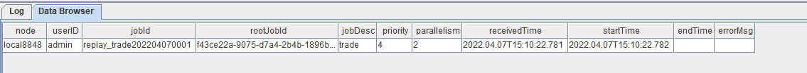

# -*- coding: utf-8 -*-
"""
DolphinDB python api version: 1.30.17.2
python version: 3.7.8
DolphinDB server version:1.30.18 or 2.00.5
last modification time: 2022.05.12
last modification developer: DolpinDB
"""
import dolphindb as ddb
import numpy as np
from threading import Event

def resultProcess(lst):
    print(lst)
s = ddb.session()
s.enableStreaming(8800)
s.subscribe(host="192.192.168.8", port=8848, handler=resultProcess, tableName="capitalFlowStream", actionName="SH600000", offset=-1, resub=False, filter=np.array(['600000']))
Event().wait()
```

* 执行 Python 代码前，必须先在 DolphinDB server 端定义流数据表 capitalFlowStream，且通过函数`setStreamTableFilterColumn`对该表设置过滤列，配合 Python API streaming 功能函数`subscribe`的 *filter* 参数一起使用。
* `s.enableStreaming(8800)`此处8800是指客户端 Python 程序占用的监听端口，设置任意 Python 程序所在服务器的空闲端口即可。
* Python API streaming 功能函数`subscribe`的 *host* 和 *port* 参数为 DolphinDB server 的IP地址和端口；*handler* 参数为回调函数，示例代码自定义了`resultProcess`回调函数，动作为打印实时接收到的数据；*tableName* 参数为 DolphinDB server 端的流数据表，示例代码订阅了`capitalFlowStream`；*offset* 参数设置为-1，表示订阅流数据表最新记录；*resub* 参数为是否需要自动重连；*filter* 表示过滤订阅条件，示例代码订阅了流数据表`capitalFlowStream`中`SecurityID`代码为`600000`的计算结果。

### 3.7. Grafana实时监控资金流向

Grafana 配置 DolphinDB 数据源及监控 DolphinDB 数据表中数据的教程：[Grafana连接DolphinDB数据源](https://gitee.com/dolphindb/grafana-datasource)

本教程监控每分钟的主买小单资金、主卖小单资金、主买大单资金和主卖大单资金流入情况。

Grafana 中的 Query 代码：

* 主买小单资金

```
select gmtime(TradeTime) as time_sec, BuySmallAmount from capitalFlowStream where SecurityID=`600000
```

* 主卖小单资金（卖方向标记为负数显示）

```
select gmtime(TradeTime) as time_sec, -SellSmallAmount as SellSmallAmount from capitalFlowStream where SecurityID=`600000
```

* 主买大单资金

```
select gmtime(TradeTime) as time_sec, BuyBigAmount from capitalFlowStream where SecurityID=`600000
```

* 主卖大单资金（卖方向标记为负数显示）

```
select gmtime(TradeTime) as time_sec, -SellBigAmount as SellBigAmount from capitalFlowStream where SecurityID=`600000
```

**注意**： 因为 Grafana 默认显示 UTC 时间，和 DolphinDB server 内的数据时间存在8个小时时差，所以 Grafana 中的 Query 需要用到`gmtime`函数进行时区的转换。

### 3.8. 历史数据回放

```
t = select * from loadTable("dfs://trade", "trade") where time(TradeTime) between 09:30:00.000 : 14:57:00.000 order by TradeTime, SecurityID
submitJob("replay_trade", "trade",  replay{t, tradeOriginalStream, `TradeTime, `TradeTime, 100000, true, 1})
getRecentJobs()
```

执行完后，返回如下信息：



如果 endTime 和 errorMsg 为空，说明任务正在正常运行中。

### 3.9. 流计算状态监控函数

* 流数据表订阅状态查询

```
getStreamingStat().pubTables
```

流数据表被订阅成功后，就可以通过上述监控函数查到具体的订阅信息。执行完后，返回如下信息：


**注意**：

有关表中第二列的数据中，

* 订阅者（subscriber）为 localhost:8849，表示节点内部的订阅，8849 为配置文件 dolphindb.cfg 中的`subPort`参数值；
* 订阅者（subscriber）为 192.192.168.8:8800，表示 Python API 发起的订阅，8800 是 Python 代码中指定的监听端口。

* 流数据表发布队列查询

```
getStreamingStat().pubConns
```

当生产者产生数据，实时写入流数据表时，可以通过上述监控函数实时监测发布队列的拥堵情况。执行完后，返回如下信息：


实时监测发布队列的拥堵情况时，需要关注的指标是`queueDepth`，即发布队列深度。如果队列深度呈现不断增加的趋势，说明上游生产者实时产生的数据流量太大，已经超过数据发布的最大负载，导致发布队列拥堵，实时计算延时增加。

`queueDepthLimit`为配置文件 dolphindb.cfg 中的`maxPubQueueDepthPerSite`参数值，表示发布节点的消息队列的最大深度（记录条数）。

* 节点内部订阅者消费状态查询

```
getStreamingStat().subWorkers
```

当流数据表把实时接收到的生产者数据发布给节点内部的订阅者后，可以通过上述监控函数实时监测消费队列的拥堵情况。执行完后，返回如下信息：


实时监测消费队列的拥堵情况时，需要关注的指标是每个订阅的 *queueDepth*，即消费队列深度。如果某个订阅的消费队列深度呈现不断增加的趋势，说明该订阅的消费处理线程超过最大负载，导致消费队列拥堵，实时计算延时增加。

*queueDepthLimit* 为配置文件 dolphindb.cfg 中的 *maxSubQueueDepthPerSite* 参数值，表示订阅节点的消息队列的最大深度（记录条数）。

## 4. 结果展示

### 4.1. 节点内的计算结果表

计算结果表 capitalFlowStream，可以通过DolphinDB所有API查询接口实时查询，通过 DolphinDB GUI 实时查看该表的结果，返回：


### 4.2. Python API实时订阅的计算结果


### 4.3. Grafana实时监控结果


## 5. 附件

### 5.1. 业务代码

* [创建存储历史数据的库表并导入数据](script/streaming_capital_flow_order_by_order/01.%E5%88%9B%E5%BB%BA%E5%AD%98%E5%82%A8%E5%8E%86%E5%8F%B2%E6%95%B0%E6%8D%AE%E7%9A%84%E5%BA%93%E8%A1%A8%E5%B9%B6%E5%AF%BC%E5%85%A5%E6%95%B0%E6%8D%AE.txt)
* [创建存储实时数据的库表](script/streaming_capital_flow_order_by_order/02.%E5%88%9B%E5%BB%BA%E5%AD%98%E5%82%A8%E5%AE%9E%E6%97%B6%E6%95%B0%E6%8D%AE%E7%9A%84%E5%BA%93%E8%A1%A8.txt)
* [清理环境并创建相关流数据表](script/streaming_capital_flow_order_by_order/03.%E6%B8%85%E7%90%86%E7%8E%AF%E5%A2%83%E5%B9%B6%E5%88%9B%E5%BB%BA%E7%9B%B8%E5%85%B3%E6%B5%81%E6%95%B0%E6%8D%AE%E8%A1%A8.txt)
* [注册流计算引擎和订阅流数据表](script/streaming_capital_flow_order_by_order/04.%E6%B3%A8%E5%86%8C%E6%B5%81%E8%AE%A1%E7%AE%97%E5%BC%95%E6%93%8E%E5%92%8C%E8%AE%A2%E9%98%85%E6%B5%81%E6%95%B0%E6%8D%AE%E8%A1%A8.txt)
* [PythonSub](script/streaming_capital_flow_order_by_order/05.PythonSub.py)
* [历史数据回放](script/streaming_capital_flow_order_by_order/06.%E5%8E%86%E5%8F%B2%E6%95%B0%E6%8D%AE%E5%9B%9E%E6%94%BE.txt)
* [流计算状态监控函数](script/streaming_capital_flow_order_by_order/07.%E6%B5%81%E8%AE%A1%E7%AE%97%E7%8A%B6%E6%80%81%E7%9B%91%E6%8E%A7%E5%87%BD%E6%95%B0.txt)

### 5.2. 示例数据

* [20200102\_SH\_trade.csv](data/streaming_capital_flow_order_by_order/20200102_SH_trade.csv)

