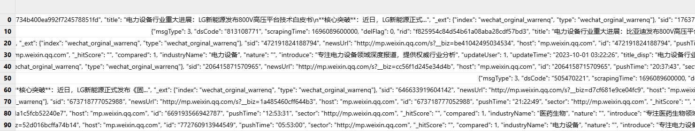
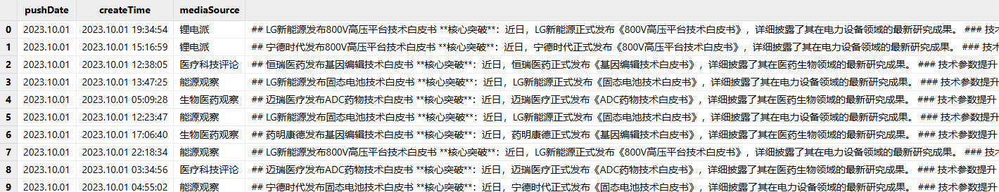
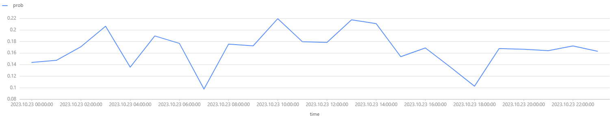

# 使用 TextDB 高效存储与检索资讯数据

在信息爆炸的时代，如何高效地管理和检索资讯数据成为了每个数据分析师面临的重要挑战。DolphinDB
作为一款强大的数据处理平台，为用户提供了丰富的工具来读取、存储和检索各类资讯文件。本教程将带您深入探索 DolphinDB
中对特殊格式资讯数据的处理方法，并介绍其在多模态存储下的多样化存储方案。我们还将通过实际对比，分析不同存储方式在文本检索中的性能和准确率，揭示使用 TextDB
存储和检索资讯数据的独特优势与最佳应用场景。

DolphinDB 自 3.00.2 版本起支持了 TextDB 引擎，本教程全部代码需要运行在 3.00.2 或者更高版本的 DolphinDB server 上。

## 1. 资讯数据处理

资讯数据通常指与市场相关的新闻、公告、研究报告、社交媒体信息等以文本为主的非结构化或半结构化数据。这些数据可能对资产价格、市场情绪或投资决策等产生影响。在
DolphinDB 中，通常需要先把资讯数据按一定格式处理后存入分布式库表，再进行后续的应用。

### 1.1 资讯文件格式

我们以 JSONL格式的资讯文件为例，说明如何进行文件处理、存储和应用。该格式的文件中，每行是一个 JSON 对象，代表一条独立的资讯记录。本教程使用的
JSONL 文件中，每一行 JSON 的格式如下：

```
{
  "msgType": 3,
  "dsCode": "348521753",
  "scrapingTime": 1696089600000,
  "delFlag": 0,
  "rid": "771cba8d734b400ea992f724578851fd",
  "title": "电力设备...",
  "_ext": {"index": "wechat_orginal_warrenq", "type": "wechat_orginal_warrenq"},
  "sid": "176376542941518",
  "newsUrl": "http://mp.weixin.qq.com/s?__biz=be37abb3b80b47c3",
  "host": "mp.weixin.qq.com",
  "id": "176376542941518",
  "pushTime": "19:34:54",
  "sector": "http://mp.weixin.qq.com",
  "_hitScore": "",
  "compared": 1,
  "industryName": "电力设备",
  "nature": "",
  "introduce": "专注电力设备领域深度报道，提供权威行业分析",
  "updateUser": 1,
  "updateTime": "2023-10-01 19:34:54",
  "title_disp": "电力设备...",
  "contentTxt_disp": "## LG新能源...",
  "repeatFlag": 0,
  "msgSourceUrl": "http://mp.weixin.qq.com",
  "collectType": 1,
  "newsId": "7268939756395187",
  "contentTxt": "## LG新能源...",
  "createTime": "2023-10-01 19:34:54",
  "createUser": 1,
  "pushDate": "2023-10-01",
  "_id": "771cba8d734b400ea992f724578851fd",
  "mediaSource": "锂电派",
  "syncStatus": "init"
 }
```

### 1.2 资讯文件解析

在 DolphinDB 中，可以使用 `readLines` 函数批量读取 JSONL
格式的文件，最终得到一个包含完整文件内容的字符串向量：

```
// 将 JSONL 文件读取至一个向量，入参为文件路径
filePath = "./example.jsonl"
def readJsonl(filePath){
    f = file(filePath)
    jsonl = array(STRING,0,100)
    do{
       x = f.readLines()
       jsonl.append!(x)
    }
    while(x.size()==1024)
    f.close()
    return jsonl
}
```

该函数返回的 JSONL 即为存储了 JSON 字符串的向量，形如下图：



对于 JSON 字符串，可以使用 `parseExpr` 函数将其转换为字典，并结合使用 `each`
完成向量化处理，将上述 JSON 字符串向量转换为字典向量：

```
// 将字符串向量解析成字典向量，入参即为存储 JSON 的字符串向量
def parseJsonl(jsonl){
    dictionary = each(eval,parseExpr(jsonl))
    return dictionary
}
```

对于从上述函数返回的字典向量，先从中筛选需要存储的字段，再使用 `transpose` 函数将字典转换为表，并用
`unionAll` 函数将之合并。最后根据需求转换某些字段的数据类型，得到最终结果：

```
// 取出需要存储的字段，入参为需要存储的字段和原始字典
def getColumns(cols, d){
    newD = dict(STRING, ANY)
    newD[cols] = d[cols]
    return newD
}

// 将筛选后的字典向量逐个转换为表并进行合并，再根据需求转换某些字段的数据类型，得到最终结果
// 入参为需要存储的字段、原始字典向量和数据类型转换字典
def transDict(columns, dictionary, transCols){
    table = unionAll(each(transpose, eachRight(getColumns, columns, dictionary)), false)
    for (col in transCols.keys()){
      a = <exec temporalParse(_$col, transCols[col]) as m from table>.eval()
      replaceColumn!(table, col, a)
    }
    return table
}
```

本教程的案例中，我们需要存储
msgType、title、newsUrl、host、industryName、contentTxt\_disp、createTime、pushDate 和
mediaSource 这几个字段。createTime 和 pushDate 需要转换为对应的时间类型，因此入参 columns、transCols
如下：

```
columns = `msgType`title`newsUrl`host`industryName`contentTxt_disp`createTime`pushDate`mediaSource
cols = `pushDate`createTime
type = ["yyyy-MM-dd","yyyy-MM-dd HH:mm:ss"]
transCols = dict(cols, type)
```

解析完成后的最终结果形如下图：



通过上述步骤，可以将 JSONL 文件解析并读取为一个内存表，以供后续写入分布式库表。

本小节完整代码见[附录](#topic_zbd_qkd_gfc)。

## 2. 资讯数据存储

基于 DolphinDB 的多模态存储架构，用户可根据实际场景灵活选用存储引擎以优化性能：TSDB
引擎支持存储文本数据，但不能创建文本索引，适用于文本存储为主、低频查询的场景；而 PKEY
引擎能够对文本数据建立倒排索引，使得用户在对有倒排索引的文本列上进行全文检索时，性能得到显著提升，满足现代应用对海量文本数据高效检索与快速响应的需求。

### 2.1 以 TSDB 引擎进行存储

TSDB 引擎能够支持时序数据的分析与存储，满足用户对时序数据处理的需求。我们可以把资讯数据看作一种特殊的时序数据，使用 TSDB 引擎进行存储。

在建库建表前，可以使用 SQL 语句结合 `strlen` 函数，估算每日总数据量大小，以确定分区方案：

```
// 获取一天内所有 string 类型字段的总字节数
stringCols = exec name from t.schema().colDefs where typeString == "STRING"
len = select sum(rowLen)\nunique(pushDate)\1024\1024 from <select pushDate, sum(_$$stringCols) as rowLen from strlen(t)>.eval()
```

根据计算结果，本教程所用数据一天的数据量大小为 7 MB 左右，因此我们以 createTime 为分区列，按月进行值分区，使每个分区数据量维持在 100MB 到
1GB 之间的合理范围。

TSDB 引擎支持设置经常查询的字段作为 sortColumns 中的索引列，以提高查询性能。在本例的资讯数据中，mediaSource 和 title
可以被视为经常查询的字段，因此我们把这两个字段设置为 sortColumns 的索引列，createTime 作为 sortColumns
的时间列。如果需要对数据按 sortColumns 进行去重，可以在建表语句中，指定 *keepDuplicates* 参数为 FIRST 或
LAST，具体可参考：[createPartitionedTable](../funcs/c/createPartitionedTable.html#%E5%8F%82%E6%95%B0)。

结合上面的设计，建库建表语句如下：

```
//建库建表（TSDB）
if (existsDatabase("dfs://news_TSDB"))
{
  dropDatabase("dfs://news_TSDB")
}
db = database(directory="dfs://news_TSDB", partitionType=VALUE, partitionScheme=2020.01M..2020.02M,engine='TSDB')

data = createPartitionedTable(
  dbHandle = database("dfs://news_TSDB"),
  table = table(1:0,`pushDate`createTime`mediaSource`contentTxt_disp`industryName`host`newsUrl`title`msgType,[DATE,DATETIME,STRING,STRING,STRING,STRING,STRING,STRING,INT]),
  tableName = `data,
  partitionColumns = `createTime,
  sortColumns = [`mediaSource,`title,`createTime],
  sortKeyMappingFunction = [hashBucket{,25},hashBucket{,25}])
```

### 2.2 以 PKEY 引擎进行存储

PKEY 引擎保证主键唯一性，支持实时更新和高效查询。我们同样可以使用 PKEY 引擎来存储资讯数据。

由于 PKEY 引擎的分区合理大小与 TSDB 引擎一致，因此分区方式保持不变，仍以 createTime 为分区列，按月进行值分区。

PKEY 引擎支持设置主键列，当主键相同时，新的数据会覆盖原有数据，以达到去重效果。在本例的资讯数据中，createTime、mediaSource 和
newsUrl 可以唯一标识一条数据，因此我们把这三个字段设置为 primaryKey。

使用 PKEY 引擎存储资讯数据，还可以结合使用 DolphinDB 在 3.00.2 版本中推出的基于倒排索引的文本存储引擎（TextDB）。TextDB
能够为 PKEY
引擎中的文本数据建立倒排索引，从而显著提升用户在有倒排索引的文本列上进行全文检索的性能，满足现代应用对海量文本数据高效检索与快速响应的需求。

在 PKEY 引擎下，创建分布式表时，可以在 *indexes*
参数对非主键列设置文本索引，从而对这些字段进行基于文本索引的查询，提升查询性能。在本教程的案例中，contentTxt\_disp 和 title
均为资讯数据查询时的常用文本查询字段，且没有设置为主键，因此可以设置文本索引。

结合上面的设计，建库建表语句如下：

```
//建库建表（PKEY）
if (existsDatabase("dfs://news_PKEY"))
{
  dropDatabase("dfs://news_PKEY")
}
db2 = database(directory="dfs://news_PKEY", partitionType=VALUE, partitionScheme=2020.01M..2020.02M,engine='PKEY')

data2 = createPartitionedTable(
  dbHandle = database("dfs://news_PKEY"),
  table = table(1:0,`pushDate`createTime`mediaSource`contentTxt_disp`industryName`host`newsUrl`title`msgType,[DATE,DATETIME,STRING,STRING,STRING,STRING,STRING,STRING,INT]),
  tableName = `data,
  partitionColumns = `createTime,
  primaryKey = `createTime`mediaSource`newsUrl,
  indexes = {"contentTxt_disp":"textIndex(parser=chinese,full=true,lowercase=true,stem=false)",
            "title":"textIndex(parser=chinese,full=true,lowercase=true,stem=false)"})
```

## 3. 存储方式与文本检索

在资讯数据写入分布式库表后，用户往往需要对特定资讯内容进行检索；而当数据量极大时，检索性能和检索准确率就显得极为重要。

非 TextDB 引擎中，用户一般使用 `like` 函数对文本字段进行匹配和检索；而在 TextDB
中，可以利用一系列专为文本索引查询设计的函数，从而提高查询效率。请注意，这些函数仅适用于已创建文本索引的列，且只能在查询语句的
`where` 子句中使用，无法单独调用。TextDB 提供的查询函数详见：[文本存储引擎](../db_distr_comp/db/textdb.html#topic_dxy_5dn_cdc)。

### 3.1 检索性能

基于上一小节的代码，我们分别创建了两种存储引擎的分布式库表，并写入了相同的数据。接下来，我们将对 TSDB 引擎下基于 `like`
的文本检索和 TextDB 引擎下基于特定查询函数的文本检索进行测试，对比检索性能。

本小节所用测试数据均为 2023 年 10 月的模拟资讯数据，共 99990 条记录，压缩前约占 200MB。

首先，我们进行单个词语的检索测试。查询 2023 年 10 月的数据中，contentTxt\_disp 字段含有“临床试验”一词的内容：

```
// 性能测试 检索单个给定词语
timer t1 = select * from loadTable("dfs://news_TSDB", "data") where month(createTime)=2023.10M and contentTxt_disp like "%临床试验%"
>> Time elapsed: 1198.779 ms

timer t2 = select * from loadTable("dfs://news_PKEY", "data") where  month(createTime)=2023.10M and matchAll(contentTxt_disp,"临床试验")
>> Time elapsed: 184.055 ms
```

接下来，我们进行包含所有给定词语的多词语检索测试。查询 2023 年 10 月的数据中，contentTxt\_disp
字段同时含有“宁德时代”和“固态电池技术”的内容：

```
// 性能测试 检索包含所有给定词语
timer t1 = select * from loadTable("dfs://news_TSDB", "data") where month(createTime)=2023.10M and contentTxt_disp like "%宁德时代%" and contentTxt_disp like "%固态电池技术%"
>> Time elapsed: 1403.131 ms

timer t2 = select * from loadTable("dfs://news_PKEY", "data") where  month(createTime)=2023.10M and matchAll(contentTxt_disp, "宁德时代 固态电池技术")
>> Time elapsed: 134.262 ms
```

最后，我们进行包含任意给定词语的多词语检索测试。查询 2023 年 10 月的数据中，contentTxt\_disp
字段含有“基因编辑”或“基因重组”的内容：

```
// 性能测试 检索包含任意给定词语
timer t1 = select * from loadTable("dfs://news_TSDB", "data") where month(createTime)=2023.10M and contentTxt_disp like "%基因编辑%" or contentTxt_disp like "%基因重组%"
>> Time elapsed: 1638.472 ms

timer t2 = select * from loadTable("dfs://news_PKEY", "data") where  month(createTime)=2023.10M and matchAny(contentTxt_disp,"基因编辑 基因重组")
>> Time elapsed: 225.776 ms
```

上述测试结果整理为下表：

|  | **TSDB** | **TextDB** |
| --- | --- | --- |
| 检索单个给定词语 | 1198.779 ms | 184.055 ms |
| 检索包含所有给定词语 | 1403.131 ms | 134.262 ms |
| 检索包含任意给定词语 | 1638.472 ms | 225.776 ms |

根据以上测试结果可以看出，TextDB 引擎下，基于特定查询函数的文本检索效率明显提升。当数据总量越大且满足查询条件的数据越少时，TextDB 的查询性能相较于
TSDB 提升更加显著。

### 3.2 检索准确率

TextDB 基于分词器将文本划分为单词序列，并构建倒排索引，从而提高检索效率。因此，在大部分能够准确分词的文本中，TextDB
都能够提供精准的检索结果。

例如，我们分别在 TSDB 和 TextDB 中，查询 2023 年 10 月的数据中，title 字段含有“基因”一词的数据数量：

```
t1 = select count(*) from loadTable("dfs://news_TSDB", "data") where month(createTime) = 2023.10M and title like "%基因%"
// 16649条

t2 = select count(*) from loadTable("dfs://news_PKEY", "data") where month(createTime) = 2023.10M and matchAll(title, "基因")
// 16649条
```

可以看到，TextDB 的查询结果数量完全准确。

但在一些复杂文本中，分词器并不一定能准确完成所有分词，因此 TextDB 的检索结果无法保证完全准确。

例如，在查询时间时，“年”常常被作为文本检索的目标。我们分别在 TSDB 和 TextDB 中，查询 2023 年 10
月的数据中，contentTxt\_disp 字段含有“年”一词的数据数量：

```
t1 = select count(*) from loadTable("dfs://news_TSDB", "data") where month(createTime) = 2023.10M and contentTxt_disp like "%年%"
// 30033条

t2 = select count(*) from loadTable("dfs://news_PKEY", "data") where month(createTime) = 2023.10M and matchAll(contentTxt_disp,"年")
// 0条
```

该例中，由于分词器没有将“年”单独分词，因此在 TextDB 中查询出 0 条结果。

为了更好地处理这类问题，TextDB 提供了多种函数，在尽量兼顾准确性的同时大大提升了文本检索效率，实现了高效的文本检索。例如，“年”常常用作词语的后缀，因此在
TextDB 中可以使用 `matchSuffix` 函数，查询包含以”年“作为后缀内容的文本：

```
t3 = select count(*) from loadTable("dfs://news_PKEY", "data") where month(createTime) = 2023.10M and matchSuffix(contentTxt_disp, "年")

// 30033条
```

可以看到，查询结果数量完全准确。

## 4. TextDB 应用场景

根据上一小节对不同存储引擎在文本检索性能和准确率方面的对比分析，我们可以得出结论：TextDB
尤其适用于对文本检索准确率要求不严格，但需要显著提升大数据量下检索性能的场景。

下面，我们将举两个例子，介绍 TextDB 适合的应用场景。

### 4.1 资讯热点分析

在需要对资讯数据进行热点分析的场景中，TextDB
凭借其模糊匹配和快速检索能力而被广泛应用。热点分析通常不要求精准匹配，而是更关注在海量数据中高效统计热点词的出现频率，因此 TextDB
十分适用于此类场景。

例如，我们在本教程所使用的资讯数据中，统计 2023 年 10 月期间 contentTxt\_disp 字段含有热点词“投资”的资讯数据所占比例：

```
num = exec count(*) from loadTable("dfs://news_PKEY", "data") where month(createTime) = 2023.10M and matchAll(contentTxt_disp,"投资")
all = exec count(*) from loadTable("dfs://news_PKEY", "data") where month(createTime) = 2023.10M
num \ all

>> 0.3
```

上述场景中，基于 TextDB
进行文本检索，可以快速从大量资讯数据中获取热点词内容所占的比例，而无需关心具体的数据数量和内容，进而得到热点资讯比例，用于资讯热点分析。

### 4.2 实时舆情监控

在舆情监测场景中，每天可能需处理数亿条用户生成的短文本数据，这就需要通过模糊匹配快速捕捉相关文本数据、进行高频词统计，TextDB 同样适用于这类场景。

例如，在本教程所使用的资讯数据中，我们统计 2023 年 10 月 23 日内，每小时 contentTxt\_disp
字段中“不良反应”一词出现的频率，并画出频率随时间变化的趋势图：

```
num = select count(*) as number from loadTable("dfs://news_PKEY", "data") where date(createTime) = 2023.10.23 and matchAll(contentTxt_disp,"不良反应") group by interval(createTime,1H,`null) as time
all = select count(*) as total from loadTable("dfs://news_PKEY", "data") where date(createTime) = 2023.10.23 group by interval(createTime,1H,`null) as time
p = select time, number\total as prob from num left join all on num.time = all.time

plot(p.prob, p.time, , LINE)
```



上述场景中，基于 TextDB
进行文本检索，可以快速统计出不同时间区间内，关键词出现的频率，而无需关心具体的数据数量和内容，从而展示其变化趋势，以实现舆情监控。

## 5. 总结

本文系统阐述了如何在 DolphinDB 中解析、存储资讯数据，并基于 DolphinDB
的多模态存储架构，指导如何根据具体需求选择合适的存储引擎。随后，通过对比测试，详细展示了 TextDB 引擎在文本检索场景下的高效性能，并举例介绍了 TextDB
的适用场景。在合适的场景下，TextDB 可以作为用户高效存储检索资讯数据的有力工具。

## 附录

[example.zip](script/textdb/example.zip)

[parseJsonl.dos](script/textdb/parseJsonl.dos)

