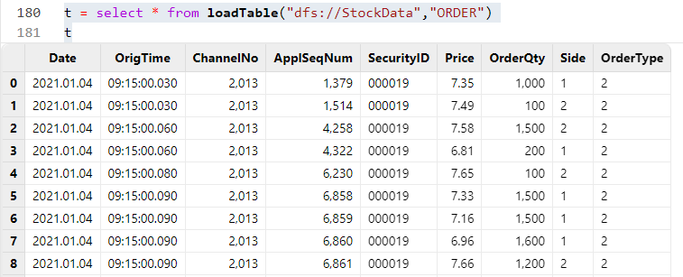

# 编程最容易忽略的十个细节

在 DolphinDB 中，无论是数据导入、数据分析还是流计算，编程都是关键的基础。而在编程中，想要更高效更优雅地写脚本，并避免一些常见问题，则需要注意一些细节。本篇教程列举10个实用的细节，有助于 DolphinDB 初学者避免分区冲突、类型不一致、计算错误、效率低下、内存膨胀、堆栈溢出等问题，提高使用 DolphinDB 编程脚本的水平。

## 1. 在 `mr` 中写入分布式表时注意避免分区冲突

`mr` 函数，即 Map-Reduce，是在 DolphinDB 分布式计算中最常用的函数之一。语法如下

```
mr(ds, mapFunc, [reduceFunc], [finalFunc], [parallel=true])
```

通常，数据表会被划分为多个分区，每个分区表被视作一个数据源（ds）。*mapFunc* 参数负责在每个 ds 内部处理数据，可选参数 *finalFunc* 会将 *mapFunc* 的返回值合并或汇总。若未使用 *finalFunc*，就会直接返回 *mapFunc* 的结果，也就是由所有返回值组合成的元组。

在进行复杂计算时，我们通常在分区内计算数据，并在映射过程中直接将其写入另一个数据库表。但是，如果 *mapFunc* 中包含写入另一个表的操作，且原库表和结果库表的分区不一致，就可能会遇到写入冲突的报错。

### 1.1 错误代码

下面使用 `mr` 对一个时间和标的均为 value 分区的库表做计算，完成后将结果写入一个仅按时间 value 分区的库表中：

```
def myMapFunc(table){
	minReturn = select `dayReturnSkew as factorname, skew(ratios(close)) as val from loadTable("dfs://k_minute_level","k_minute") group by date(tradetime) as tradetime, securityid
	loadTable("dfs://K_FACTOR_VERTICAL","factor_k").append!(minReturn)
}
ds = sqlDS(<select * from  loadTable("dfs://k_minute_level","k_minute")>)
mr(ds,myMapFunc)
```

运行这段代码会报错：`1 map call(s) failed. The error message for the first failed call is: <ChunkInTransaction>filepath '/K_FAC/TOR_VERTICAL/202001M_202101M/dayReturnSkew/a' has been owned by transaction 27 RefId: S00002`。

这是因为上述例子中，`mr` 数据源的分区方式和目标写入库表的分区方式是冲突的，即多个数据源中的计算结果对应了待写入库表的同一个分区。例子中的数据源涉及到三个分区，而计算结果对应的待写入库表只写入一个分区，在三个并行计算完成后，同时往同一个分区写入，会发生分区冲突，抛出异常，写入失败。

这种情况下，每一个 map 的结果写入结果表时，最好是串行写入。串行写入的方法有很多，包括：

* 在 `mr` 中不做写入，只做计算。拿到返回的结果后，使用 `unionAll` 将多个结果表进行合并，再一次性写入目标库表。
* 在 `mr` 的 *finalFunc* 中完成合并结果和写入目标库表的操作。
* 如果 `mr` 的计算结果很大，在内存中无法合并结果，则可以将结果写入流表，由流表的 handler 来串行写入目标库表。

### 1.2 解决方案

```
def myMapFuncCorrect(table){
	minReturn = select `dayReturnSkew as factorname, skew(ratios(close))
	as val from loadTable("dfs://k_minute_level","k_minute")
    	group by date(tradetime) as tradetime, securityid
	return minReturn
	}
def unionAndWrite(result){
	multi_result = unionAll(result,false)
	return tableInsert(loadTable("dfs://K_FACTOR_VERTICAL","factor_k"), multi_result)
	}
mr(ds, myMapFuncCorrect, , unionAndWrite)
```

上述代码中，我们在 *finalFunc* 里对各个 ds 的计算结果进行了合并，再将合并结果写入目标库表，可以有效避免分区冲突。

## 2. 留意空值的数据类型

在 DolphinDB 中，空值既可以是无特定类型的（如 NULL），也可以是特定类型的（如 `int(NULL)`、`double(NULL)`、`string(NULL)` 等）。在向强类型的向量或表中填充或更新空值时，必须确保空值的数据类型与向量类型或表中对应列的类型相匹配。

### 2.1 错误代码

下面这段代码试图更新表中的空值：

```
id = `a`b`c
val = 1 2 3
t1 = table(id, val)
t2 = select NULL as type, * from t1
update t2 set type = "S"
```

这段代码将会报错：`The data type of the new values does not match the data type of column type.`

这是因为在生成 t2 时，由于没有指定空值的数据类型，将会生成 VOID 类型的空值，导致 type 列的类型为 VOID。因此，在更新（`update`） t2 时，由于 “S” 是 STRING 类型，与 type 列的类型不匹配，便无法将其更新到 type 列中。

### 2.2 解决方案

```
id = `a`b`c
val = 1 2 3
t1 = table(id, val)
t2 = select string(NULL) as type, * from t1
update t2 set type = "S"
```

上述代码中，我们在生成 t2 时，显式指定了 type 列空值的类型为 STRING 类型，因此可以正常 `update` t2，不会报错。

## 3. 注意矩阵与表之间的转换

在做计算的时候，经常会遇到要转换数据结构的情况，譬如将表转为矩阵。但是由于矩阵和表的性质不同，普通转换的时候可能会缺失一些信息（如表的列名、矩阵的行列标签等）。因此，在转换过程中，我们需要注意补充这些缺失的信息。

### 3.1 错误代码

```
t = table(stretch(2020.01.01..2020.01.05, 10) as Date,
    take(`AAPL`BABA,10) as sym, take(`alpha1,10) as factorName,
    0.1 0.2 0.11 0.22 0.13 0.5 0.6 0.4 0.44 0.12 as factorValue)
m = exec factorValue from t pivot by Date,sym
m
```

输出结果为：

```
           AAPL BABA
           ---- ----
2020.01.01|0.1  0.2
2020.01.02|0.11 0.22
2020.01.03|0.13 0.5
2020.01.04|0.6  0.4
2020.01.05|0.44 0.12
```

随后，将矩阵 m 转换为表：

```
table(m)
```

预期的输出为：

```
Date       AAPL BABA
---------- ---- ----
2020.01.01 0.1  0.2
2020.01.02 0.11 0.22
2020.01.03 0.13 0.5
2020.01.04 0.6  0.4
2020.01.05 0.44 0.12
```

实际输出如下，其中 matrix 的 label 列丢失：

```
AAPL BABA
---- ----
0.1  0.2
0.11 0.22
0.13 0.5
0.6  0.4
0.44 0.12
```

由于矩阵的值不包括矩阵的行标签，因此在矩阵转换为表时，只会把矩阵的值转成表的列。如果需要保证矩阵中的标签列不丢失，并且转成表中的首列，则需要手动添加。反之亦然，如果要将表的内容转为矩阵，那么需要先剔除目标矩阵中的标签列，把目标值的列先转成矩阵，再将标签列手动添加进矩阵。

### 3.2 解决方案

```
//将矩阵转成正确的表
correctT = table(m.rowNames()) join table(m)
//将表转换成正确的矩阵
correctM = matrix(correctT[,1:]).rename!(correctT.Date,correctT.colNames()[1:])
```

矩阵转表时，将矩阵的行标签通过 `rowNames()` 函数取出，拼接到转换后的表中。表转矩阵时，将值所在的列转成矩阵，接着用 `rename!()` 函数给矩阵列和行添加标签。

## 4. 表连接时注意键值冗余

表连接是通过连接谓词来合并两张或者多张表的数据，从而创建新表的函数。在进行表连接时，如果连接列存在多条匹配记录，通常会返回所有匹配记录。因此，如果关联列有大量重复值，可能会导致结果表规模急剧膨胀，甚至引发内存溢出（OOM）等问题。

### 4.1 错误代码

下面这段代码将两个表做左连接：

```
t1 = table(`a`b`c as id, 1 2 3 as val1)
t2 = table(`a`a`a`b`b`b`c`c`c as id, 4..12 as val2)
t1.lj(t2,`id)
```

将会得到结果：

```
id val1 val2
-- ---- ----
a  1    4
a  1    5
a  1    6
b  2    7
b  2    8
b  2    9
c  3    10
c  3    11
c  3    12
```

这是因为，左连接（`lj`）会返回左表中所有与右表匹配的记录。如果右表中没有匹配的记录，将会返回 NULL；如果右表中有多条匹配记录，将会返回所有的匹配记录。因此，由于右表中的 id 列有很多重复值，实际结果会比左表行数多得多。想要保证返回结果的行数与左表的行数相等，可以使用左半连接 `lsj`  函数，如果右表中有多条匹配记录，`lsj` 将会取第一条的匹配记录。

### 4.2 解决方案

```
t1 = table(`a`b`c as id, 1 2 3 as val1)
t2 = table(`a`a`a`b`b`b`c`c`c as id, 4..12 as val2)
t1.lsj(t2,`id)
```

如上，我们使用左半连接 `lsj` 来连接两个表，就不会出现匹配多次的冗余情况。

## 5. SQL 中变量名不要与列名同名

DolphinDB 支持多范式编程，包括 SQL 编程、命令式编程和函数式编程。在 SQL 语句中，列名可能与函数名或变量名相同。当三者产生歧义时，DolphinDB 会将其视为列名。若想表示函数的含义，可以在变量名称前加地址符 &。然而，当列名与变量名产生歧义时，就无法通过语法来消除歧义了。

注意，在 DolphinDB 中的 SQL 中，列名是大小写不敏感的。因此，取变量名时尽量不要与表中字段重名，以免出现不符合预期的返回结果。

### 5.1 错误代码

下面这段代码试图删除指定日期的数据：

```
t = table(2020.01.01..2020.01.05 as Date)

date = 2020.01.01
delete from t where Date = date
t.Date
```

正常情况下，这段代码预期会返回向量 [2020.01.02,2020.01.03,2020.01.04,2020.01.05]，但实际会返回空值，表示表 t 中已无数据。

在这个 where 语句中，由于列名具有最高优先级， "=" 右边的 "date" 会优先查找是否存在名为 "date" 的列。由于列名不区分大小写，"=" 右边的 "date" 会被识别为表 t 中的 "Date" 列。因此，在 where 条件中，这样的写法会被解释为 "列date = 列date"，意味着每一条记录都符合 where 条件，从而导致表 t 被清空。

### 5.2 解决方案

避免变量名与列名同名，即把 date 这个变量改成例如 date1 即可。

```
t = table(2020.01.01..2020.01.05 as Date)
date1 = 2020.01.01
delete from t where Date = date1
```

## 6. 使用元编程计算多列数据

在使用 SQL 对表的多列进行计算时，手写 SQL 不仅繁琐，而且容易出错。因此，在对表内多列进行计算时，我们可以利用元编程来简化代码逻辑并提高准确性。如果想学习元编程相关的更多内容，可以阅读教程：[元编程](https://docs.dolphindb.cn/zh/tutorials/meta_programming.md)。

### 6.1 繁琐代码

```
date = 2023.01.01..2023.01.10
code = take(`SH0001,10)
price = rand(10.0,10)
t = table(date,code,price)

res = select date, price, code, mmax(price,2) as mmax_2d, mmax(price,5) as mmax_5d,
mmax(price,7) as mmax_7d, mmin(price,2) as mmin_2d, mmin(price,5) as mmin_5d,
mmax(price,7) as mmin_7d, mavg(price,2) as mavg_2d, mavg(price,5) as mavg_5d,
mavg(price,7) as mavg_7d, mstd(price,2) as mstd_2d, mstd(price,5) as mstd_5d,
mstd(price,7) as mstd_7d from t context by code
```

手写 SQL 十分繁琐。

### 6.2 优化方案

```
date = 2023.01.01..2023.01.10
code = take(`SH0001,10)
price = rand(10.0,10)
t = table(date,code,price)

factor = `mmax`mmin`mavg`mstd
windowSize = 2 5 7
metrics=[<date>,<code>,<price>]

f = def (x, y){return sqlCol(`price, partial(funcByName(x),,y),
		x + "_" + string(y) + "d")}
metrics.appendTuple!(cross(f, factor, windowSize).flatten())

res = sql(select=metrics, from = t, groupBy=sqlCol(`code), groupFlag=0).eval()
```

如上所示，我们使用 `cross` 函数结合匿名函数，生成了所有需要计算的因子的源代码，并加入到一个 *metrics* 向量中，即可用元编程函数 `sql` 方便地计算得到结果。

## 7. 注意元组的追加行为

在 DolphinDB 中，元组 （ANY VECTOR） 是一种特殊的向量类型，它允许元素类型不一致，其类型可以是表、矩阵、字符串向量、数值向量等。因此，在向元组中添加元素时，我们需要明确是将整个目标添加到元组中，还是将目标中的元素分别添加到元组中。

例如，在元编程中拼接元代码时，直接拼接可能会得到不符合预期的结果。

### 7.1 错误代码

比如一个表中有这些字段："dDate", "symbol", "open", "close", "high", "low"。目标是对除了日期和 symbol 字段外的其他字段做 demean 操作（原值-平均值）。在用元编程写 *select* 参数的时候可能会这样写：

```
colName = ["dDate", "symbol", "open", "close", "high", "low"]
colNoCal = sqlCol(colName[0:2])
colCal = each(makeUnifiedCall{demean}, sqlCol(colName[2:]))
selects = colNoCal join colCal
//预期的行为：(< dDate >,< symbol >,< demean(open) >,< demean(close) >,
    < demean(high) >,< demean(low) >)
//实际的输出：(< dDate >,< symbol >,(< demean(open) >,< demean(close) >,
    < demean(high) >,< demean(low) >))
```

可以看到实际输出中的元组只有三个元素，第三个元素是一个包含4个元素的元组。由于元组类型可以接受任何类型，因此在将 colCal 这个变量使用 `join` 添加到 colNoCal 时，colCal 将会被整体添加到 colNoCal 中。在元编程中，我们需要将 colCal 中的元素铺开加入到 colNoCal 中，因此需要逐个调用 `join`，将其一个个加进元组中。

### 7.2 解决方案

```
metrics = colNoCal
metrics.appendTuple!(colCal, wholistic = false)
metrics
```

如上所示，我们使用 `appendTuple!` 函数，当 wholistic 参数为 false 时，就能够将 colCal 中的每一个元素依次追加到 metrics 中，即可得到符合预期的结果。

## 8. WHERE 子句正确进行分区剪枝

在查询分布式表时，我们往往只需要查询部分分区的数据。当数据量较大时，过滤条件的不同写法会造成查询耗时的巨大差异。查询分布式表时，当 WHERE 子句中的过滤条件满足以下要求时，可以进行分区剪枝，加快查询速率。

* 当对采用 VALUE 分区、RANGE 分区或 LIST 分区的分布式表做查询时，若 where 子句中某个过滤条件同时满足以下条件，则系统只加载与查询相关的分区，以节省查询耗时：
  + 仅包含分布式表的原始分区字段、使用关系运算符（<, <=, =, ==, >, >=, in, between）或逻辑运算符（or, and），以及常量（包括常量与常量的运算）；
  + 非链式条件（例如100< x <200）；
  + 过滤逻辑可以缩窄相关分区范围。
* 当查询采用 HASH 分区的分布式表时，若 where 子句中某个过滤条件满足以下条件，则系统会进行分区剪枝：
  + 包含分布式表的原始分区字段，使用关系运算符（=, ==, in, between）或逻辑运算符（or, and），以及常量（包括常量与常量的运算）。**注意**：当分区字段是 STRING 类型时，使用 between 运算符不能进行剪枝。

若 WHERE 子句中的过滤条件不满足以上要求，则会遍历所有分区进行查询。因此，在 WHERE 条件中，需要正确进行分区剪枝。如果想了解 DolphinDB 中关于时间类型的比较和分区剪枝的更多细节，可以阅读：[DolphinDB 时间类型比较规则](https://docs.dolphindb.cn/zh/tutorials/ddb_comparison_rules_of_time_types.md)。

### 8.1 错误代码

snapshot 是一个分区表，该表按天做了 VALUE 分区，分区字段为 DateTime。下面是错误的查询方式：

```
t1 = select count(*) from snapshot
		   where temporalFormat(DateTime, "yyyy.MM.dd") >= "2020.06.01" and temporalFormat(DateTime, "yyyy.MM.dd") <= "2020.06.02"
		   group by SecurityID

// 耗时 4145 ms
```

运行如下代码，使用 `sqlDS` 查看该查询涉及的分区数：

```
sqlDS(<select count(*) from snapshot
		   where temporalFormat(DateTime, "yyyy.MM.dd") >= "2020.06.01" and temporalFormat(DateTime, "yyyy.MM.dd") <= "2020.06.02"
		   group by SecurityID>).size()

>> 752
```

显然，对于按天分区的 snapshot，查询两天的数据并不应该涉及 752 个分区，说明该查询没有做分区剪枝。这是因为在该查询中，对分区字段套用了 `temporalFormat` 函数，先对所有日期进行转换，再去和对应日期比较，因此系统需要扫描所有分区，无法做分区剪枝，导致耗时大大增加。

### 8.2 解决方案

使用 `between` 谓词来指定分区字段所在的查询区间，能够正确做到分区剪枝，可以看到正确的查询仅涉及了两个分区，耗时大大减少，仅为 92ms。

```
sqlDS(<select count(*) from snapshot
		   where date(DateTime) between 2020.06.01 : 2020.06.02 group by SecurityID>).size()

t2 = select count(*) from snapshot
		   where date(DateTime) between 2020.06.01 : 2020.06.02 group by SecurityID
```

## 9. 灵活使用字典和元编程

在进行计算时，我们经常会遇到一些通用的公式，这些公式往往以字符串的形式生成。同时，我们希望公式中的变量能够引用会话（session）中已存在的变量。然而 DolphinDB 中没有全局变量，那么如何能实现公式中变量的转换与输出呢？

### 9.1 错误代码

比如期望在函数内部对变量做计算，例如：”B+C“，得到的结果并不符合预期。

```
a = 1
b = 2
def funcA(a,b){
	B = a+1
	C = b+2
	funcExpr = "B+C"
	return parseExpr(funcExpr).eval()
	}
funcA(a,b)
//期望的输出：6
//实际的输出：SQL context is not initialized yet.
```

这是因为，`parseExpr` 函数解析变量时，首先搜索会话中的局部变量，再搜索共享变量，但不会搜索函数体内定义的局部变量。因此，需要的变量 B 和 C 均找不到，最终保存。想要找到需要的变量，则应当通过字典传入。

### 9.2 解决方案

```
a = 1
b = 2
def funcA(a, b){
	funcExpr = "B+C"
	d = dict(`B`C, [a+1, b+2])
	return parseExpr(funcExpr, d).eval()
}
funcA(a, b)
```

如上所示，我们创建了一个字典 d，作为 `parseExpr` 的参数，即可完成计算。

## 10. 避免将大结果集直接返回客户端

在使用 SQL 查询数据时，如果直接将结果返回给客户端而不赋值给变量，不仅会导致结果无法修改和参与后续计算，还可能因为结果集过大而导致 GUI 或 Web 集群管理界面等终端堆栈溢出并抛出异常。因此，在查询数据时，我们应该尽量将结果赋值给一个变量而不是直接返回给客户端。

### 10.1 错误代码

下述代码将会在 GUI 抛出异常：`Java heap space`，在 Web 集群管理界面抛出异常：`Out of Memory`。

```
select * from loadTable("dfs://StockData","ORDER")
```

这是因为如果直接进行查询，数据将会返回到终端，过大的数据量会导致客户端的堆栈溢出。

### 10.2 解决方案

```
t = select * from loadTable("dfs://StockData", "ORDER")
```

将查询结果赋值给一个变量，能够正常看到结果：



## 总结

本文介绍了使用 DolphinDB 进行编程时，最容易忽略的 10 个细节，涵盖了分区冲突、数据类型处理、元编程、分区剪枝、SQL 查询等多个方面。在编程时忽略这些细节，可能导致程序运行报错或运算结果不符合预期。用户了解了这些细节，并合理进行编程，可以极大提升脚本的质量，提高编程效率。

DolphinDB 文档中心提供了更多使用 DolphinDB 编程的相关教程：[教程](https://docs.dolphindb.cn/zh/tutorials/about_tutorials.md)。如果想浏览更多 SQL 案例，可以阅读教程：[SQL 编写案例](https://docs.dolphindb.cn/zh/tutorials/ddb_sql_cases.md)。

