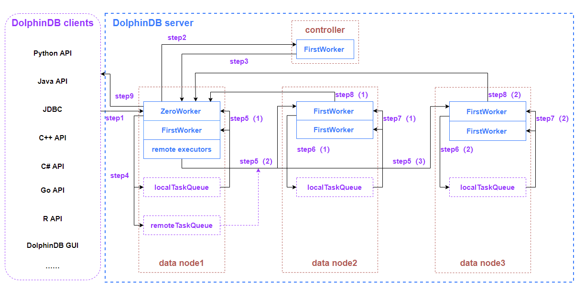

# 线程模型

## 1. 前言

DolphinDB的线程模型较为复杂，写入与查询分布式表都可能需要多个类型的线程。通过了解 SQL 查询的全过程，帮助我们了解 DolphinDB 的线程模型，掌握 DolpinDB 的配置，以及优化系统性能的方法。

本教程以一个分布式 SQL 查询为例，介绍 DolphinDB 分布式数据库查询过程的数据流，以及其经历的各类线程池。

## 2. DolphinDB 的主要节点类型

* **agent（代理节点）**

  负责执行控制节点发出的启动和关闭数据节点或计算节点的命令。在一个集群中，每台物理服务器有且仅有一个代理节点。
* **controller（控制节点）**

  负责收集代理节点、数据节点和计算节点的心跳，监控每个节点的工作状态，管理分布式文件系统的元数据和事务。
* **data node（数据节点）**

  既可以存储数据，也可以用于数据的查询和计算。
* **compute node（计算节点）**

  只用于数据的查询和计算。计算节点应用于计算密集型的操作，包括流计算、分布式关联和机器学习等场景。计算节点不存储数据，但可以通过 `loadTable` 加载数据进行计算。通过在集群中配置计算节点，可以将写入任务提交到数据节点、所有计算任务提交到计算节点，实现存储和计算的分离。

  1.30.14/2.00.1 版本开始支持计算节点。

## 3. DolphinDB 线程类型

### 3.1 worker 线程

* 常规交互作业的工作线程。
* 每个节点都存在 worker 线程，可以分为以下几类：

  + ZeroWorker
  + FirstWorker
  + SecondWorker
  + ThirdWorker
  + ForthWorker
  + FifthWorker
  + SixthWorker
* 客户端提交至节点的作业为0级，由 ZeroWorker 处理。
* 根据作业所涉及到的分区，ZeroWorker 将其分解为多个子任务。
* 其中本地节点上的子任务由 ZeroWorker 与 FirstWorker 并行执行。
* 需要由远程节点执行的子任务则降低为1级，并通过 remoteExecutor 发送到对应节点上的 FirstWorker 处理。
* 以此类推，若某个级别的子任务需要进一步拆解，则拆分出来的由远程节点执行的子任务降低一级，发送至远程节点上对应层级的 worker 处理。
* ZeroWorker, FirstWorker, SecondWorker 的线程数量由配置参数 *workerNum* 决定，分别为 *workerNum*, *workerNum*-1, *workerNum* \*0.75。
* 其余层级的 work 线程数量为上级的1/2 ，向上取整，最小个数为1。
* 配置参数 *workerNum* 默认值为机器上的 CPU 核数，最大值不超过 license 中的最大核数。

### 3.2 remote executor 线程

* 将远程任务发送到远程节点的线程。
* 在非 single 模式的节点上可以通过配置参数 *remoteExecutors* 配置线程个数。
* 默认值为集群中节点个数和本地 *worker* 的较小值。

### 3.3 asynchronous remote executor 线程

* 接收对其他节点发起的远程调用（Remote Procedure Call, RPC）任务的线程。
* 将收到的远程调用任务放到 remote executor 的任务队列中。
* 每个非 single 模式的节点上有且仅有1个该线程。

### 3.4 remote task dispatcher 线程

* 在远程调用出错需要重试时，或者一个被关闭的连接上仍有未完成的任务时，这些任务会先放到一个队列里，由 remote task dispatcher 线程从这个队列取任务并重新交由 asynchronous remote executor 线程去发起远程调用。

### 3.5 batch job worker 线程

* 执行批处理作业任务的工作线程，批处理作业是指通过函数 `submitJob`、`submitJobEx` 、`submitJobEx2` 提交的作业。
* 其上限通过配置参数 *maxBatchJobWorker* 设置。
* 如果 *maxBatchJobWorker* 未设置，其默认值是配置参数 *workerNum* 的值。
* 该线程在任务执行完后若闲置60 秒会被系统自动回收，不再占用系统资源。

### 3.6 web worker 线程

* 处理 HTTP 请求的工作线程。
* 由配置参数 *webWorkerNum* 配置，默认为1，最大值为 CPU 内核数。

### 3.7 dynamic worker manager 线程和 dynamic worker 线程

* dynamic worker 是动态工作线程，是 worker 线程的补充。
* dynamic worker manager 是创建 dynamic worker 的线程，每个节点有且仅有1个该线程。
* 当所有的 worker 线程被占满时，再有新任务到来时，通过 dynamic worker manager 线程创建 dynamic worker 线程来执行新任务。
* 根据系统并发任务的繁忙程度，总共可以创建三组动态工作线程，每一个级别可以创建 *maxDynamicWorker* 个动态工作线程。
* *maxDynamicWorker* 的默认值为配置参数 *workerNum* 的值。
* 动态工作线程在任务执行完后若闲置60秒则会被系统自动回收，不再占用系统资源。

### 3.8 infra worker 线程

* 基础设施处理线程。
* 开启高可用后，用于接收 raft 心跳汇报的线程，防止集群负载大时，心跳信息无法及时汇报。
* 默认自动创建2个该线程。

### 3.9 urgent worker 线程

* 处理紧急任务。
* 只接收一些特殊的系统级任务，譬如登录、取消作业等。
* 由配置参数 urgentWorkerNum 配置，默认值为1，最大值为 CPU 内核数。

### 3.10 block IO worker 线程

* 执行对硬盘读写任务的线程。
* 由配置参数 diskIOConcurrencyLevel 配置，默认值为1。

  ​

## 4. 一次 SQL 查询的线程经历

SQL 查询可提交到集群中任一计算节点或数据节点。获得请求的节点作为该查询的协调节点。

下面以 API 向协调节点发起一次 SQL 查询为例，讲述整个过程中所调度的所有线程。



**step1：DolphinDB 客户端向协调节点（数据节点或计算节点）发起数据查询请求**

以协调节点为数据节点为例，发起一次聚合查询，查询语句如下：

```
select avg(price)
from loadTable("dfs://database", "table")
where date between 2021.01.01 : 2021.12.31
group by date
```

假设上述聚合查询语句总共涉及300个分区的数据，且正好平均分配在三个数据节点（即每个数据节点包含了100个查询的分区数据）。

DolphinDB 客户端将查询请求进行二进制序列化后通过 TCP 协议传输给 datanode1。

**step2：datanode1 收到查询请求**

datanode1 收到客户端的查询请求后，将分配1个 ZeroWorker 线程对内容进行反序列化和解析。当发现内容是 SQL 查询时，会向 controller 发起请求，获取跟这个查询相关的所有分区的信息。整个 SQL 查询执行完毕前，这个 ZeroWorker 线程会被一直占用。

**step3：controller 收到 datanode1 的请求**

controller 收到 datanode1 的请求后，将分配1个 FirstWorker 线程对内容进行反序列化和解析，准备好本次 SQL 查询涉及的数据分区信息后，由该 FirstWorker 线程序列化后通过 TCP 协议传输给 datanode1。controller 的该 FirstWorker 线程完成该工作后将从请求队列中获取下一个请求。

**step4：datanode1 收到 controller 返回的信息**

datanode1 的 ZeroWorker 收到 controller 返回的信息后，由本节点下的1个 FirstWorker 线程对内容进行反序列化和解析。

得知本次 SQL 查询涉及的数据分区信息后，将位于本节点的分区数据计算任务添加到本地任务队列，此时本地任务队列会产生100个子任务。

同时，把需要使用远程节点 datanode2 与 datanode3 的分区数据的计算任务，以任务包的方式发送到远程任务队列。远程任务队列会被添加2个远程任务，分别打上 datanode2 和 datanode3 的标志。

**step5(1)：本地 worker 消费本地任务队列**

此时，datanode1 中的 ZeroWorker 线程和 FirstWorker 线程会同时并行消费本地任务队列的子任务。

**step5(2)(3)：本地 remote executor 发送远程任务至远程节点**

同时，remote executor 线程将远程任务队列的内容序列化后，通过 TCP 协议分别发送到 datanode2 和 datanode3。

**step6(1)(2)：远程节点收到远程任务**

datanode2 和 datanode3 收到远程任务后，将分配1个 FirstWorker 线程对内容进行反序列化和解析，并将计算任务发送到本地任务队列，此时 datanode2 和 datanode3 的本地任务队列各会产生100个子任务。

**step7(1)(2)：远程节点 FirstWorker 消费本地任务队列**

此时，datanode2 和 datanode3 上的 FirstWorker 线程会并行消费本地任务队列的子任务。

**step8(1)(2)：远程节点返回中间计算结果至 datanode1**

当 datanode2 和 datanode3 涉及的计算任务完成后，分别得到了本次 SQL 查询的中间计算结果，由一直占用的 FirstWorker 线程对内容进行序列化后，通过 TCP 协议传输给 datanode1。

**step9：datanode1 计算最终结果并返回给客户端**

datanode1 接收到 datanode2 和 datanode3 返回的中间计算结果后，由一直占用的 ZeroWorker 线程对内容进行反序列化，然后在该线程上计算出最终结果，并在序列化后通过 TCP 协议传输给客户端。

DolphinDB 客户端接收到 datanode1 返回的信息后，经过反序列化显示本次 SQL 查询的结果。

**协调节点为数据节点和计算节点的区别**：

1. 数据节点可以存储数据，计算节点不能存储数据。但计算节点解析客户端的 SQL 查询后，从 controller 拿到本次 SQL 查询涉及的数据分区信息，会将所有数据查询任务都分配到数据节点执行，得到每个数据节点返回的中间结果，最后调度计算节点的 ZeroWorker 线程计算最终结果并返回给客户端。
2. 当实时写入的数据量非常大时，建议配置计算节点，将所有 SQL 查询都提交到计算节点，实现存储和计算的分离，减轻数据节点的计算工作负担。

## 5. 优化建议

通过分析上述的线程经历，可以发现，本次 SQL 查询一共发生了8次 TCP 传输，其中2次是 DolphinDB server 和 DolphinDB client 之间的传输。如果查询结果的数据量比较大，同时又对查询结果的延时性比较敏感，可以选择如下6个优化方向：

* 集群节点之间，以及节点和客户端之间的通信推荐使用万兆以太网。
* 优化线程配置参数。(详见本文后续章节)
* 增加每个节点的物理磁盘的数量。更多的磁盘可以更快速地并行读取多个分区的数据。
* SQL 语句优化：where 条件添加分区字段的信息过滤，起到分区剪枝的目的，避免全表扫描。
* 在查询数据量较大时，可对 API 查询结果进行数据压缩，提高传输效率。开启压缩后从 server 下载的数据即为压缩后的数据。Java 代码示例如下。

  ```
  //API 建立 connection 的时候将第三个参数 compress 设置为 true 即可开启压缩
  DBConnection connection = new DBConnection(false, false, true);
  connection.connect(HOST, PORT, "admin", "123456");
  BasicTable basicTable = (BasicTable) connection.run("select * from loadTable(\"dfs://database\", \"table\")");
  ```
* 增加 license 限制的 CPU 核心数和内存大小，提升系统的并发处理能力。

## 6. 不同类型线程与配置参数的关系

| **线程类型** | **参数配置** | **默认配置** | **配置优化建议** |
| --- | --- | --- | --- |
| worker | workerNum | CPU的内核数 | license 限制的 CPU 核心数与物理机 CPU 核心数两者的最小值 |
| remote executor | remoteExecutors | 1 | 集群的节点数-1 |
| batch job worker | maxBatchJobWorker | workerNum | license 限制的 CPU 核心数与物理机 CPU 核心数两者的最小值 |
| web worker | webWorkerNum | 1 | 推荐 webWorkerNum 配置为4大多情况下很少通过 web 与 DolphinDB 节点交互的方式提交查询任务 |
| dynamic worker | maxDynamicWorker | workerNum | 采用默认值 |
| infra worker | infraWorkerNum | 2 | 采用默认值 |
| urgent worker | urgentWorkerNum | 1 | 采用默认值 |
| block IO worker | diskIOConcurrencyLevel | 1 | 对于 hdd 磁盘，推荐 diskIOConcurrencyLevel 设为对应节点下通过 volumes 参数配置的磁盘个数对于 ssd 磁盘，推荐 diskIOConcurrencyLevel = 0 |

**备注：**

* 如果是单节点 single 模式或者是单数据节点集群，不需要配置 remoteExecutors 的值。

  ​

## 7. 总结

通过本文介绍，可以看出，DolphinDB的线程模型主要由 worker、remote executor、batch job worker、web worker、dynamic worker、infra worker、urgent worker、block IO worker组成。在一次 SQL 查询会发生多次 TCP 传输，用户可以会根据服务器的具体情况进行合理配置线程参数，从而降低查询延时。

