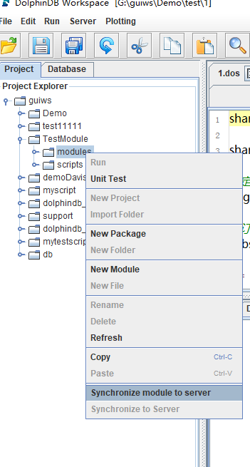

# жЁЎеқ—

еңЁдҪҝз”Ё DolphinDB
зҡ„и„ҡжң¬иҝӣиЎҢејҖеҸ‘ж—¶пјҢеҸҜд»ҘеҲӣе»әеҸҜеӨҚз”ЁжЁЎеқ—пјҢд»Ҙе°ҒиЈ…иҮӘе®ҡд№үеҮҪж•°гҖӮжЁЎеқ—еҸҜд»Ҙе°ҶеӨ§йҮҸеҮҪж•°жҢүзӣ®еҪ•ж ‘з»“жһ„з»„з»ҮеңЁдёҚеҗҢжЁЎеқ—дёӯгҖӮж—ўеҸҜд»ҘеңЁзі»з»ҹеҲқе§ӢеҢ–ж—¶йў„еҠ иҪҪжЁЎеқ—пјҢд№ҹеҸҜд»ҘеңЁйңҖиҰҒдҪҝз”Ёзҡ„ж—¶еҖҷеј•е…ҘжЁЎеқ—гҖӮ

## 1. ModuleпјҲжЁЎеқ—пјүд»Ӣз»Қ

еңЁ DolphinDB дёӯпјҢжЁЎеқ—жҳҜеҸӘеҢ…еҗ«еҮҪж•°е®ҡд№үзҡ„и„ҡжң¬ж–Ү件гҖӮе®ғе…·жңүд»ҘдёӢзү№зӮ№пјҡ

* жЁЎеқ—ж–Ү件й»ҳи®ӨдҝқеӯҳеңЁ [home]/modules зӣ®еҪ•дёӢгҖӮ
* жЁЎеқ—ж–Ү件еҗҚзҡ„еҗҺзјҖдёә .dosпјҲ"DolphinScript"зҡ„зј©еҶҷпјүжҲ– .domпјҲ"DolphinModule"зҡ„зј©еҶҷпјүгҖӮ
* жЁЎеқ—ж–Ү件第дёҖиЎҢеҸӘиғҪдҪҝз”Ё module еҗҺжҺҘжЁЎеқ—еҗҚд»ҘеЈ°жҳҺжЁЎеқ—пјҢеҚі module module\_nameгҖӮ
* жЁЎеқ—ж–Ү件йҷӨ第дёҖиЎҢеӨ–пјҢд»…еҸҜеҢ…еҗ«жЁЎеқ—еҜје…ҘиҜӯеҸҘдёҺеҮҪж•°е®ҡд№үгҖӮ

## 2. е®ҡд№үжЁЎеқ—

### 2.1. еҲӣе»әжЁЎеқ—зӣ®еҪ•

жүҖжңүзҡ„жЁЎеқ—е®ҡд№үй»ҳи®Өеӯҳж”ҫеңЁ [home]/modules зӣ®еҪ•дёӢпјҡ

* [home] зӣ®еҪ•з”ұзі»з»ҹй…ҚзҪ®еҸӮж•° *home* еҶіе®ҡпјҢеҸҜд»ҘйҖҡиҝҮ `getHomeDir` еҮҪж•°жҹҘзңӢгҖӮ
* иҠӮзӮ№зҡ„жЁЎеқ—зӣ®еҪ•з”ұй…ҚзҪ®еҸӮж•° *moduleDir* жқҘжҢҮе®ҡпјҢе…¶й»ҳи®ӨеҖјжҳҜзӣёеҜ№и·Ҝеҫ„ modulesгҖӮзі»з»ҹдјҡйҰ–е…ҲеҲ°иҠӮзӮ№зҡ„ home
  зӣ®еҪ•еҜ»жүҫиҜҘзӣ®еҪ•пјҢеҰӮжһңжІЎжңүжүҫеҲ°пјҢдјҡдҫқж¬ЎеңЁиҠӮзӮ№зҡ„е·ҘдҪңзӣ®еҪ•дёҺеҸҜжү§иЎҢж–Ү件жүҖеңЁзӣ®еҪ•еҜ»жүҫгҖӮиҜ·жіЁж„ҸпјҢеҚ•иҠӮзӮ№жЁЎејҸдёӢпјҢиҝҷдёүдёӘзӣ®еҪ•й»ҳи®ӨзӣёеҗҢгҖӮ

### 2.2. еҲӣе»әжЁЎеқ—ж–Ү件

еңЁ modules зӣ®еҪ•дёӢеҲӣе»әд»Ҙ .dos дёәеҗҺзјҖзҡ„жЁЎеқ—ж–Ү件пјҢдҫӢеҰӮ fileLog.dosгҖӮжЁЎеқ—ж–Ү件зҡ„第дёҖиЎҢеҝ…йЎ»жҳҜжЁЎеқ—еЈ°жҳҺиҜӯеҸҘгҖӮдҫӢеҰӮеңЁ fileLog.dos
дёӯеЈ°жҳҺжЁЎеқ—пјҡ

```
module fileLog
```

е…¶дёӯ fileLog жҳҜжЁЎеқ—еҗҚпјҢеҝ…йЎ»дёҺжЁЎеқ—ж–Ү件пјҲfileLog.dosпјүзҡ„еҗҚз§°дёҖиҮҙгҖӮ

жЁЎеқ—ж–Ү件йҷӨ第дёҖиЎҢеӨ–зҡ„еҶ…е®№д»…еҸҜеҢ…еҗ«еҮҪж•°е®ҡд№үжҲ–жЁЎеқ—еҜје…ҘиҜӯеҸҘпјҲеҰӮйңҖеј•з”Ёе…¶е®ғжЁЎеқ—пјүгҖӮдҫӢеҰӮпјҢfileLog жЁЎеқ—д»…еҢ…жӢ¬еҗ‘жҢҮе®ҡж—Ҙеҝ—ж–Ү件еҶҷе…Ҙж—Ҙеҝ—зҡ„еҮҪж•°
`appendLog`пјҡ

```
module fileLog

def appendLog(filePath, logText){
	f = file(filePath,"a+")
	f.writeLine(string(now()) + " : " + logText)
	f.close()
}
```

еңЁжЁЎеқ—ж–Ү件дёӯпјҢ**йҷӨеҮҪж•°е®ҡд№үгҖҒжЁЎеқ—еЈ°жҳҺиҜӯеҸҘе’ҢжЁЎеқ—еҜје…ҘиҜӯеҸҘеӨ–пјҢе…¶е®ғд»Јз Ғе°Ҷиў«еҝҪз•Ҙ**гҖӮ

еҰӮжһңйңҖиҰҒеҜ№жЁЎеқ—иҝӣиЎҢеҲҶзұ»пјҢеҸҜеңЁ modules зӣ®еҪ•дёӢи®ҫзҪ®еӨҡдёӘеӯҗзӣ®еҪ•пјҢд»ҘдҪңдёәдёҚеҗҢжЁЎеқ—зұ»еҲ«зҡ„е‘ҪеҗҚз©әй—ҙгҖӮдҫӢеҰӮпјҢзҺ°жңүдёӨдёӘжЁЎеқ— fileUtil е’Ң
dateUtilпјҢе®ғ们еҲҶеҲ«еӯҳж”ҫдәҺ modules/system/file/fileUtil.dos дёҺ
modules/system/temporal/dateUtil.dosпјҢйӮЈд№ҲеЈ°жҳҺиҜӯеҸҘеҲҶеҲ«дёә `module
system::file::fileUtil` дёҺ `module
system::temporal::dateUtil`гҖӮ

### 2.3. еәҸеҲ—еҢ–жЁЎеқ—ж–Ү件

дҪҝз”Ё saveModule еҮҪж•°еҸҜд»Ҙе°ҶжЁЎеқ—еәҸеҲ—еҢ–жҲҗжү©еұ•еҗҚдёә dom зҡ„дәҢиҝӣеҲ¶ж–Ү件гҖӮе°ҶжЁЎеқ—еәҸеҲ—еҢ–дёә dom ж–Ү件иғҪеӨҹеўһејәд»Јз Ғзҡ„дҝқеҜҶжҖ§е’Ңе®үе…ЁжҖ§гҖӮдҫӢеҰӮпјҢеәҸеҲ—еҢ–дёҠдёҖиҠӮдёӯзҡ„
module fileLogпјҡ

```
saveModule("fileLog")
```

dom ж–Ү件дјҡдҝқеӯҳиҮі dos ж–Ү件жүҖеңЁзҡ„зӣ®еҪ•гҖӮ

жіЁж„Ҹпјҡ

* еҰӮжһң dos ж–Ү件зҡ„еҶ…е®№еҸ‘з”ҹж”№еҸҳпјҢйңҖиҰҒйҮҚж–°жү§иЎҢ `saveModule` еҮҪж•°жқҘз”ҹжҲҗж–°зҡ„ dom ж–Ү件гҖӮеҸҜе°Ҷ
  `saveModule` еҮҪж•°зҡ„ overwrite еҸӮж•°и®ҫзҪ®дёә true жқҘиҰҶзӣ–е·Іжңүзҡ„ dom
  ж–Ү件гҖӮдҫӢеҰӮпјҡ

  ```
  saveModule("fileLog" , , true)
  ```
* еҰӮжһңеҪ“еүҚжЁЎеқ—еј•з”ЁдәҶеҸҰдёҖдёӘжЁЎеқ—зҡ„еҮҪж•°пјҢеҲҷеңЁеәҸеҲ—еҢ–иҜҘжЁЎеқ—дёӯеҸӘдјҡеҜ№е…¶дҫқиө–жЁЎеқ—зҡ„еҗҚз§°иҝӣиЎҢеәҸеҲ—еҢ–пјҢдёҚдјҡеәҸеҲ—еҢ–дҫқиө–еҮҪж•°зҡ„е®ҡд№үгҖӮеӣ жӯӨпјҢеңЁеҠ иҪҪжҲ–移еҠЁ .dom
  ж–Ү件时пјҢйңҖеҗҢж—¶еҠ иҪҪжҲ–移еҠЁе…¶дҫқиө–зҡ„жЁЎеқ—ж–Ү件гҖӮ

## 3. еҜје…ҘжЁЎеқ—

### 3.1. дҪҝз”Ё use е…ій”®еӯ—

дҪҝз”Ё `use` е…ій”®еӯ—жқҘеҜје…ҘдёҖдёӘжЁЎеқ—гҖӮеҰӮжһңеҜје…Ҙзҡ„жЁЎеқ—дҫқиө–дәҶе…¶д»–жЁЎеқ—пјҢзі»з»ҹдјҡиҮӘеҠЁеҠ иҪҪе…¶д»–жЁЎеқ—гҖӮ

жіЁж„Ҹпјҡ

* `use` е…ій”®еӯ—еҜје…Ҙзҡ„жЁЎеқ—жҳҜдјҡиҜқйҡ”зҰ»зҡ„пјҢд»…еҜ№еҪ“еүҚдјҡиҜқжңүж•ҲгҖӮ
* иҮӘ 2.00.12 зүҲжң¬иө·пјҢuse е…ій”®еӯ—ж”ҜжҢҒеҜје…ҘеҗҺзјҖдёә .dos зҡ„жЁЎеқ—ж–Ү件жҲ– .dom зҡ„дәҢиҝӣеҲ¶ж–Ү件гҖӮ

еҜје…ҘжЁЎеқ—еҗҺпјҢеҸҜд»ҘйҖҡиҝҮд»ҘдёӢдёӨз§Қж–№ејҸжқҘдҪҝз”ЁжЁЎеқ—еҶ…зҡ„иҮӘе®ҡд№үеҮҪж•°пјҡ

(1) зӣҙжҺҘдҪҝз”ЁжЁЎеқ—дёӯзҡ„еҮҪж•°пјҡ

```
use fileLog
appendLog("mylog.txt", "test my log")
```

(2) жҢҮе®ҡжЁЎеқ—дёӯзҡ„еҮҪж•°зҡ„е‘ҪеҗҚз©әй—ҙпјҲеҚіеңЁ modules зӣ®еҪ•дёӢзҡ„е®Ңж•ҙи·Ҝеҫ„пјүпјҡ

```
use fileLog
fileLog::appendLog("mylog.txt", "test my log")
```

иӢҘеҜје…Ҙзҡ„дёҚеҗҢжЁЎеқ—дёӯеҗ«жңүзӣёеҗҢеҗҚз§°зҡ„еҮҪж•°пјҢеҲҷеҝ…йЎ»йҖҡиҝҮжӯӨз§Қж–№ејҸи°ғз”ЁжӯӨзұ»еҮҪж•°гҖӮ

### 3.2. е°ҶжЁЎеқ—еҶ…еҮҪж•°еҠ иҪҪдёәзі»з»ҹеҶ…зҪ®еҮҪж•°

**жіЁж„Ҹ**пјҡиҜҘеҠҹиғҪеңЁ1.20.1еҸҠд»ҘдёҠзүҲжң¬ж”ҜжҢҒгҖӮ

3.1иҠӮжҸҗеҲ°пјҢ`use` е…ій”®еӯ—еҜје…Ҙзҡ„жЁЎеқ—жҳҜдјҡиҜқйҡ”зҰ»зҡ„пјҢиҝҷеңЁе®һйҷ…дҪҝз”ЁдёӯдјҡеёҰжқҘдёҖдәӣдёҚдҫҝгҖӮдёәдәҶи§ЈеҶіиҝҷдёҖй—®йўҳпјҢDolphinDB ж”ҜжҢҒйҖҡиҝҮ
`loadModule` еҮҪж•°жҲ–иҖ…й…ҚзҪ®еҸӮж•° *preloadModules*
е°ҶжЁЎеқ—е®ҡд№үзҡ„еҮҪж•°еҠ иҪҪдёәзі»з»ҹзҡ„еҶ…зҪ®еҮҪж•°пјҢиҝҷж ·жЁЎеқ—еҜ№жүҖжңүдјҡиҜқйғҪжҳҜеҸҜи§Ғзҡ„гҖӮ

жЁЎеқ—е®ҡд№үзҡ„еҮҪж•°жҲҗдёәеҶ…зҪ®еҮҪж•°д№ӢеҗҺпјҢе…·жңүд»ҘдёӢзү№зӮ№пјҡ

* з”ЁжҲ·ж— жі•иҰҶзӣ–еҮҪж•°зҡ„е®ҡд№үгҖӮ
* еҰӮжһңеңЁ `remoteRun` жҲ– `rpc`
  дёӯдҪҝз”ЁдәҶиҜҘеҮҪж•°пјҢзі»з»ҹдёҚдјҡеәҸеҲ—еҢ–иҜҘеҮҪж•°зҡ„е®ҡд№үеҲ°иҝңзЁӢиҠӮзӮ№гҖӮеӣ жӯӨиҝңзЁӢиҠӮзӮ№д№ҹеҝ…йЎ»еҠ иҪҪиҜҘжЁЎеқ—пјҢеҗҰеҲҷзі»з»ҹдјҡжҠӣеҮәж— жі•жүҫеҲ°еҮҪж•°зҡ„ејӮеёёгҖӮ
* иҜҘеҮҪж•°еңЁзі»з»ҹеҶ…еӯҳдёӯеҸӘжңүдёҖд»ҪпјҢдё”еҜ№жүҖжңүдјҡиҜқеҸҜи§ҒгҖӮдёҚд»…иҠӮзәҰдәҶеҶ…еӯҳпјҢиҝҳеҮҸе°‘дәҶжҜҸдёӘдјҡиҜқеҠ иҪҪжЁЎеқ—зҡ„ж—¶й—ҙгҖӮеҸҰеӨ–пјҢж— йңҖдҪҝз”Ё `use`
  е…ій”®еӯ—еҜје…ҘжЁЎеқ—пјҢдҪҝеҫ—и°ғз”ЁжЁЎеқ—зҡ„д»Јз ҒжӣҙеҠ з®ҖжҙҒпјҢAPI и°ғз”ЁжЁЎеқ—еҮҪж•°жӣҙеҠ ж–№дҫҝгҖӮ

еҸҜд»ҘйҖҡиҝҮ .dos ж–Ү件жҲ– .dom ж–Ү件еҠ иҪҪжЁЎеқ—гҖӮзі»з»ҹдјҡиҮӘеҠЁеҲ° modules зӣ®еҪ•еҜ»жүҫжЁЎеқ—ж–Ү件гҖӮеҰӮжһңзӣ®еҪ•дёӯеҢ…еҗ«еҗҢеҗҚзҡ„ .dos ж–Ү件е’Ң .dom
ж–Ү件пјҢзі»з»ҹеҸӘеҠ иҪҪ .dom ж–Ү件гҖӮеҰӮжһңеҠ иҪҪзҡ„жҳҜ .dom ж–Ү件пјҢеҲҷз”ЁжҲ·ж— жі•жҹҘзңӢжЁЎеқ—еҶ…еҮҪж•°зҡ„е®ҡд№үгҖӮ

еҰӮжһңеҠ иҪҪзҡ„жЁЎеқ—дёӯеј•з”ЁдәҶе…¶д»–жЁЎеқ—пјҡ

* еҰӮжһңеҠ иҪҪзҡ„жҳҜ .dos ж–Ү件пјҢеҲҷзі»з»ҹеңЁеҠ иҪҪж—¶дјҡиҮӘеҠЁеҠ иҪҪе…¶дҫқиө–зҡ„жЁЎеқ—гҖӮ
* еҰӮжһңеҠ иҪҪзҡ„жҳҜ .dom ж–Ү件пјҢеҲҷеҝ…йЎ»е…ҲеҠ иҪҪиҜҘжЁЎеқ—дёӯжүҖдҫқиө–зҡ„жЁЎеқ—ж–Ү件гҖӮ

#### 3.2.1. йҖҡиҝҮ loadModule еҮҪж•°еҠ иҪҪ

иҜҘеҮҪж•°еҸӘиғҪеңЁзі»з»ҹзҡ„еҲқе§ӢеҢ–и„ҡжң¬пјҲй»ҳи®ӨжҳҜdolphindb.dosпјүдёӯдҪҝз”ЁпјҢдёҚиғҪеңЁе‘Ҫд»ӨиЎҢжҲ–иҖ… GUI дёӯжү§иЎҢгҖӮдҫӢеҰӮпјҢеҠ иҪҪдёҠж–ҮвҖңеҲӣе»әжЁЎеқ—ж–Ү件вҖқиҠӮдёӯзҡ„жЁЎеқ—
fileLogпјҢеңЁ dolphindb.dos ж–Ү件жң«е°ҫеҠ дёҠпјҡ

```
loadModule("fileLog")
```

йҖҡиҝҮжӯӨж–№жі•еҠ иҪҪжЁЎеқ—еҗҺпјҢеңЁи°ғз”ЁжЁЎеқ—еҮҪж•°ж—¶еҝ…йЎ»жҢҮе®ҡеҮҪж•°зҡ„е‘ҪеҗҚз©әй—ҙпјҲеҚіеңЁ modules зӣ®еҪ•дёӢзҡ„е®Ңж•ҙи·Ҝеҫ„пјүпјҡ

```
fileLog::appendLog("mylog.txt", "test my log")
```

#### 3.2.2. йҖҡиҝҮй…ҚзҪ®еҸӮж•° preloadModules еҠ иҪҪ

еҜ№еҚ•жңәзүҲпјҢиҜҘеҸӮж•°еңЁ dolphindb.cfg дёӯй…ҚзҪ®гҖӮеҜ№йӣҶзҫӨзүҲпјҢйңҖиҰҒдёә controller е’Ң datanode еҠ иҪҪзӣёеҗҢзҡ„жЁЎеқ—гҖӮжңҖз®ҖеҚ•зҡ„ж–№жі•еңЁ
controller.cfg е’Ң cluster.cfg дёӯй…ҚзҪ® *preloadModules* еҸӮж•°гҖӮ

дҫӢеҰӮпјҡ

```
preloadModules=fileLog
```

еҰӮжһңйңҖиҰҒеҠ иҪҪеӨҡдёӘжЁЎеқ—пјҢдҪҝз”ЁйҖ—еҸ·еҲҶйҡ”гҖӮ

#### 3.2.3. дёҺеҮҪж•°и§ҶеӣҫпјҲfunction viewпјүзҡ„еҢәеҲ«

йҖҡиҝҮ `loadModule` жҲ– *preloadModules* з”ҹжҲҗзҡ„еҶ…зҪ®еҮҪж•°дёҺ function view
еҜ№жҜ”пјҢжңүд»ҘдёӢеҢәеҲ«пјҡ

* dom жЁЎеқ—дёӯзҡ„еҮҪж•°е®ҡд№үеҜ№жүҖжңүдәәеқҮдёҚеҸҜи§ҒпјҢеҢ…жӢ¬зі»з»ҹз®ЎзҗҶе‘ҳе’Ң ownerпјҢдҝқеҜҶжҖ§жӣҙй«ҳгҖӮfunction view зҡ„е®ҡд№үеҜ№ admin е’Ң
  owner д»ҘеҸҠжҺҲжқғз”ЁжҲ·еҸҜи§ҒгҖӮ
* еәҸеҲ—еҢ–дёҖдёӘжЁЎеқ—ж—¶пјҢдёҚдјҡеәҸеҲ—еҢ–дҫқиө–зҡ„еҮҪж•°пјҢеҸӘдјҡеәҸеҲ—еҢ–дҫқиө–зҡ„жЁЎеқ—еҗҚз§°гҖӮиҖҢ function view
  еәҸеҲ—еҢ–ж—¶пјҢдјҡеәҸеҲ—еҢ–жүҖжңүзҡ„дҫқиө–пјҢд»ҘеҸҠдҫқиө–зҡ„дҫқиө–пјҢе®һзҺ° self-containedгҖӮ

function view е’ҢжЁЎеқ—зҡ„еә”з”ЁеңәжҷҜжңүжүҖдёҚеҗҢгҖӮfunction view
дёҖиҲ¬з”ЁдәҺи·ҹж•°жҚ®еә“зӣёе…ізҡ„ж•°жҚ®и®ҝй—®гҖӮжЁЎеқ—дёӯзҡ„еҮҪж•°дёҖиҲ¬жҳҜйҖҡз”Ёзҡ„еӨ„зҗҶйҖ»иҫ‘жҲ–з®—жі•гҖӮfunction view еҸҜиғҪдјҡи°ғз”ЁжЁЎеқ—дёӯзҡ„еҮҪж•°пјҢдҪҶжҳҜжЁЎеқ—дёӯзҡ„еҮҪж•°дёҖиҲ¬дёҚи°ғз”Ё
function viewгҖӮ

## 4. жЁЎеқ—еҲҶзұ»

### 4.1. еЈ°жҳҺжЁЎеқ—зұ»еҲ«е‘ҪеҗҚз©әй—ҙ

еҰӮжһңйңҖиҰҒеҜ№жЁЎеқ—иҝӣиЎҢеҲҶзұ»пјҢеҸҜеңЁ modules зӣ®еҪ•дёӢи®ҫзҪ®еӨҡдёӘеӯҗзӣ®еҪ•пјҢд»ҘдҪңдёәдёҚеҗҢжЁЎеқ—зұ»еҲ«зҡ„е‘ҪеҗҚз©әй—ҙгҖӮдҫӢеҰӮпјҢзҺ°жңүдёӨдёӘжЁЎеқ— fileLog е’Ң
dateUtilпјҢе®ғ们еҲҶеҲ«еӯҳж”ҫдәҺ modules/system/log/fileLog.dos дёҺ
modules/system/temperal/dateUtil.dosгҖӮиҝҷдёӨдёӘжЁЎеқ—зӣёеә”зҡ„еЈ°жҳҺиҜӯеҸҘеҲҶеҲ«дёә `module
system::log::fileLog` дёҺ `module
system::temporal::dateUtil`гҖӮ

### 4.2. и°ғз”Ёе‘ҪеҗҚз©әй—ҙжЁЎеқ—

еңЁеҜ№жЁЎеқ—иҝӣиЎҢеәҸеҲ—еҢ–пјҲsaveModuleпјүгҖҒйҖҡиҝҮ `use` иҜӯеҸҘеҜје…ҘгҖҒд»ҘеҸҠйҖҡиҝҮ
`loadModule` еҮҪж•°жҲ– *preloadModules*
й…ҚзҪ®еҸӮж•°еҠ иҪҪж—¶пјҢеқҮйңҖжҢҮе®ҡе®Ңж•ҙи·Ҝеҫ„гҖӮдҫӢеҰӮпјҢеҜје…ҘдёҠдёҖиҠӮдёӯзҡ„ fileLog жЁЎеқ—пјҡ

```
use system::log::fileLog
```

еҸҜд»ҘйҖҡиҝҮд»ҘдёӢдёӨз§Қж–№жі•и°ғз”ЁжЁЎеқ—еҮҪж•°пјҡ

* зӣҙжҺҘи°ғз”Ёе…¶дёӯеҮҪж•°пјҡ

```
appendLog("mylog.txt", "test my log")
```

* дҪҝз”Ёе…Ёи·Ҝеҫ„и°ғз”Ёе…¶дёӯеҮҪж•°пјҡ

```
system::log::fileLog::appendLog("mylog.txt", "test my log")
```

## 5. GUIдёӯиҝңзЁӢи°ғиҜ•жЁЎеқ—

еҪ“ GUI жүҖеңЁжңәеҷЁдёҺ DolphinDB жңҚеҠЎеҷЁдёҚжҳҜеҗҢдёҖеҸ°жңәеҷЁж—¶пјҢеңЁ GUI дёӯзј–иҫ‘зҡ„жЁЎеқ—д»Јз ҒпјҢйңҖиҰҒе…ҲдёҠдј еҲ°иҝңзЁӢжңҚеҠЎеҷЁзҡ„ [home]/modules зӣ®еҪ•пјҢжүҚиғҪйҖҡиҝҮ
`use` иҜӯеҸҘи°ғз”ЁжЁЎеқ—гҖӮе…¶дёӯ[home]иЎЁзӨәDolphinDB зҡ„дё»зӣ®еҪ•пјҢйҖҡиҝҮй…ҚзҪ®йЎ№ home жҢҮе®ҡгҖӮ

DolphinDB GUI д»Һ0.99.2зүҲжң¬ејҖе§ӢжҸҗдҫӣдәҶиҝңзЁӢеҗҢжӯҘжЁЎеқ—зҡ„еҠҹиғҪпјҢе…·дҪ“з”Ёжі•еҰӮдёӢпјҡ

1. жҢҮе®ҡиҝңзЁӢжңҚеҠЎеҷЁи·Ҝеҫ„пјҡ
   * ж·»еҠ иҝңзЁӢжңҚеҠЎеҷЁпјҲServer->Add Serverпјүж—¶пјҢжҢҮе®ҡ `Remote Directory`
     зӣ®еҪ•:
     
   * иӢҘдёҠжӯҘдёӯжңӘжҢҮе®ҡ `Remote Directory`пјҢеҸҜйҖҡиҝҮ Server->Edit Server
     иҝӣиЎҢж·»еҠ пјҡ
     
2. зӮ№еҮ»дёӢеӣҫ `Synchronize to server` е°Ҷ modules зӣ®еҪ•дёӢзҡ„жүҖжңүж–Ү件е’Ңеӯҗзӣ®еҪ•еҗҢжӯҘеҲ°жӯҘйӘӨ1и®ҫзҪ®зҡ„
   `Remote Directory` дёӢгҖӮ 

еҒҮи®ҫ `Remote Directory` и®ҫзҪ®дёә'[home]/modules'пјҢжң¬ең°йңҖиҰҒеҗҢжӯҘзҡ„ж–Ү件еҗҚжҳҜ
"C:/users/usr1/Project/scripts/test.dos"гҖӮеҗҢжӯҘзҡ„ж—¶еҖҷпјҢзі»з»ҹдјҡеңЁиҝңз«ҜиҮӘеҠЁеҲӣе»әзӣ®еҪ•е’Ңзӣёеә”ж–Ү件
'[home]/modules/Project/scripts/test.dos'гҖӮ

еҗҢжӯҘе®ҢжҲҗеҗҺпјҢе°ұеҸҜд»ҘеңЁиҝңзЁӢжңҚеҠЎеҷЁдёҠжү§иЎҢ `use` иҜӯеҸҘеҜје…ҘжЁЎеқ—гҖӮйңҖиҰҒжіЁж„Ҹзҡ„жҳҜпјҢеңЁдҪҝз”ЁжЁЎеқ—еүҚпјҢйңҖиҰҒеҸӮиҖғ[дёҠж–ҮвҖңеҲӣе»әжЁЎеқ—зӣ®еҪ•вҖқ](tu_modules.html#emv_ltk_gcc)и®ҫзҪ®жЁЎеқ—и·Ҝеҫ„гҖӮ

## 6. жіЁж„ҸдәӢйЎ№

### 6.1. еҗҢеҗҚеҮҪж•°е®ҡд№ү规еҲҷ

дёҚеҗҢжЁЎеқ—дёӯеҸҜд»Ҙе®ҡд№үзӣёеҗҢеҗҚеӯ—зҡ„еҮҪж•°гҖӮеҰӮжһңдҪҝз”Ёе…Ёи·Ҝеҫ„и°ғз”ЁеҮҪж•°пјҢеҸҜд»ҘйҖҡиҝҮжЁЎеқ—е‘ҪеҗҚз©әй—ҙжқҘеҢәеҲҶеҮҪж•°гҖӮ

еҰӮжһңзӣҙжҺҘи°ғз”ЁеҮҪж•°пјҡ

* иӢҘеҸӘжңүдёҖдёӘе·ІеҜје…ҘжЁЎеқ—еҢ…еҗ«иҜҘеҮҪж•°пјҢDolphinDB дјҡи°ғз”ЁиҜҘжЁЎеқ—зҡ„еҮҪж•°гҖӮ
* иӢҘеӨҡдёӘе·ІеҜје…ҘжЁЎеқ—еҢ…еҗ«иҜҘеҮҪж•°пјҢдјҡжҠӣеҮәејӮеёёпјҡ

  ```
  Modules [Module1] and [Module2] contain function [functionName].
      Please use module name to qualify the function.
  ```
* иӢҘжүҖжңүе·ІеҜје…Ҙзҡ„жЁЎеқ—дёӯеқҮдёҚеҢ…еҗ«иҜҘеҮҪж•°пјҢDolphinDB дјҡеңЁзі»з»ҹеҶ…зҪ®еҮҪж•°дёӯжҗңзҙўиҜҘеҮҪж•°гҖӮеҰӮжһңеҶ…зҪ®еҮҪж•°дёӯд№ҹжІЎжңүиҜҘеҮҪж•°пјҢе°ҶжҠӣеҮәеҮҪж•°жңӘе®ҡд№үзҡ„ејӮеёёгҖӮ
* иӢҘе·ІеҜје…ҘжЁЎеқ—дёӯжҹҗеҮҪж•°дёҺжҹҗиҮӘе®ҡд№үеҮҪж•°йҮҚеҗҚпјҢи°ғз”Ёж—¶йңҖиҰҒйҖҡиҝҮе‘ҪеҗҚз©әй—ҙжқҘеҢәеҲҶеҮҪж•°гҖӮиҮӘе®ҡд№үеҮҪж•°е’ҢеҶ…зҪ®еҮҪж•°зҡ„й»ҳи®Өе‘ҪеҗҚз©әй—ҙдёәж №зӣ®еҪ•пјҢз”ЁдёӨдёӘеҶ’еҸ·иЎЁзӨәгҖӮ

дёӢдҫӢдёӯпјҢйҰ–е…ҲеҲӣе»әиҮӘе®ҡд№үеҮҪж•°`myfunc`пјҡ

```
login("admin","123456")
def myfunc(){
 return 1
}
addFunctionView(myfunc)
```

然еҗҺе®ҡд№үжЁЎеқ—sysпјҢе…¶дёӯеҗ«жңүеҮҪж•°`myfunc`гҖӮ

```
module sys
def myfunc(){
 return 3
}
```

иӢҘиҰҒи°ғз”ЁжЁЎеқ—sysдёӯзҡ„еҮҪж•°`myfunc`пјҢеҸҜеңЁдҪҝз”Ё

```
use sys
```

д№ӢеҗҺпјҢдҪҝз”Ёпјҡ

```
sys::myfunc()
```

жҲ–пјҡ

```
myfunc()
```

иӢҘиҰҒдҪҝз”ЁжЁЎеқ—еӨ–зҡ„иҮӘе®ҡд№үеҮҪж•°пјҢеҸҜдҪҝз”Ёпјҡ

```
::myfunc()
```

### 6.2. еҲ·ж–°жЁЎеқ—е®ҡд№ү

йҖҡиҝҮ `use`
еҜје…ҘжЁЎеқ—ж—¶пјҢжЁЎеқ—еҮҪж•°иў«еҠ иҪҪеҲ°зј“еӯҳдёӯпјҢеҗҺз»ӯи°ғз”ЁеҮҪж•°ж—¶пјҢйғҪе°Ҷд»Һзј“еӯҳдёӯиҝӣиЎҢи°ғз”ЁгҖӮиӢҘйңҖиҰҒеңЁжөӢиҜ•иҝҮзЁӢдёӯеҝ«йҖҹеҸҚеӨҚдҝ®ж”№жЁЎеқ—д»Јз Ғ并еҲ·ж–°е®ҡд№үпјҢеҸҜйҮҮз”Ёд»ҘдёӢж–№жі•пјҡ

* еңЁжЁЎеқ—ж–Ү件дҝ®ж”№еҗҺжү§иЎҢе…ЁйғЁзҡ„жЁЎеқ—д»Јз ҒгҖӮиҝҷз§Қж–№жі•д»…еҜ№еҪ“еүҚдјҡиҜқжңүж•ҲгҖӮ
* и°ғз”Ёе‘Ҫд»Ө clearCachedModulesпјҢејәеҲ¶жё…йҷӨзј“еӯҳзҡ„жЁЎеқ—гҖӮеҪ“зј“еӯҳжё…йҷӨеҗҺпјҢжү§иЎҢ use иҜӯеҸҘж—¶пјҢдјҡйҮҚж–°д»Һж–Ү件еҠ иҪҪжЁЎеқ—пјҢж— йңҖйҮҚеҗҜиҠӮзӮ№гҖӮеҸӘжңү
  admin жүҚжңүжқғйҷҗжү§иЎҢиҝҷдёӘе‘Ҫд»ӨгҖӮ

### 6.3. жЁЎеқ—й—ҙдә’зӣёи°ғз”Ё

* жЁЎеқ—д№Ӣй—ҙеҸҜд»ҘеҚ•еҗ‘еј•з”ЁпјҢдҫӢеҰӮе…Ғи®ёжЁЎеқ—aеј•з”ЁbпјҢbеј•з”ЁcгҖӮ
* жЁЎеқ—д№Ӣй—ҙдёҚж”ҜжҢҒдәӨеҸүеј•з”ЁпјҢдҫӢеҰӮдёҚе…Ғи®ёжЁЎеқ—aеј•з”ЁbпјҢжЁЎеқ—bеҸҲеј•з”ЁaгҖӮ

еңЁжң¬йЎөдёҠ

* [1. ModuleпјҲжЁЎеқ—пјүд»Ӣз»Қ](#msw_ktk_gcc)
* [2. е®ҡд№үжЁЎеқ—](#ccq_ltk_gcc)
  + [2.1. еҲӣе»әжЁЎеқ—зӣ®еҪ•](#emv_ltk_gcc)
  + [2.2. еҲӣе»әжЁЎеқ—ж–Ү件](#jyy_ltk_gcc)
  + [2.3. еәҸеҲ—еҢ–жЁЎеқ—ж–Ү件](#tmf_mtk_gcc)
* [3. еҜје…ҘжЁЎеқ—](#yzk_mtk_gcc)
  + [3.1. дҪҝз”Ё use е…ій”®еӯ—](#wfp_mtk_gcc)
  + [3.2. е°ҶжЁЎеқ—еҶ…еҮҪж•°еҠ иҪҪдёәзі»з»ҹеҶ…зҪ®еҮҪж•°](#aht_mtk_gcc)
    - [3.2.1. йҖҡиҝҮ loadModule еҮҪж•°еҠ иҪҪ](#byy_mtk_gcc)
    - [3.2.2. йҖҡиҝҮй…ҚзҪ®еҸӮж•° preloadModules еҠ иҪҪ](#xqd_ntk_gcc)
    - [3.2.3. дёҺеҮҪж•°и§ҶеӣҫпјҲfunction viewпјүзҡ„еҢәеҲ«](#dbj_ntk_gcc)
* [4. жЁЎеқ—еҲҶзұ»](#cg4_ntk_gcc)
  + [4.1. еЈ°жҳҺжЁЎеқ—зұ»еҲ«е‘ҪеҗҚз©әй—ҙ](#nps_ntk_gcc)
  + [4.2. и°ғз”Ёе‘ҪеҗҚз©әй—ҙжЁЎеқ—](#h1w_ntk_gcc)
* [5. GUIдёӯиҝңзЁӢи°ғиҜ•жЁЎеқ—](#anb_4tk_gcc)
* [6. жіЁж„ҸдәӢйЎ№](#gdh_4tk_gcc)
  + [6.1. еҗҢеҗҚеҮҪж•°е®ҡд№ү规еҲҷ](#l34_4tk_gcc)
  + [6.2. еҲ·ж–°жЁЎеқ—е®ҡд№ү](#mpr_4tk_gcc)
  + [6.3. жЁЎеқ—й—ҙдә’зӣёи°ғз”Ё](#swx_4tk_gcc)

Copyright

**В©2025 жөҷжұҹжҷәиҮҫ科жҠҖжңүйҷҗе…¬еҸё жөҷICPеӨҮ18048711еҸ·-3**
