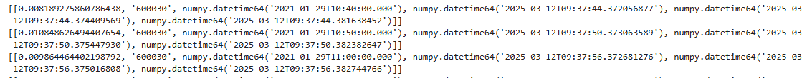

# 订阅实时计算结果流表
import dolphindb as ddb

s = ddb.session(keepAliveTime=60)
s.connect("192.168.100.201", 8848, "admin", "123456")
s.enableStreaming()

def handler(lst):
    print(lst)

s.subscribe(host="192.168.100.201", port=8848, handler=handler, tableName="result10min", actionName="result10min", offset=-1, resub=True, msgAsTable=True, batchSize=100, throttle=0.001)
```

订阅成功的输出结果如下所示：

图 4. 图 4-2 Python 订阅预测结果展示图



### 4.4 实时预测性能

实时预测的时间开销主要是实时因子计算和模型实时推理两个部分，本例我们通过在各个环节采用时间戳的方式进行统计。实时因子计算部分的具体方式是在数据注入引擎时打一个时间戳
`ReceiveTime` ，在数据计算结束时打一个时间戳 `HandleTime`
，取差值即可得到引擎计算因子的耗时。模型实时预测部分的具体方式是在模型推理结束时打一个时间戳 `PredictedTime`，取
`PredictedTime` 和 `HandleTime`
的差值得到模型推理耗时。

通过将一天的原始快照数据以 100 倍速回放，我们测试了一只股票通过 LSTM 模型进行实时预测的耗时，单次响应总时延约 9.8
毫秒。测试环境软硬件配置见附录，模型结构见 3.4 小节。

|  | 平均时延（毫秒） | 95分位时延（毫秒） | 最小时延（毫秒） | 最大时延（毫秒） |
| --- | --- | --- | --- | --- |
| **因子计算时延** | 2 | 2 | 2 | 2 |
| **模型推理时延** | 7.5 | 8.7 | 7 | 12 |
| **总时延** | 9.8 | 10.7 | 9 | 14 |

性能统计脚本：

```
stat = select (HandleTime-ReceiveTime)/1000/1000 as factorDelay, (PredictedTime-HandleTime)/1000/1000  as predictDelay, (PredictedTime-ReceiveTime)/1000/1000  as totalDelay  from result10min
select avg(factorDelay), percentile(factorDelay, 95), min(factorDelay), max(factorDelay), avg(predictDelay), percentile(predictDelay, 95), min(predictDelay), max(predictDelay), avg(totalDelay), percentile(totalDelay, 95), min(totalDelay), max(totalDelay)  from stat
```

## 5. 总结

结合金融市场中常见的预测股票实时波动率场景，本文介绍了 DolphinDB
在深度学习实践的各个环节中的解决方案，充分发挥其在大规模数据计算和流计算上的速度优势，迅速处理实时数据，得到实时因子表及实时预测结果表。用户可以根据实际业务场景，进行适当调整和修改。

## 附录

**开发环境：**

* CPU：AMD EPYC 7513 32-Core Processor @ 2.60GHz
* 逻辑 CPU 总数：128
* GPU：NVIDIA A800 80GB PCIe
* 磁盘：NVMe \* 1块
* CUDA 版本：12.4
* OS：64 位 CentOS Linux 7 (Core)
* DolphinDB 版本：3.00.2.3 2024.11.04 LINUX\_ABI x86\_64 shark版本
* DolphinDB Python API 版本：3.0.2.3
* Python 版本：3.12.9

**脚本：**

* snapshot 建库建表与文件导入：[snapshotDB.dos](script/application_in_deep_leaing_real_time_stock_volatility_prediction/snapshotDB.dos)
* 特征因子计算与存储脚本：[FeatureEngineering.dos](script/application_in_deep_leaing_real_time_stock_volatility_prediction/FeatureEngineering.dos)
* 模型训练脚本：[LSTMmodel.py](script/application_in_deep_leaing_real_time_stock_volatility_prediction/LSTMmodel.py)
* 模型实时推理脚本：[StreamComputing.dos](script/application_in_deep_leaing_real_time_stock_volatility_prediction/StreamComputing.dos)

**数据：**

* 股票的 level 2 快照数据： [Snapshot.csv](script/application_in_deep_leaing_real_time_stock_volatility_prediction/Snapshot.csv)

