# 基于 Zabbix 的 DolphinDB 集群运维监控

在高并发的读写场景中，了解资源使用情况对于快速定位性能问题至关重要。作为一种企业级分布式开源监控解决方案，Zabbix 在各行各业都得到广泛应用。本教程提供 Zabbix 对
DolphinDB 集群的资源监控、告警和预警方案。

## 1. 方案概述

本方案适用于对多（或单）服务器以及 DolphinDB 高可用集群（或单节点）资源的监控、告警、预警。

### 1.1 Zabbix 概述

Zabbix 是一种基于 Server-Client 架构的网络监视和管理系统，由 Alexei Vladishev
开发。它用于监视各种网络服务、服务器和网络设备的状态。

Zabbix Server 是整个 Zabbix 软件的核心程序。它通过轮询和捕获数据，计算是否满足触发器条件，并向用户发送通知。

Zabbix Agent 是用于监控和管理远程主机的代理程序，定期收集系统性能数据并将其发送给 Zabbix 服务器进行分析和报告。通过安装 Zabbix
Agent，管理员可以监控远程主机的 CPU 利用率、内存使用情况、磁盘空间、网络流量等系统性能指标，及时发现并解决潜在问题。

Zabbix Web 提供了监控数据的可视化呈现，通过图形、表格等方式展示监控数据，帮助用户更直观地了解系统状态和性能数据。

### 1.2 监控方案概述

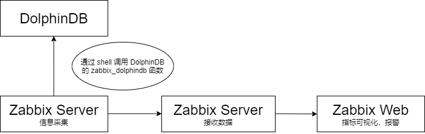

本方案旨在监控 DolphinDB 进程对服务器资源的使用情况和 DolphinDB 的运行情况，包括 DolphinDB 进程的 CPU
占用情况、内存占用情况和磁盘资源使用情况等。为了获取当前节点的资源使用情况，DolphinDB 需要定义相应的运维函数。在本方案中，Zabbix Agent
可以抓取这些指标，并将其发送给 Zabbix Server 进行分析和报告。通过 Zabbix Web 对 Zabbix Server
采集的指标信息进行可视化，用户可以更直观地了解 DolphinDB 的性能和资源使用情况。

## 2. 软件部署

### 2.1 Zabbix 部署

从官网下载 Zabbix，下载链接为：<https://www.zabbix.com/cn/download> 。相关文档可参阅[官方帮助](https://www.zabbix.com/documentation/6.4/zh/manual/quickstart/login)。

本文所使用的软件版本如下：

* Zabbix 版本：6.4
* 操作系统分布：Ubuntu
* 操作系统版本：22.04(Jammy)
* 数据库：MySQL
* Web服务器：Nginx

### 2.2 DolphinDB 部署

DolphinDB 支持单节点、集群等多种部署方式，Zabbix 也支持监控这些不同部署方式的 DolphinDB 服务。

在本文中，我们使用的是 DolphinDB 2.00.12.1 版本的高可用集群，包括三个控制节点、三个数据节点和三个代理节点。

注： 部署 DolphinDB 的相关文档可查阅：[DolphinDB教程](../deploy/deploy_intro.md)

## 3. DolphinDB 监控项配置

为了让 Zabbix Agent 能够获取 DolphinDB 的各种指标信息，需要进行以下准备工作：

* 确保 DolphinDB 中包含获取指标信息的函数。
* 编写 Zabbix Agent 调用的 shell 文件。
* 配置 Zabbix Server 监控所需的指标。

### 3.1 DolphinDB 的监控指标

DolphinDB 目前支持的指标如下所示：

| 指标 | 含义 |
| --- | --- |
| cpuUsage | DolphinDB 进程占用 CPU 的百分比（单位：无） |
| memoryUsed | 节点使用的内存（单位：字节） |
| memoryAlloc | 节点中 DolphinDB 当前内存池的容量（单位：字节） |
| diskCapacity | 磁盘容量（单位：字节） |
| diskFreeSpace | 磁盘剩余空间（单位：字节） |
| lastMinuteWriteVolume | 前一分钟写磁盘容量(单位：字节) |
| lastMinuteReadVolume | 前一分钟读磁盘容量（单位：字节） |
| lastMinuteNetworkRecv | 前一分钟网络接收字节数（单位：字节） |
| lastMinuteNetworkSend | 前一分钟网络发送字节数（单位：字节） |
| diskReadRate | 磁盘读速率（单位：字节/秒） |
| diskWriteRate | 磁盘写速率（单位：字节/秒） |
| networkSendRate | 网络发送速率（单位：字节/秒） |
| networkRecvRate | 网络接收速率（单位：字节/秒） |
| cumMsgLatency | 流数据订阅节点所有已接收的消息的平均延时（单位：纳秒） |
| lastMsgLatency | 流数据订阅节点最后收到的消息的延时（单位：纳秒） |
| maxLast10QueryTime | 前10个完成的查询执行所耗费时间的最大值（单位：纳秒） |
| medLast10QueryTime | 前10个完成的查询执行所耗费时间的中间值（单位：纳秒） |
| medLast100QueryTime | 前100个完成的查询执行所耗费时间的中间值（单位：纳秒） |
| maxLast100QueryTime | 前100个完成的查询执行所耗费时间的最大值（单位：纳秒 |
| maxRunningQueryTime | 当前正在执行的查询的耗费时间的最大值（单位：纳秒） |
| avgLoad | 平均负载（单位：无） |
| jobLoad | 作业负载（单位：无） |
| runningJobs | 正在执行中的作业和任务数（单位：无） |
| queuedJobs | 队列中的作业和任务数（单位：无） |
| connectionNum | 节点连接数 |

### 3.2 定义获得 DolphinDB 监控指标的接口

在 DolphinDB 中运行以下脚本，添加 functionView 来定义获取 DolphinDB 监控指标的接口。

在脚本中，使用 `login("admin","123456")` 函数来登录 DolphinDB。请注意，账号应为
admin，密码应根据实际情况进行更改。

```
login("admin","123456")
def zabbix_dolphindb(node_item){
    dataNode = select * from rpc(getControllerAlias(),getClusterPerf{1})
    // 如果节点名称包含 . ，需要进行特殊判断
    if(node_item.split(".").size()==2){
        nodeAlias = node_item.split(".")[0]
        metrics = node_item.split(".")[1]
        whereConditions = expr(sqlCol("site"),like,"%"+nodeAlias+"%")
        return sql(sqlCol(metrics),dataNode,whereConditions).eval()[metrics][0]
    } else {
        size = node_item.split(".").size()
        nodeAlias = concat(node_item.split(".")[:size-1],".")
        metrics = node_item.split(".")[size-1]
        whereConditions = expr(sqlCol("site"),like,"%"+nodeAlias+"%")
        return sql(sqlCol(metrics),dataNode,whereConditions).eval()[metrics][0]
    }
}
addFunctionView(zabbix_dolphindb)
```

### 3.3 定义 Shell 文件用于 Zabbix Agent 采集信息

* 定义 Shell 文件

请将以下 shell 文件命名为 *zabbix\_dolphindb.sh* 并将其放置在
*/etc/zabbix/zabbix\_agentd.d* 目录下。Zabbix Agent 将根据此 shell 脚本调用
DolphinDB 的 `zabbix_dolphindb` 函数，以获取 DolphinDB 的各种指标。

以下是需要更改的脚本参数：

* dolphindbIp：DolphinDB 的 IP 地址。
* dolphindbPort：DolphinDB 的端口号。
* dolphindbAdmin：DolphinDB 的用户名，需要使用 admin 账户。
* dolphindbPassword：DolphinDB 的密码，需要使用 admin 账户的密码。

```
dolphindbIp=192.198.1.31
dolphindbPort=8742
dolphindbAdmin=admin
dolphindbPassword=

dolphindb_command=$1

getDolphindbMessage(){
    script='{"sessionID": "0","functionName": "executeCode","params": [{"name": "script","form": "scalar","type": "string","value": "login(\"'$dolphindbAdmin'\",\"'$dolphindbPassword'\");zabbix_dolphindb(\"'$dolphindb_command'\")"}]}'
    command="curl -H \"Content-Type: application/json\" -X POST -d '$script' $dolphindbIp:$dolphindbPort -s"
    result=$(eval $command)
    echo $result | awk -F '"' '{print $34}' | xargs | bc
}
getDolphindbMessage
```

请按照以下步骤为 Zabbix Agent 添加配置：

* 在
  */etc/zabbix/zabbix\_agentd.d*目录下创建一个名为*dolphindbMsg.conf*的文件。
* 将以下内容添加到 *dolphindbMsg.conf*文件中：

```
UserParameter=dolphindb_status[*],/bin/bash /etc/zabbix/zabbix_agentd.d/zabbix_dolphindb.sh \$1
```

这个配置文件会将 \* 号中的内容传递给 *zabbix\_dolphindb.sh* 这个 shell 文件，从而调用 DolphinDB 的
`zabbix_dolphindb` 函数。\* 号中的内容即为函数的输入参数。

### 3.4 生成 Zabbix 监控模板

对于快速实现 DolphinDB 高可用集群与服务器资源的监控，我们提供了监控模板。您可以在 Zabbix Web
中导入相应的模板，从而实现监控指标的拉取、可视化和触发器功能。通过执行一个 Python3 脚本，您可以生成针对特定 DolphinDB
服务器的监控模板。

以下是需要更改的脚本参数：

* dolphindbIp：DolphinDB 服务器的 IP 地址。
* dolphindbPort：DolphinDB 服务器的端口号。
* dolphindbAdmin：DolphinDB 的用户名，需使用 `admin`。
* dolphindbPassword：DolphinDB 的密码。
* hostName：对应 Zabbix Agent 配置文件中的 `Hostname` 配置项。
* groupName：Zabbix 中的主机组名称，可自定义填写。
* ip：对应 Zabbix Agent 配置文件中的 `Server` 配置项。

执行该 Python 3 脚本后，在当前目录下将生成一个名为 *dolphindb.xml* 的文件，这个文件即为 Zabbix Web
所需的监控模板。

```
from xml.etree import ElementTree as ET
import xmltodict

import dolphindb as ddb

dolphindbIp="192.168.100.43"
dolphindbPort=8742
dolphindbAdmin="admin"
dolphindbPassword=""

hostName="Zabbix server"
groupName="QuantDataCenter"
ip="127.0.0.1"

s = ddb.Session()
s.connect(dolphindbIp, dolphindbPort, dolphindbAdmin, dolphindbPassword)
nodes = s.run('exec name from rpc(getControllerAlias(),getClusterPerf{1}) where mode in [0,2,3,4]')
metrics = ["queuedTask","connectionNum","memoryUsed","memoryAlloc","cpuUsage","avgLoad","medLast10QueryTime","maxLast10QueryTime","medLast100QueryTime","maxLast100QueryTime","maxRunningQueryTime","runningJobs","queuedJobs","jobLoad","diskCapacity","diskFreeSpace","diskFreeSpaceRatio","diskWriteRate","diskReadRate","lastMinuteWriteVolume","lastMinuteReadVolume","networkSendRate","networkRecvRate","lastMinuteNetworkSend","lastMinuteNetworkRecv","lastMsgLatency","cumMsgLatency"]
example = {}
example['zabbix_export'] = []

item = []
for node in nodes:
    for metric in metrics:
        name = node + "." + metric

        if metric == "connectionNum":
            maxConnections = s.run("int(int(rpc('"+node+"', getConfig).maxConnections)*0.8)")
            triggers = {"trigger": [{"expression": "{last()}>="+str(maxConnections)+""},{"name": name},{"url": "http://" + dolphindbIp + ":" + str(dolphindbPort)},{"priority": "HIGH"}]}
            item.append({"name": name, "type": "ZABBIX_ACTIVE", "key": "dolphindb_status[" + name + "]", "value_type": "FLOAT","triggers": triggers})

        elif metric == "memoryUsed":
            maxMemSize = s.run("long(rpc('"+node+"', getConfig).maxMemSize)*1024*1024*1024*0.8")
            triggers = {"trigger": [{"expression": "{last()}>="+str(maxMemSize)+""},{"name": name},{"url": "http://" + dolphindbIp + ":" + str(dolphindbPort)},{"priority": "HIGH"}]}
            item.append({"name": name, "type": "ZABBIX_ACTIVE", "key": "dolphindb_status[" + name + "]", "value_type": "FLOAT","triggers": triggers})

        elif metric == "cpuUsage":
            workerNum = s.run("int(int(rpc('"+node+"', getConfig).workerNum)*100*0.8)")
            print(workerNum)
            triggers = {"trigger": [{"expression": "{last()}>="+str(workerNum)+""},{"name": name},{"url": "http://" + dolphindbIp + ":" + str(dolphindbPort)},{"priority": "HIGH"}]}
            item.append({"name": name, "type": "ZABBIX_ACTIVE", "key": "dolphindb_status[" + name + "]", "value_type": "FLOAT","triggers": triggers})

        elif metric == "avgLoad":
            triggers = {"trigger": [{"expression": "{last()}>=4"},{"name": name},{"url": "http://" + dolphindbIp + ":" + str(dolphindbPort)},{"priority": "HIGH"}]}
            item.append({"name": name, "type": "ZABBIX_ACTIVE", "key": "dolphindb_status[" + name + "]", "value_type": "FLOAT","triggers": triggers})

        else:
            item.append({"name": name, "type": "ZABBIX_ACTIVE", "key": "dolphindb_status[" + name + "]", "value_type": "FLOAT"})

host = []
host.append({"host": hostName})
host.append({"name": hostName})
host.append({"groups": {"group":{"name": groupName}}})
host.append({"interfaces": {"interface":[{"ip": "10.6.0.2"},{"interface_ref": "if1"}]}})
host.append({"items": {"item": item}})

colorList = ["1A7C11","2774A4","F63100","9FA8DA","303F9F","512DA8","FF5722","FFEE58","33691E"]

graphs = []
for metric in metrics:
    i = 0
    graph_item = []
    for node in nodes:
        name = node + "." + metric
        if i == 0:
            graph_item.append({"color": colorList[i], "item": {"host": hostName, "key": "dolphindb_status[" + name + "]"}})
        else:
            graph_item.append({"color": colorList[i], "sortorder": i,"item": {"host": hostName, "key": "dolphindb_status[" + name + "]"}})
        i += 1
    graphs.append({"graph":{"name": metric, "ymin_type_1": "FIXED","ymax_type_1": "FIXED","graph_items": {"graph_item": graph_item}}})

example['zabbix_export'].append({"version": 4.4})
example['zabbix_export'].append({"date": "2024-01-15T08:18:08Z"})
example['zabbix_export'].append({"groups": {"group": {"name": "QuantDataCenter"}}})
example['zabbix_export'].append({"hosts": {"host": host}})
example['zabbix_export'].append({"graphs": graphs})

xml_string = xmltodict.unparse({'root': example}, pretty=False)

f = open("dolphindb.xml","w")
f.write(xml_string.replace("</zabbix_export><zabbix_export>","").replace("</graphs><graphs>","").replace("</host><host>","").replace("</interface><interface>","").replace("<root>","").replace("</root>","").replace("</trigger><trigger>",""))
f.close()
```

这个 py3 脚本会生成一个 XML 文件，其文件大致结构如下。

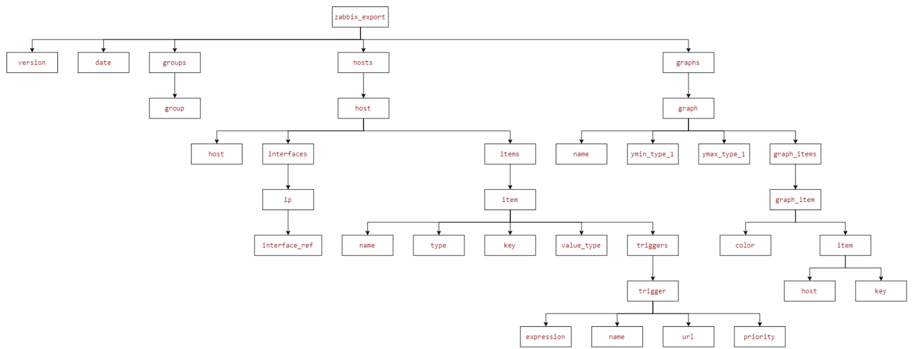

其中各节点含义为：

* **zabbix\_export**：整个 XML 文件的根节点。
* **version**：模板的版本号。
* **date**：模板的创建日期时间。
* **groups**：定义主机群组的节点。
  + **group**：具体的主机群组。
    - **name**：主机群组的名称。
* **hosts**：定义主机相关配置的节点。
  + **host**：具体的主机配置。
    - **name**：主机的名称。
    - **interfaces**：定义主机的网络接口信息。
      * **interface**：具体的网络接口配置。
        + **ip**：主机的 IP 地址。
        + **port**：Zabbix 客户端使用的端口。
        + **useip**：指定是否使用 IP 地址。
    - **items**：定义监控项的节点。
      * **item**：具体的监控项配置。
        + **name**：监控项的名称。
        + **type**：监控项的类型。
        + **key**：监控项的键值。
        + **value\_type**：信息类型。
    - **triggers**：定义触发器的节点。
      * **trigger**：具体的触发器配置。
        + **expression**：触发器的表达式。
        + **name**：触发器的名称。
        + **url**：菜单条目 URL。
        + **priority**：触发器的严重性。
    - **graphs**：定义图形的节点。
      * **graph**：具体的图形配置。
        + **name**：图形的名称。
        + **ymin\_type\_1**：图形 y 轴的最小值。
        + **ymax\_type\_1**：图形 y 轴的最大值。
        + **graph\_items**：定义图形项的节点。
          - **graph\_item**：具体的图形项配置。
            * **color**：指标显示的颜色。
            * **sortorder**：指标的排名。
            * **item**：需要显示的指标。
            * **host**：主机的名称。
            * **key**：显示的指标的键值。

### 3.5 导入 Zabbix 监控模板

在 Zabbix Web 界面中，依次点击 "数据采集" -> "主机" -> "导入"，然后选择使用 Python3 生成的 Zabbix
监控模板进行导入。

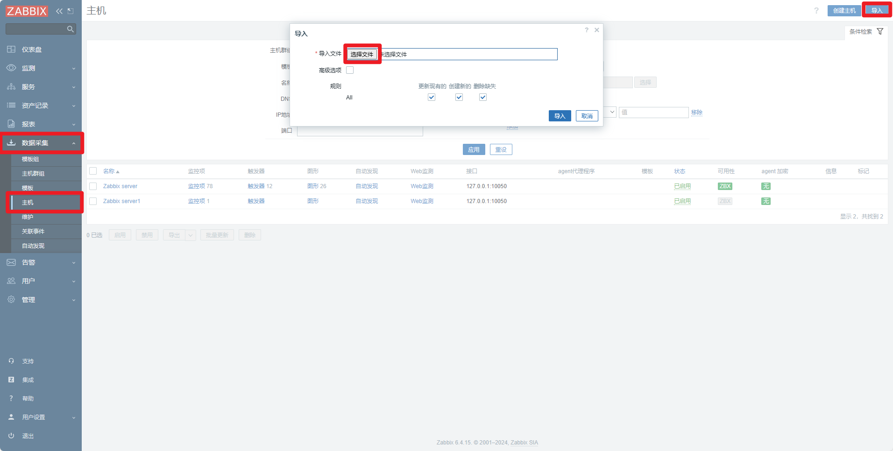

导入后，应包含监控项、触发器和图形。


* 监控项：名称应为“节点名 + 监控指标”，用于监控 DolphinDB 的各项指标。

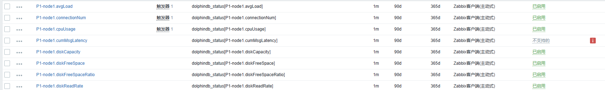

* 触发器：当 DolphinDB 的指标符合触发器条件时，触发警报。

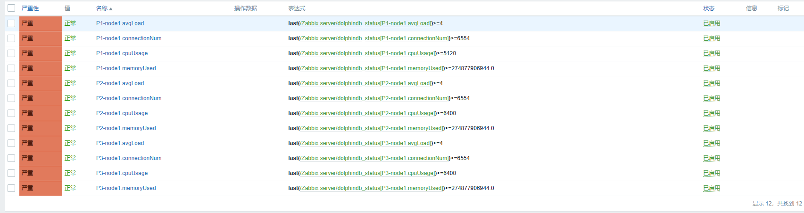

* 图形：展示 DolphinDB 指标的可视化界面。

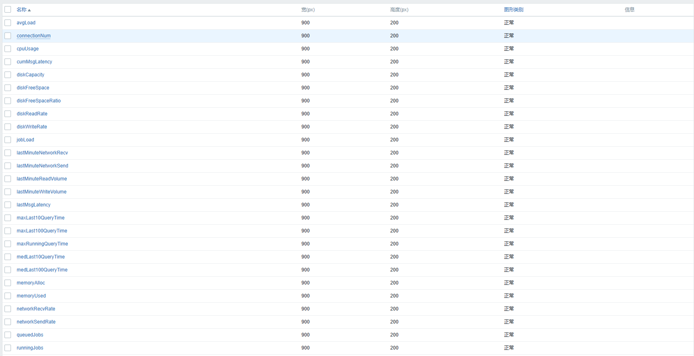

下图是 CPU 使用率的可视化界面。

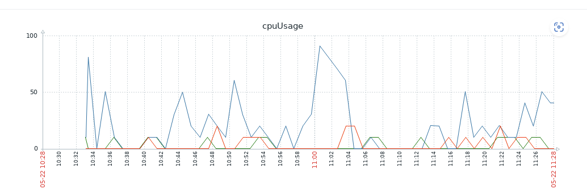

### 3.6 监控指标的可视化效果展示

在 Zabbix Web 界面中，依次点击 "仪表盘" -> "编辑仪表盘" -> "添加"。

* 类型：选择 "图表（经典）"。
* 图形：选择包含 DolphinDB 监控项的主机。

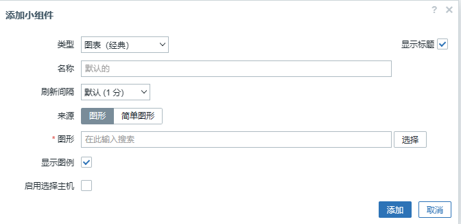

以下是仪表盘的显示。

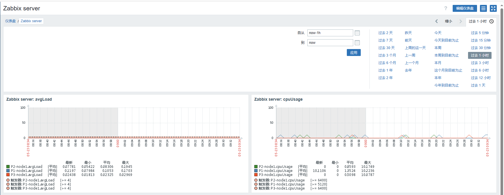

## 4. 告警

在第 3.5 步导入模板后，已设置触发器。一旦触发触发器，警告将显示在 Zabbix Web
界面上。​警报和预警的主要目的是帮助相关人员了解服务器当前运行状况。当出现异常时，警报会提醒专业人员进行维护。不同的警报需要不同部门或运维人员介入处理，因此需要将不同的警报消息发送给不同的人员。

### 4.1 告警媒介

警报媒介的作用是按照制定的策略发送警报消息。

以下是 Zabbix 自带的警报媒介列表，配置后即可使用。

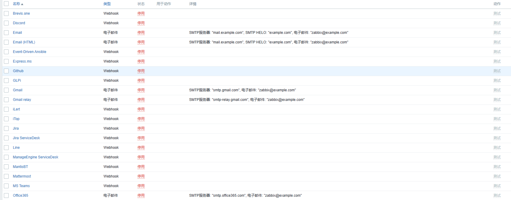

以下是一个使用自定义 shell 脚本进行企微告警的示例：

在 Zabbix Web 界面中，依次点击 "告警 " -> "媒介" -> "创建媒介类型"。

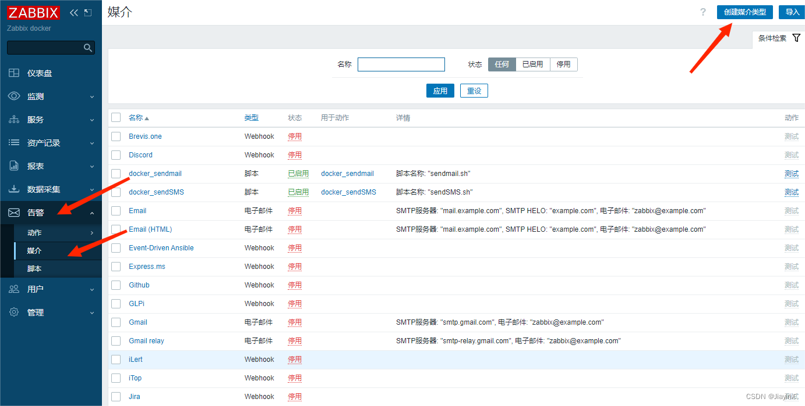

名称：发送信息到企业微信

类型：脚本

脚本名称：zabbix\_sendMsg.sh

脚本参数：

* 第一个参数为发送的信息，固定格式为{ALERT.MESSAGE}
* 第二个参数为企业微信机器人的 key（[如何设置群机器人 -帮助中心-企业微信
  (qq.com)](https://open.work.weixin.qq.com/help2/pc/14931?person_id=1&is_tencent=)）

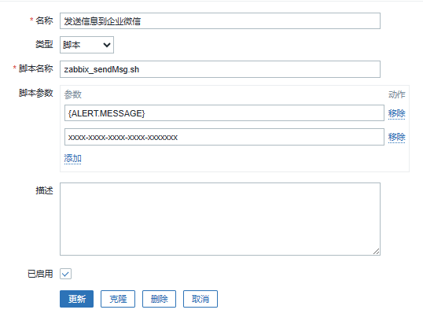

请按照以下步骤为 Zabbix Server 添加配置：

* 取消注释 Zabbix Server 的 *AlertScriptsPath* 配置项。
* 下面是
  *zabbix\_sendMsg.sh*脚本的内容，将其放置到*zabbix\_server.conf*的*AlertScriptsPath*
  配置项指定的路径下：

```
script='{"msgtype": "text","text": {"content": "'$1'"}}'
echo $1
command="curl -H \"Content-Type: application/json\" -X POST -d '$script' https://qyapi.weixin.qq.com/cgi-bin/webhook/send?key="$2" -s"
echo $(eval $command)
```

### 4.2 创建报警动作

在 Zabbix Web 界面中，依次点击 "告警" → "动作" → "触发器动作" → "创建动作"。

动作配置如下：

* 名称：自定义内容
* 新的触发条件：主机等于 hostName

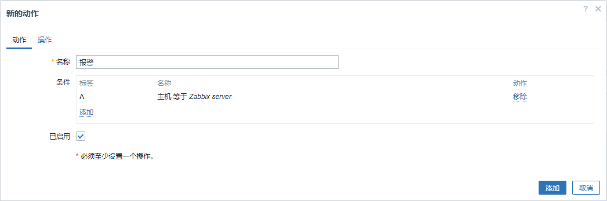

* 操作

发送给用户：选择 Admin

主题：Problem: {EVENT:NAME}

信息内容模板：

```
ZABBIX WARNING
告警时间: {EVENT.DATE} {EVENT.TIME}
告警项目: {EVENT.NAME}
告警等级: {EVENT.SEVERITY}
当前状态:{TRIGGER.STATUS}:{ITEM.VALUE1}

告警项目:{TRIGGER.KEY1}
问题详情:{ITEM.NAME}:{ITEM.VALUE}

{TRIGGER.URL}
```

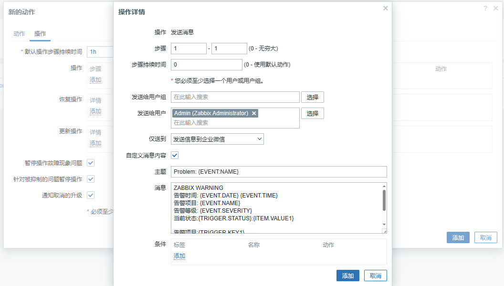

触发告警规则后，企业微信收到的信息样式如下：

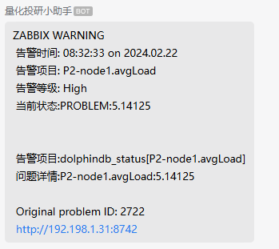

至此，企业微信告警部署完毕，用户可根据上述步骤开启 DolphinDB 集群监控的企业微信告警。

## 5. 总结

本文讲述了 Zabbix agent 如何调用 shell 脚本来获取 DolphinDB 的各种指标，并定义报警媒介向企业微信报警。

